# Cluster and Cloud Computing

## Contents

- [Lecture 1](#lecture-1)
- [Lecture 3](#lecture-3)
- [Lecture 4](#lecture-4)
- [Lecture 5](#lecture-5)
- [Lecture 6](#lecture-6)
- [Lecture 7](#lecture-7)
- [Lecture 8](#lecture-8)
- [Lecture 9](#lecture-9)

---

## Lecture 1

**Computing and Communication Technologies (r)evolution: 1960-:**
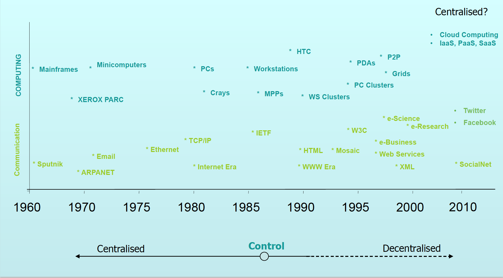

- **Centralised system:** Single physical (centralised) system. All resources (processors, memory and storage) fully shared and tightly coupled within one integrated OS
- **Parallel system:** All processors (_each processor in all the processors_)either tightly coupled with centralised shared memory or loosely coupled with _distributed memory_(refer to pictures below). Interprocess communication through shared memory or throughsome form of message passing

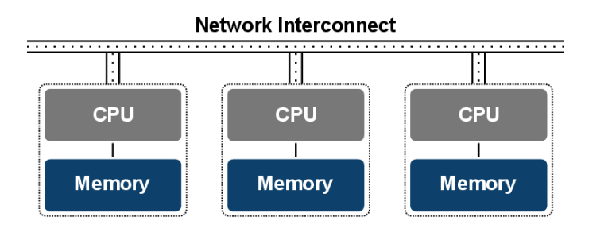

- **Distributed system:** Multiple autonomous computers with their own private memory, communicating through some form of message passing over a computer network
- **Cloud computing:** It is distributed computing over a network and has the ability to run a program on many connected computers at the same time.

**Cloud Characteristics:**

- _On-demand self-service_: A consumer can provision computing capabilities as needed without requiring human interaction with each service provider.
- _Networked access_: Capabilities are available over the network and accessed through standard mechanisms that promote use by heterogeneous client platforms.
- _Resource pooling_: The provider's computing resources are pooled to serve multiple consumers using a multi-tenant model potentially with different physical and virtual resources that can be dynamically assigned and reassigned according to consumer demand.
- _Rapid elasticity_: Capabilities can be elastically provisioned and released, in some cases automatically, to scale rapidly upon demand.
- _Measured service_: Cloud systems automatically control and optimize resource use by leveraging a metering capability at some level of abstraction appropriate to the type of service.

**Grid Architecture:**
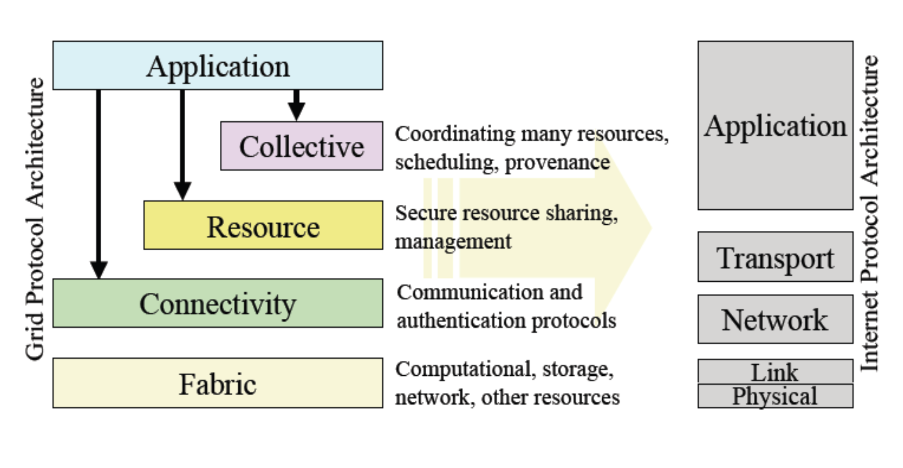

## Lecture 3

**Compute Scaling:**

- _Vertical Computational Scaling_ (quality,improving performance of processors): Have faster processors, Limits of fundamental physics/matter (nanoCMOS)
- _Horizontal Computational Scaling_(quantity of processors): Have more processors (Easy to add more, cost increase not so great,but harder to design, develop, test, debug, deploy, manage, understand)

**ADD MORE:**

- Single machine multiple cores
- Loosely coupled cluster of machines (Pooling/sharing of resources)
- Tightly coupled cluster of machines (Typical HPC/HTC set-up,SPARTAN)
- Widely distributed clusters of machines
- Hybrid combinations of the above

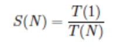

- **T(1)** = time for serial computation
- **T(N)** = time for N parallel computations
- **S(N)** = speed up
- Proportion of speed up depends on parts of program that can’t be parallelised

**Amdahl's Law:**
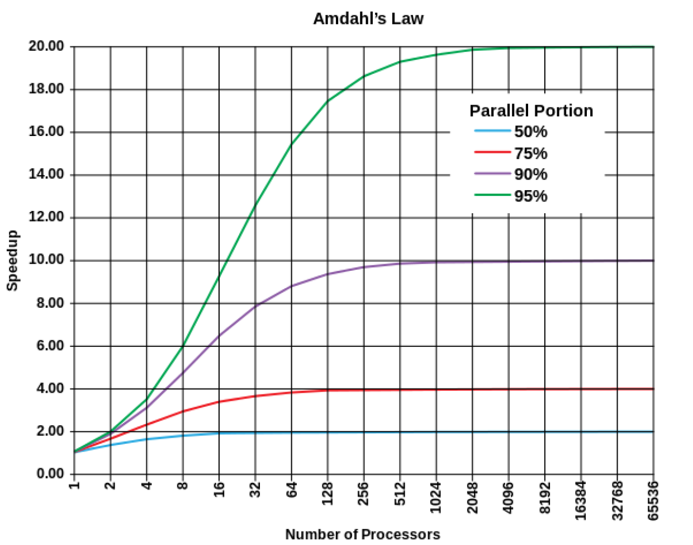

- If 95% of the program can be parallelized, the theoretical maximum speedup using parallel computing would be 20×, no matter how many processors are used
- If the non-parallelisable part takes 1 hour, then no matter how many cores you throw at it it won’t complete in <1 hour.

```
Amdahl’s law states that the speedup achieved through parallelisation of 
a program is limited by the percentage of its workload that is 
inherently serial. We can get no more than a maximum speedup equal to
1 / (s + p / N ) where

s = the length of the serial part of the problem
p = the length of the parallel part of the problem
N = number of processors used
```

****Overheads:** overhead is any combination of excess or indirect computation time, memory, bandwidth, or other resources that are required to perform a specific task (It's like when you need to go somewhere, you might need a car. But, it would be a lot of overhead to get a car to drive down the street, so you might want to walk. However, the overhead would be worth it if you were going across the country.)


**Gustafson-Barsis's Law:** programmers tend to set the size of problems to use the available equipment to solve problems within a practical fixed time. _Faster (more parallel) equipment available, larger problems can be solved in the same time_

```
Gustafson’s law states that , with increasing data size, the speedup 
obtained through parallelisation increases, because the parallel work 
increases(scales) with data size.
scaled speed-up: S(N) = α + N(1 − α) = N − α(N − 1)
α Fraction of running time sequential program spends on parallel parts
N parallel computations/processors

A VS G:
one sees data size as fixed and the other sees the relation as a 
function of data size.
```

**Flynn’s Taxonomy:**

- SISD (Single Instruction, Single Data stream)

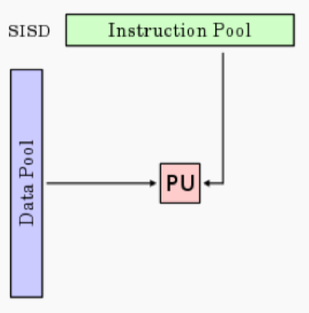

- Sequential computer which exploits no parallelism in either the instruction or data streams
- Single control unit (CU/CPU) fetches single Instruction Stream from memory. The CU/CPU then generates appropriate control signals to direct single processing element to operate on single Data Stream, i.e. one operation at a time.
- Basic idea of von Neumann computer (pretty much obsolete)

### MISD (Multiple Instruction, Single Data stream)

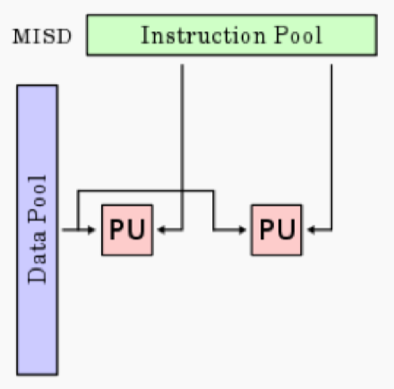

- Parallel computing architecture where many functional units (PU/CPU) perform different operations on the same data
- Examples include fault tolerant computer architectures, e.g. running multiple error checking processes on same data stream

### SIMD (Single Instruction, Multiple Data stream)

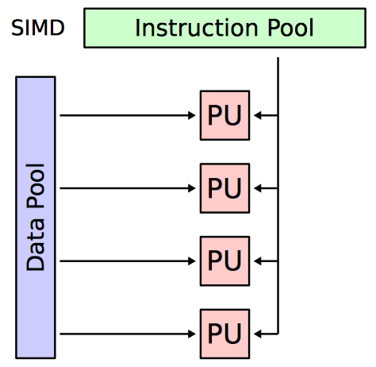

- multiple processing elements that perform the same operation on multiple data points simultaneously
- focus in on data level parallelism, i.e. many parallel computations, but only a single process (instruction) at a given moment.
- many modern computers use SIMD instructions, e.g. to improve performance of multimedia use such as for image processing
- Harvard architecture? Digital Signal Processor?

### MIMD Multiple Instruction, Multiple Data stream

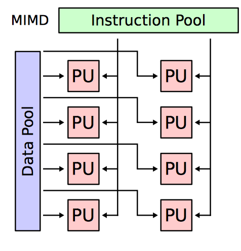

- number of processors that function asynchronously and independently
- at any time, different processors may be executing different instructions on different pieces of data
- machines can be shared memory or distributed memory categories
    - depends on how MIMD processors access memory
- most systems these days operate on MIMD e.g. HPC (almost all high performance computing systems are cluster of computer connected using a high bandwidth and especially a low latency interconnect)

**Computer Architecture:**

- CPU for executing programs
- Memory that stores/executing programs and related data
- I/O systems (keyboards, networks, …)
- Permanent storage for read/writing data into out of memory(hard disk)
- Balance of all of these
- different ways to design/architect computers


### Approaches for Parallelism

**Explicit vs Implicit Parallelisation:**

- _Implicit Parallelism_: Supported by parallel languages and parallelizing compilers that take care of identifying parallelism, the scheduling of calculations and the placement of data
- _Explicit Parallelism_:the programmer is responsible for most of the parallelization effort such as task decomposition, mapping tasks to processors, inter-process communications

**Hardware Parallelisation:**
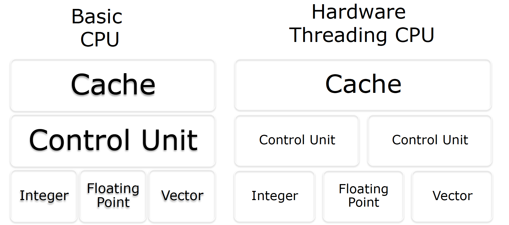

- Cache: much faster than reading/writing to main memory,instruction cache, data cache (multilevel) and translation lookaside buffer used for virtual-physical address translation

Parallelisation by adding extra CPU to allow more instructions to be processed per cycle.

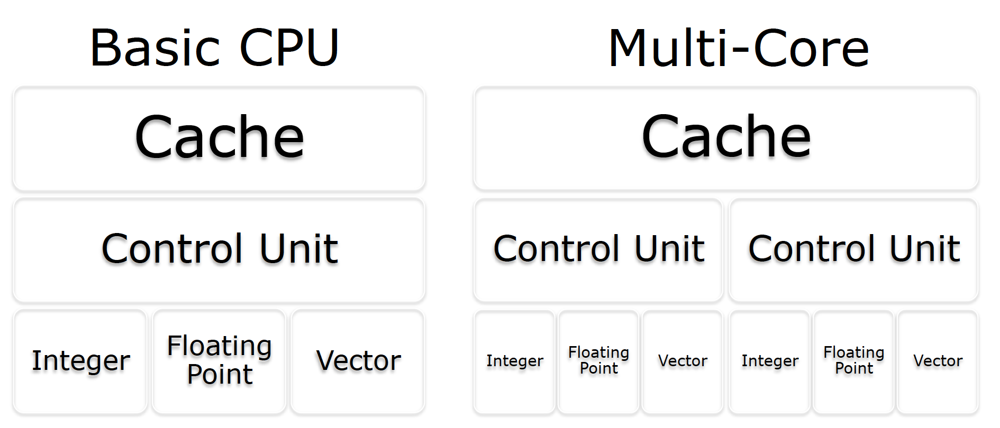
Multiple cores that can process data and perform computational tasks in parallel(L1 cache on single cores; L2 cache on pairs of cores; L3 cache
shared by all cores, (higher hit rates
but potentially higher latency))

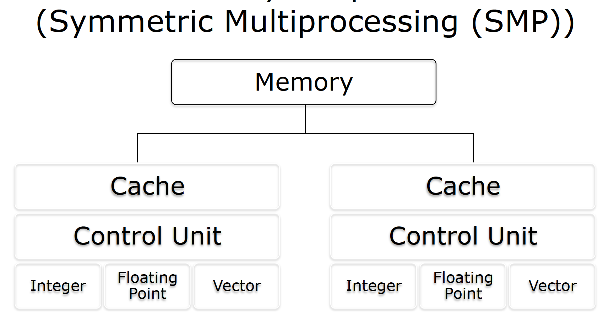
Two (or more) identical processors connected to a single, shared main memory, with full access to all I/O devices, controlled by a single OS instance that treats all processors equally. Each processor executes different programs and works on different data but with capability of sharing common resources (memory, I/O device, …). Processors can be connected in a variety of ways: buses, crossbar switches, meshes. More complex to program since need to program both for CPU and inter-processor communication (bus).

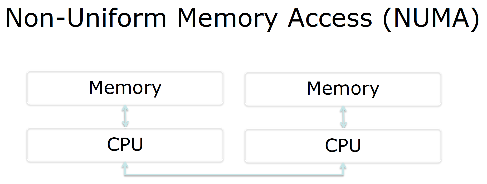
**Non-uniform memory access (NUMA)** provides speed-up by allowing a processor to access its own local memory faster than non-local memory. Improved performance as long as data are localized to specific processes/processors. Key is allocating memory/processors to avoid scheduling/locking and (expensive) inter-processor communication

**OS Parallelism:**

- parallel(real parallel) vs interleaved semantics(context switch)
- Compute parallelism (Native threads, Fork, Spawn, Join; Green threads Scheduled by a virtual machine instead of natively by the OS)
- Data parallelism(Caching)

**Software Parallelism:**

- Deadlock – processes involved constantly waiting for each other
- Livelock – processes involved in livelock constantly change with regard to one another, but none are progressing

**Message Passing Interface:**(message passing in parallel
systems)

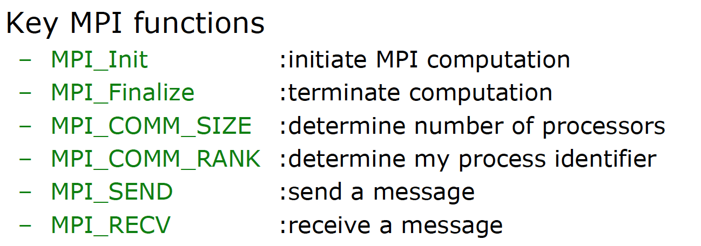

Data Parallelism


**Distribution system challenges:** A distributed system is one in which the failure of a computer you didn't even know existed can render your own computer unusable (**Assumptions)

****Bandwidth:** Bandwidth is the capacity of a wired or wireless network communications link to transmit the maximum amount of data from one point to another over a computer network or internet connection in a given amount of time -- usually one second.

****Topology:** A network topology is the arrangement of a network, including its nodes and connecting lines. There are two ways of defining network geometry: the physical topology and the logical (or signal) topology.

- physical topology: the actual geometric layout of workstations(star or ring network)
- some networks are physically laid out in a star configuration, but they operate logically as bus or ring networks

**Incorrected Assumptions in distributed system:**

```
1. The network is reliable
2. Latency is zero
3. Bandwidth is infinite
4. The network is secure
5. Topology doesn't change
6. There is one administrator
7. Transport cost is zero
8. The network is homogeneous
9. Time is ubiquitous
```

**Design Stages of Parallel Programs:**(through steps)

1. Partitioning: Decomposition of _computational activities(procedures) and data_ into smaller tasks(Master-worker,pipeline, divide and conquer)
2. Communication: Flow of information and coordination among tasks that are created in the partitioning stage
3. Agglomeration(collection of things):
    - Tasks and communication structure created in the above stages are evaluated for performance and implementation cost
    - Tasks may be grouped into larger tasks to improve communication
    - Individual communications can be bundled
4. Mapping / Scheduling: Assigning tasks to processors such that job completion time is minimized and resource utilization is maximized

**Master-Slave model:** Master decomposes the problem into small tasks(different processes), distributes to workers and gathers partial results to produce the final result
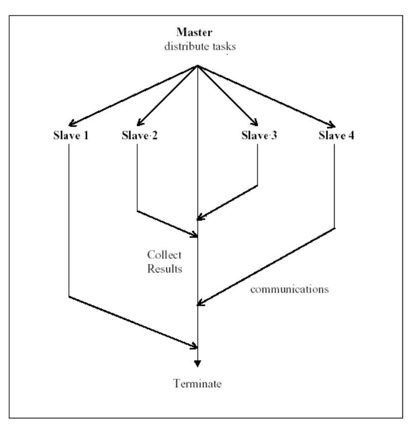

**Single-Program Multiple-Data:**

- Each process executes the same piece of code, but on different parts of the data
- Data is typically split among the available processors

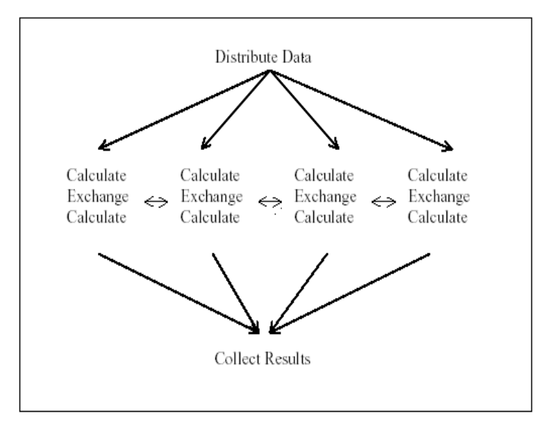

**Data Pipelining:** Suitable for applications involving multiple stages of execution, that typically operate on large number of data sets.
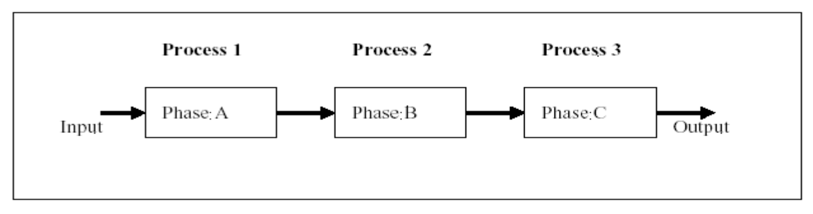

**Divide and Conquer:**

- A problem is divided into two or more sub problems, and each of these sub problems are solved independently, and their results are combined
- 3 operations: split, compute, and join
- Master-slave is like divide and conquer with master doing both split and join operation

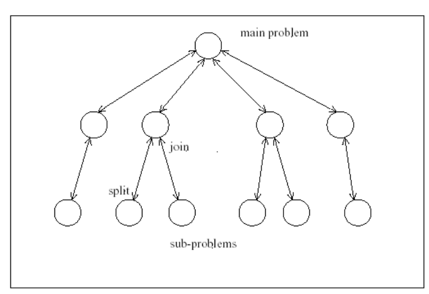

**Speculative Parallelism:**(Used when it is quite difficult to achieve parallelism through the previous paradigms)

- Problems with complex dependencies - use “look ahead “execution
- If the value of V is predictable, we can execute C speculatively using a predicted value in parallel with P.

    - If the prediction turns out to be correct, we gain performance since C doesn’t wait for P anymore.
    - If the prediction is incorrect (which we can find out when P completes), we have to take corrective action, cancel C and restart C with the right value of V again

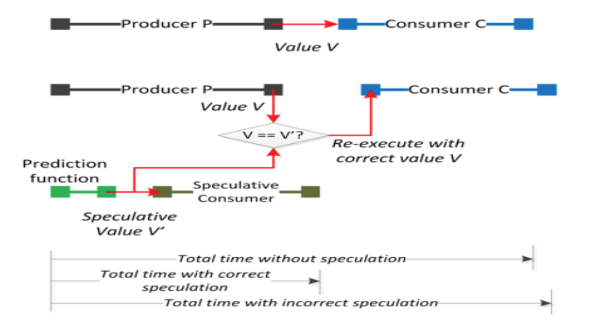

## Lecture 4

**Supercomputer:** any single computer system (itself a contested term) that has exceptional processing power for its time.

**High-performance computing (HPC):** any computer system whose architecture allows for above average performance. A system that is one of the most powerful in the world, but is poorly designed, could be a "supercomputer". _High-performance computing (HPC) is the use of super computers and parallel processing techniques for solving complex computational problems. A highly efficient HPC system requires a high-bandwidth, low-latency network to connect multiple nodes and clusters._

**Clustered computing:**

- Clustered computing is when two or more computers serve a single resource
- This improves performance and provides redundancy in case of failure system
- For example, there are a collection of smaller computers strapped together with a high-speed local network, although a low-speed network system could certainly be used.

**Parallel computing** refers to the submission of jobs or processes over multiple processors and by splitting up the data or tasks between them

**Cluster and Parellel:** With a cluster architecture, applications can be more easily parallelised across them. Parallel computing refers to the submission of jobs or processes over multiple processors and by splitting up the data or tasks between them._The core issue is that high performance compute clusters is just speed and power but also usage, productivity, correctness, and reproducibility_

**HPC Cluster Design:**
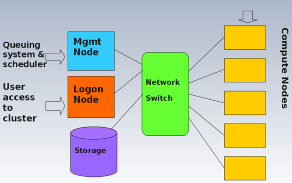

**Degree of parallelisation by using Flynn's Taxonomy of Computer
Systems:** each process is considered as the execution of a pool of instructions (instruction stream) on a pool of data (data stream)
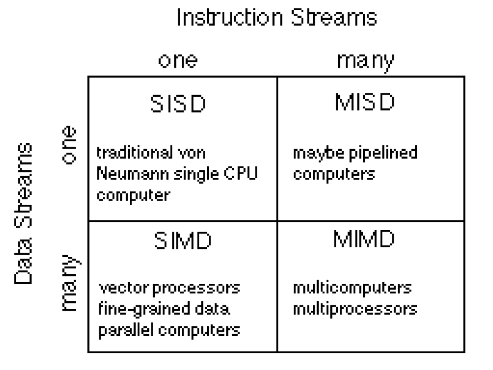

**Limitations of Parallel Computation:** Parallel programming and multicore systems should mean better performance

- Speedup (p) = Time (serial)/ Time (parallel)
- Correctness in parallelisation requires synchronisation (locking). Synchronisation and atomic operations causes loss of performance, communication latency.
- Amdahl's law, establishes the maximum improvement to a system when only part of the system has been improved. Gustafson and Barsis noted that Amadahl's Law assumed a computation problem of fixed data set size.

**Shared Memory Parallel Programming:** 

- multithreading programming, whereby a master thread forks a number of sub-threads and divides tasks between them. The threads will then run concurrently and are then joined at a subsequent point to resume normal serial application.
- One implementation of multithreading is OpenMP (Open Multi-Processing). It is an Application Program Interface that includes directives for multi-threaded, shared memory parallel programming.
- However, OpenMP is limited to a single system unit (no distributed memory) and is thread-based rather than using message passing.

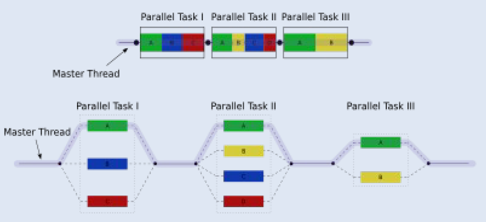

**Distributed Memory Parallel Programming:** MPI (Message Passing
Interface), along with implementation as OpenMPI. It leads to connecting several systems together to form clusters of computers to work together to solve a single computational workload.

- The core principle is that many processors should be able cooperate to solve a problem by passing messages to each through a common communications network
- However, it requires explicit programmer effort, The programmer is responsible for identifying opportunities for parallelism and implementing algorithms for parallelisation using MPI

**MPI Communication (Game):**  A very popular and basic use of MPI Send and Recv routines is a ping-ping program. Because it can be used to test latency within and between nodes and partitions if they have different interconnect (like on Spartan).

- **routines** here which manage the communication in the ping-pong activity

    - MPI_Status()
    - MPI_Request()
    - MPI_Barrier()
    - MPI_Wtime()

## Lecture 5

### NIST definition: “Cloud computing is a model for enabling ubiquitous, convenient, on-demand network access to a shared pool of configurable computing resources (e.g., networks, servers, storage, applications, and services) that can be rapidly provisioned and released with minimal management effort or service provider interaction.”

**The Most Common Cloud Models:**
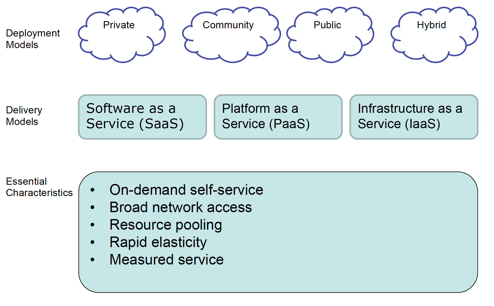

### Deployment Models

**Public Clouds:** Public clouds are the most common way of deploying cloud computing. The cloud resources (like servers and storage) are owned and operated by a third-party cloud service provider and delivered over the Internet. With a public cloud, all hardware, software and other supporting infrastructure are owned and managed by the cloud provider. In a public cloud, you share the same hardware, storage and network devices with other organisations or cloud “tenants”. You access services and manage your account using a web browser. Public cloud deployments are frequently used to provide web-based email, online office applications, storage, and testing and development environments

- Pros
    - Utilty computing
    - Can focus on core business
    - Cost-effective
    - “Right-sizing”
    - Democratisation of computing
- Cons
    - Security
    - Loss of control
    - Possible lock-in
    - Dependency of Cloud provider continued existence

**Private Clouds:** A private cloud consists of computing resources used exclusively by one business or organisation. The private cloud can be physically located at your organisation’s on-site data centre, or it can be hosted by a third-party service provider. But in a private cloud, the services and infrastructure are always maintained on a private network and the hardware and software are dedicated solely to your organisation. In this way, a private cloud can make it easier for an organisation to customise its resources to meet specific IT requirements. Private clouds are often used by government agencies, financial institutions and any other medium to large-sized organisations with business-critical operations seeking enhanced control over their environment.

- Pros
    - Control
    - Consolidation of resources
    - Easier to secure
    - More trust
- Cons
    - Relevance to core business? e.g. Netflix moved to Amazon
    - Staff/management overheads
    - Hardware obsolescence(outdated and no longer used)
    - Over/under utilisation challenges

**Hybrid Clouds:** In a hybrid cloud, data and applications can move between private and public clouds for greater flexibility and more deployment options. For instance, you can use the public cloud for high-volume, lower-security needs such as web-based email, and the private cloud (or other on-premises infrastructure) for sensitive, business-critical operations like financial reporting. In a hybrid cloud, “cloud bursting” is also an option. This is when an application or resource runs in the private cloud until there is a spike in demand (such as a seasonal event like online shopping or tax filing), at which point the organisation can “burst through” to the public cloud to tap into additional computing resources

- Pros
    - Cloud-bursting, Use private cloud, but burst into public cloud when needed
- Cons
    - How do you move data/resources when needed?
    - How to decide (in real time?) what data can go to public cloud?
    - Is the public cloud compliant with PCI-DSS (Payment Card Industry – Data Security Standard)?

### Delivery Models

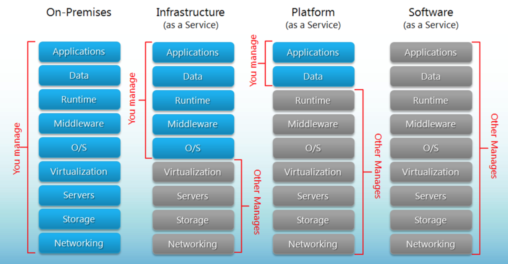

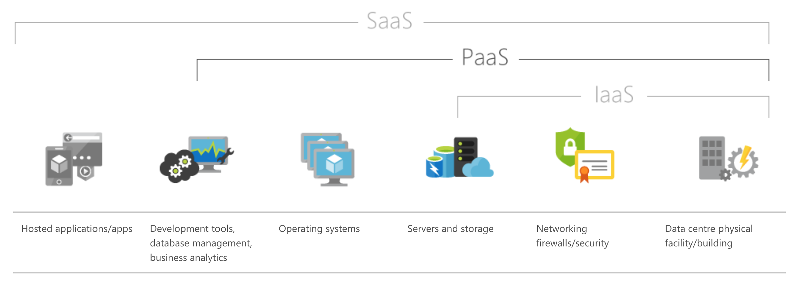

**Infrastructure as a service (IaaS):**

- Infrastructure as a service (IaaS) is an instant computing infrastructure, provisioned and managed over the Internet. Quickly scale up and down with demand, and only pay for what you use.
- IaaS helps you avoid the expense and complexity of buying and managing your own physical servers and other data centre infrastructure. Each resource is offered as a separate service component, and you only need to rent a particular one for as long as you need it. The cloud computing service provider manages the infrastructure, while you purchase, install, configure and manage your own software – operating systems, middleware and applications.
- For example, Website hosting, High-performance computing,Big data analysis

**Platform as a service (PaaS):**

- PaaS allows you to avoid the expense and complexity of buying and managing software licences, the underlying application infrastructure and middleware or the development tools and other resources. You manage the applications and services that you develop, and the cloud service provider typically manages everything else.
- For example, PaaS provides a framework that developers can build upon to develop or customise cloud-based applications.It has pre-coded application components built into the platform, such as workflow, directory services, security features, search and so on

**Software as a service (SaaS):**

- Software as a service (SaaS) allows users to connect to and use cloud-based apps over the Internet. Common examples are email(web-based email service such as Outlook, Hotmail or Yahoo! Mail), calendaring and office tools (such as Microsoft Office 365).
- SaaS provides a complete software solution that you purchase on a pay-as-you-go basis from a cloud service provider. You rent the use of an app for your organisation, and your users connect to it over the Internet, usually with a web browser. All of the underlying infrastructure, middleware, app software and app data are located in the service provider’s data centre. The service provider manages the hardware and software, and with the appropriate service agreement, will ensure the availability and the security of the app and your data as well. SaaS allows your organisation to get up and running quickly with an app, at minimal upfront cost.


****OpenStack** is a cloud operating system that controls large pools of compute, storage, and networking resources throughout a datacenter, all managed through a dashboard that gives administrators control while empowering their users to provision resources through a web interface. It makes horizontal scaling easy, which means that tasks that benefit from running concurrently can easily serve more or fewer users on the fly by just spinning up more instances.

**Automation:**

- Provides a record of what you did
- Codifies knowledge about the system
- Makes process repeatable
- Makes it programmable – “Infrastructure as Code”


**Classification of Scripting tools:**

- Cloud-focused, Only used to interact with Cloud services
    - Apache JClouds (Java-based - supports mulBple clouds)
    - Boto (Python – supports AWS and OpenStack)
    - OpenStackClient (Python - supports OpenStack)
    - CloudFormaBon (YAML/JSON - supports AWS, OpenStack Heat)
- Shell scripts
    - Bash
    - Perl
- Configuration management (CM) tools, refers to the process of systematically handling changes to a system in a way that it maintains integrity over time. Automation is the mechanism used to make servers reach a desirable state.
    - Chef (uses Ruby for creaBng cookbooks)
    - Puppet (uses its own configuraBon language)
    - Ansible (use YAML to express playbooks)
    - Fabric (Python library that uses SSH for applicaBon deployment and administraBon tasks)
    - Terraform, SaltStack, Docker, …


**Ansible:** Automation should not be more complex than the task(For example, to update thousands of instances)

- Ansible is a radically simple IT automation engine that automates cloud provisioning, configuration management, application deployment, intra-service orchestration, and many other IT needs.

****Playbooks** are Ansible’s configuration, deployment, and orchestration language.Playbooks are designed to be human-readable and are developed in a basic text language

#### Ansible: Structure

- Ansible scripts are called playbooks
- Scripts writen as simple YAML files
- Structured in a simple folder hierarchy

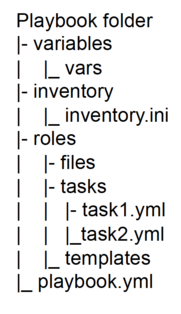

#### Ansible: Inventory

- Description of the nodes that can be accessed by Ansible
- By default, stored in .INI file
- Can be groupe

```
[webservers]
foo.example.com
bar.example.com

[dbservers]
one.example.com
two.example.com
three.example.com
```

#### Ansible: Playbooks

- Executed sequentially from a YAML file
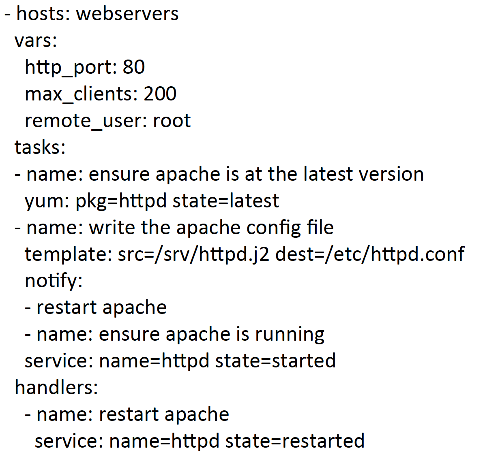

#### Ansible: Features

- Easy to learn
    - Playbooks in YAML, Templates in Jinja2, Inventory in .INI file
    - SequenBal execuBon
- Minimal requirements
    - No need for centralized management servers/daemons
    - Single command to install (pip install ansible)
    - Uses SSH to connect to target machine
- Idempotent (repeatable):
    - Executing N times no different to executing once
    - Prevents side-effects from re-running scripts
- Extensible:
    - Write your own modules
- Supports push or pull
    - Push by default but can use cron job to make it pull
- Rolling updates
    - Useful for continuous deployment/zero downtime deployment
- Inventory management
    - Dynamic inventory from external data sources
    - Execute tasks against host patterns
- Ansible Vault for encrypted data
- Ad-hoc commands
    - When you need to execute a one-off command against your inventory
        - e.g. ansible -i inventory_file -u ubuntu -m shell -a “reboot”
- Ansible Tower: Enterprise mission control for Ansible 
    - (Dashboard, System Tracker, etc)

## Lecture 6

### “Big data” Challenges and Architectures

**The four “Vs” :**

- Volume, refers to the amount of data
- Velocity,  refers to the speed of data processing
- Variety,refers to the number of types of data
- Veracity: the level of trust in the data accuracy (provenance); the more diverse sources you have, the more unstructured they are, the less veracity you have.

**Why DBMSs(database management system) for Distributed Environments:**

- Relational DBMSs rely on normalized data models to ensure consistency
- It makes sense to use DBMSs that are built upon data models that are not relational (tables and relationships amongst tables and the entities they describe)

**DBMSs for Distributed Environments:**

- A _key-value store_ is a DBMS that allows the retrieval of a chunk of data given a key: fast, but crude (e.g. Redis, PostgreSQL Hstore, Berkeley DB)
- A _BigTable_ DBMS stores data in columns grouped into column families, with rows potentially containing different columns of the same family (e.g. Google BigTable, Apache Accumulo)


- A _Document-oriented_ DBMS stores data as structured documents, usually expressed as XML or JSON (e.g. Apache CouchDB, MongoDB)

**The Tale of Two Clusters:**(1. spread over loads and horizontal scability  2. redunancy->one machine failed is not the end of word)

- Distributed databases are run over “clusters”, that is, sets of connected computers
- Clusters are needed to:
    - Distribute the computing load over multiple computers, e.g. to improve availability
    - Storing multiple copies of data, e.g. to achieve redundancy
- Consider two document-oriented DBMSs (CouchDB and MongoDB) and their typical cluster architectures

#### MongoDB Cluster Architecture

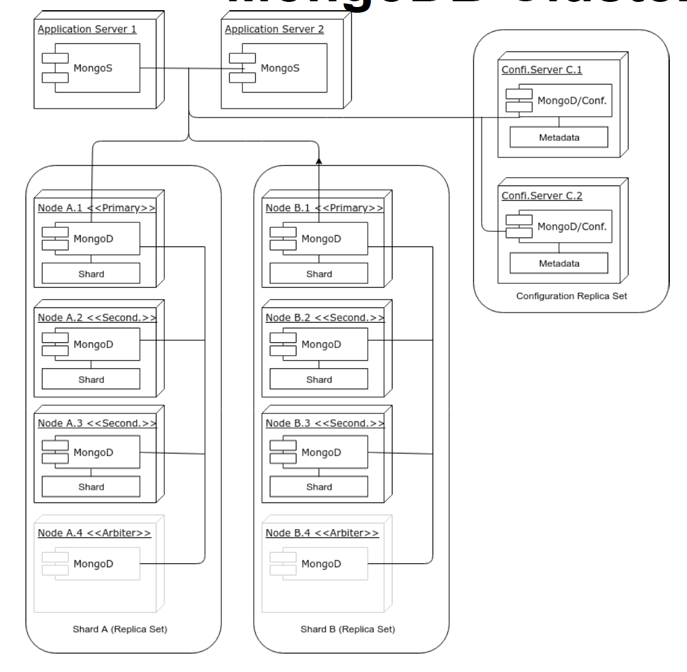
```
****MongoDB replica set and shard:**

- **replica set**
    - MongoDB replication stores multiple copies of data across 
    different databases in multiple locations, and thus protects data 
    when the database suffers any loss, increasesing data availability 
    by creating data redundancy.
    - A replica set consists of a group of mongod (read as Mongo D) 
    instances that host the same data set.(That is Node A.* in the 
    picture above)
    - In a replica set, the primary mongod receives all write operations 
    and the secondary mongod replicates the operations from the primary 
    and thus both have the same data set. The primary node receives 
    write operations from clients.
    - A replica set can have only one primary and therefore only one 
    member of the replica set can receive write operations
    - When the primary becomes unavailable, the replica set nominates a 
    secondary as the primary
    - Secondary members in a replica set asynchronously apply operations 
    from the primary
- **shard**
    - Sharding is taking a single logical data model and partitioning it 
    into disjoint subsets, ideally so that relationships between records 
    in the data model do not span a single "shard". In practice, a shard 
    is often an independent database instance. A simple example would be 
    sharding a database of people by last name such that names that 
    start with "a" are on shard 1, "b" are on shard 2, etc. Distributed 
    hash tables are a special case of sharding; all records can be 
    sharded but there will be no common relationship between records on 
    a particular shard.
    - The importance of sharding is that it can be a simple way to build 
    a scalable distributed database because each shard can be on a 
    different machine.
    - Conventional sharding has significant limits. If a data model 
    cannot be partitioned into disjoint sets then it often scales poorly
- **features of arbiters**
    - They DO NOT maintain a dataset
    -  Their primary function is to select the primary node
    - They do not store data and hence need no additional hardware
```

- Sharding is done at the replica set level, hence it involves more than 
one cluster (a shard is on top of a replica set)
- Only the primary node in a replica set answers write requests, but 
read requests can -depending on the specifics of the configuration- be 
answered by every node (including secondary nodes) in the set
- Updates flow only from the primary to the secondary
- If a primary node fails, or discovers it is connected to a minority of 
nodes, a secondary of the same replica set is elected as the primary
- Arbiters (MongoDB instances without data) can assist in breaking a tie 
in elections.
- Data are balanced across replica sets
- Since a quorum has to be reached, it is better to have an odd number 
of voting members (the arbiter in this diagram is only illustrative)

#### CouchDB Cluster Architecture

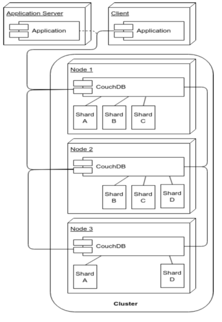

- All nodes answer requests (read or write) at the same time
- When a node does not contain a document (say, a document of Shard A is requested to Node 2), the node requests it from another node (say, Node 1)and returns it to the client
- Nodes can be added/removed easily, and their shards are re-balanced automatically upon addition/deletion of nodes
- In this example there are 3 nodes, 4 shards and a replica number of 2

#### MongoDB vs CouchDB Clusters

- MongoDB clusters are considerably more complex than CouchDB ones
- MongoDB clusters are less available, as - by default - only primary nodes can talk to clients for read operations, (and exclusively so for write operations)
- MongoDB software routers (MongoS) must be embedded in application servers, while any HTTP client can connect to CouchDB
- Some features (such as unique indexes or geo-spatial indexes) are not supported in MongoDB sharded environments
- Losing two nodes out of three in the CouchDB example architecture,means losing access to one quarter of data, while losing two nodes in the MongoDB example architecture implies losing access to half the data (although there are ten nodes in the cluster instead of three)

#### Brewer’s CAP Theorem

- Consistency: every client receiving an answer receives _the same answer_ from all nodes in the cluster
- Availability: every client receives _an answer_ from any node in the cluster
- Partition-tolerance: the cluster _keeps on operating_ when one or more nodes cannot communicate with the rest of the cluster

**pick any two...

#### CAP Theorem and the Classification of Distributed Processing Algorithms

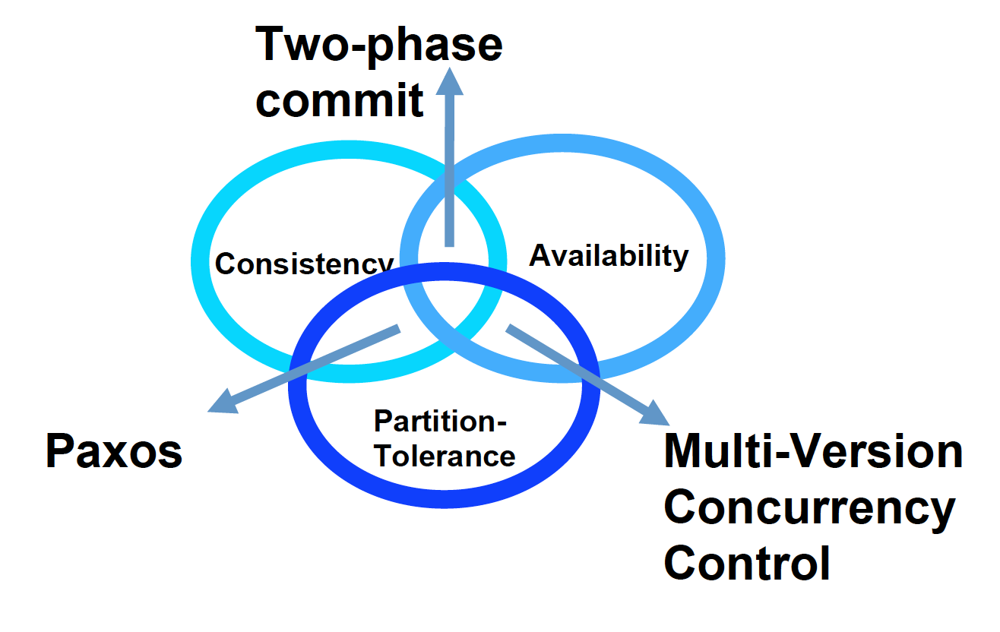

##### Consistency and Availability: Two phase commit

```
**As its name implies, the coordinator arranges activities and 
synchronization between distributed servers. Saving data changes is 
known as a commit and undoing changes is known as a rollback. The 
two-phase commit is implemented as follows:

- **Phase 1 - Each server that needs to commit data writes its data 
records to the log. If a server is unsuccessful, it responds with a 
failure message. If successful, the server replies with an OK message.

- **Phase 2 - This phase begins after all participants respond OK. Then, 
the coordinator sends a signal to each server with commit instructions. 
After committing, each writes the commit as part of its log record for 
reference and sends the coordinator a message that its commit has been 
successfully implemented. If a server fails, the coordinator sends 
instructions to all servers to roll back the transaction. After the 
servers roll back, each sends feedback that this has been completed.
```

- it enforces consistency by:
    - locking data that are within the transaction scope
    - performing transactions on write-ahead logs
    - completing transactions (commit) only when all nodes in the cluster have performed the transaction
    - aborts transactions (rollback) when a partition is detected
- procedure entails:
    - reduced availability (data lock, stop in case of partition)
    - enforced consistency (every database is in a consistent state, and all are left in the same state)

Therefore, two-phase commit is a good solution when the cluster is co-located, less then good when it is distributed

##### Consistency and Partition-Tolerance: Paxos

```
**Basic steps in Paxos:

- Elect a node to be a Leader / Proposer
- The Leader selects a value and sends it to all nodes (called Acceptors 
in Paxos) in an accept-request message. Acceptors can reply with reject 
or accept.
- Once a majority of the nodes have accepted, consensus is reached and 
the coordinator broadcasts a commit message to all nodes.
```

- driven by consensus, and is both partitiontolerant and consistent
- In Paxos, every node is either a proposer or an accepter :
    - a proposer proposes a value (with a timestamp)
    - an accepter can accept or refuse it (e.g. if the accepter receives a more recent value)
- when a proposer has received a sufficient number of acceptances (a quorum is reached), and a confirmation message is sent to the accepters with the agreed value
- Paxos clusters can recover from partitions and maintain consistency, but the smaller part of a partition (the part that is not in the quorum) will not send responses, hence the availability is compromised

##### Availability and Partition-tolerance: Multi-Version Concurrency Control (MVCC)

```
Multiversion Concurrency Control (MVCC) enables snapshot isolation. 
Snapshot isolation means that whenever a transaction would take a read 
lock on a page, it makes a copy of the page instead, and then performs 
its operations on that copied page. This frees other writers from 
blocking due to a read locks held by other transactions.

** snapshot: VMware snapshots copy a virtual machine disk file and can 
restore a virtual machine (VM) to a specific point in time if a failure 
occurs.
                 ^                ^                  ^
                 ^                ^                  ^
                 ^                ^                  ^
## An image of a virtual machine is (in simple words) a copy of the VM,
which may contain an OS, data files, and applications.
An image is a virtual hard disk (.vhd) file that is used as a  template
for creating a virtual machine. An image is a template because  it
doesn’t have the specific settings that a configured virtual machine 
has, such as the computer name and user account settings. If you want to
create multiple virtual machines that are set up the same way, you can
capture an image of a configured virtual machine and use that image as a
template

virtual images(snapshots)
```

- MVCC is a method to ensure availability (every node in a cluster always accepts requests), and some sort of recovery from a partition by reconciling the single databases with revisions (data are not replaced, they are just given a new revision number)
- In MVCC, concurrent updates are possible without distributed locks (in optimistic locking only the local copy of the object is locked), since the updates will have different revision numbers; the transaction that completes last will get a higher revision number, hence will be considered as the current value.
- In case of cluster partition and concurrent requests with the same revision number going to two partitioned nodes, both are accepted, but once the partition is solved, there would be a conflict. Conflict that would have to be solved somehow (CouchDB returns a list of all current conflicts, which are then left to be solved by the application).
- MVCC relies on monotonically increasing revision numbers and, crucially, the preservation of old object versions to ensure availability (i.e. when an object is updated, the old versions can still be read).

#### Document-oriented DBMS for Big data

Relational DBMSs(fine-grained data)---->>ensuring consistency and availability using normalization but less partition-tolerant than coarse-grained data

- Relational data model, including a person table, a telephone table, an email table
- Document-oriented database, one document type only, with telephones numbers, email addresses, etc., nested as arrays in the same document

#### MongoDB vs CouchDB Clusters

- While CouchDB uses MVCC, MongoDB uses a hybrid two-phase commit (for replicating data from primary to secondary nodes) and Paxos-like in supporting network partition strategies
- MongoDB, a network partition may segregate a primary into a partition with a minority of nodes. When the primary detects that it can only see a minority of nodes in the replica set, the primary steps down and becomes a secondary. Independently, a member in the partition that can communicate with a majority of the nodes (including itself) holds an election to become the new primary.

#### Sharding

- Sharding is the partitioning of a database “horizontally”, i.e. the database rows (or documents) are partitioned into subsets that are stored on different servers. Every subset of rows is called a shard.
- Usually the number of shards is larger than the number of _replicas(number of copies of single data)_, and the number of nodes is larger than the replica number(A replica set contains several data bearing nodes and optionally one arbiter node, nodes including primary node and secondary and arbiter node)
- Main advantage of a sharded database,  improvement of performance through the distribution of computing load across nodes and easier to move data files around, e.g. when adding new nodes to the cluster
- different sharding strategies:
  - _Hash sharding_: to distribute rows evenly across the cluster
  - _Range sharding_: similar rows (say, tweets coming for the same area) that are stored on the same node (or subset of nodes)

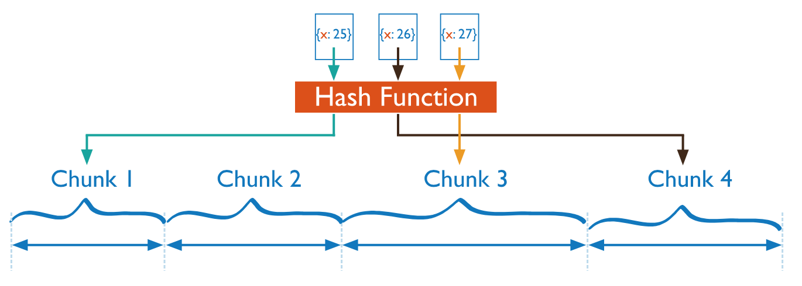
---
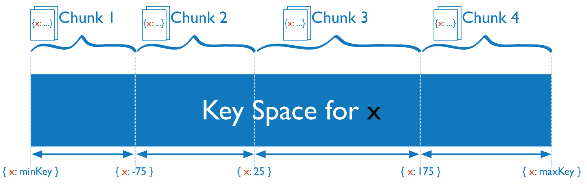

#### Replication and Sharding

- Replication is the action of storing the same row (or document) on different nodes to make the database fault-tolerant.
- Replication and sharding can be combined with the objective of _maximizing availability while maintaining a minimum level of data safety(any failure)_.

### MapReduce Algorithms

- Particularly suited to parallel computing of the Single-Instruction, Multiple-Data type
- [The first step (Map), distributes data across machines(machine for map, distributed load to clusers/computers), while the second (Reduce) hierarchically summarizes them until the result is obtained.](https://www.quora.com/How-does-Map-Reduce-exactly-work-And-what-functions-run-on-which-machines-architecturally)
- Apart from parallelism, its advantage lies in _moving the process to where data are_, greatly reducing network traffic.
- it is horizontally scalable

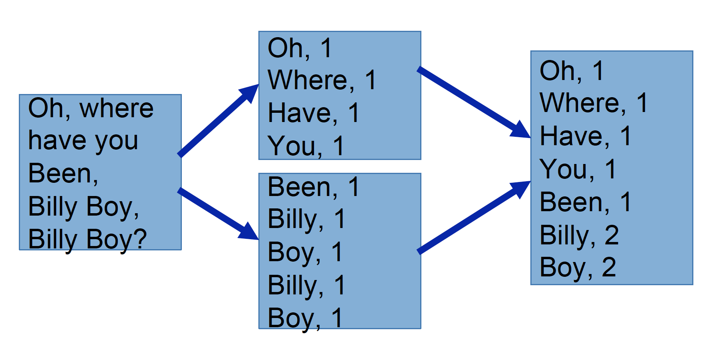

****More specific**


### Introduction to CouchDB

#### CouchDB Main Features

- Document-oriented DBMS, where documents are expressed in JavaScript Object Notation (JSON)
- HTTP ReST API
- Web-based admin interface
- Web-ready: since it talks HTTP and produces JSON (it can also produce HTML or XML), it can be both the data and logic tier of a three-tier application, hence avoiding the marshaling and unmarshaling of data objects
- Support for MapReduce algorithms, including aggregation at different levels
- avaScript as the default data manipulation language
- Run Mango queries (MongoDB query language), which can use indexes for better performance
- Schema-less data model with JSON as the data definition language
- Support for replication
- Support for sharding
- Support for clustering

##### Database

- A CouchDB instance can have many databases; each database can have its own set of functions, and can be stored in different shards
- In every CouchDB instance there are system databases. These are prefixed by underscore, such as _users

##### Querying a CouchDB Database

Two mechanisms to select a set of _documents (json structure, including multiple types of data)_ that exhibit certain features

- MapReduce Views: results of MapReduce processes that are written as B-tree indexes to disk and become part of the database. Views are fast, but inflexible and use a lot of storage. Views are used for a number of reasons, including:

```
    - Indexing and querying data from stored objects
    - Producing lists of data on specific object types
    - Producing tables and lists of information based on your stored data
    - Extracting or filtering information from the database
    - Calculating, summarizing or reducing the information on a collection of stored data
```

- Mango Queries: queries expressed in JSON, following the MongoDB queries syntax (Mango queries can also use B-tree indexes to speed-up computations)(For example, Json will retrieves all the indexes from the database)

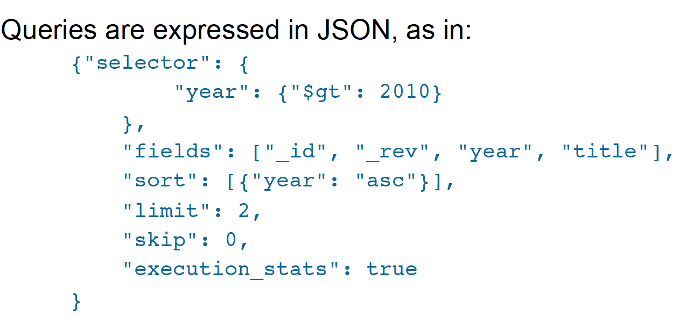

- Mango Indexes,to speed-up queries, Mango can use B-tree indexes on attributes

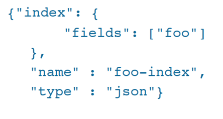
##### Views

- views are not influenced by the state of the system
    - defined in languages other than JavaScript
    - cannot be passed custom parameters, either during computation or during selection
    - Computation of views can be influenced only by the document itself
- this ensures consistency of results

##### List and Show Functions

Views are limited, since they can produce only JSON and cannot
change their behavior. To address these shortcomings, CouchDB offers List and Show functions

- Both these two classes of functions can modify their behavior when HTTP request parameters are sent, and both can produce non-JSON output
- List functions transform a view into a list of something (can be a list of HTML ```<li>``` tags, or a list of ```<doc>``` XML tags.
- Show functions transform an entire document into something else (like an entire HTML page).
- To sum up:
    - Show functions are applied to the output of a single document query
    - List functions are applied to the output of Views
    - List and Show functions can be seen as the equivalent of JEE servlets


## Lecture 7

### Introduction to SOA (Service-oriented architecture)

**What's in an Architecture?**

- A system architecture is the way different software components are distributed on computing devices, and the way in which they interact with each other
- standard graphic way, UML deployment diagram, which is diagrams used to describe the physical components (hardware), their distribution, and association.

```
**Service-Oriented Architecture: A service-oriented architecture is a 
style of software design where services are provided to the other 
components by application components, through a communication protocol 
over a network. The basic principles of service-oriented architecture 
are independent of vendors, products and technologies. 

A service is a discrete unit of functionality (independent functionality)
that can be accessed remotely and acted upon and updated independently, 
such as retrieving a credit card statement online.

A service has four properties from SOA:
- It logically represents a business activity with a specified outcome.
- It is self-contained.
- It is a black box for its consumers.
- It may consist of other underlying services.

Different services can be used in conjunction to provide the 
functionality of a large software application. Service-oriented 
architecture is less about how to modularize an application, and more 
about how to compose an application by integrating distributed, 
separately-maintained and deployed software components. It is enabled by 
technologies and standards that make it easier for components to 
communicate and cooperate over a network, especially an IP network.

```


**Why SOA?**

- When an architecture is completely contained within the same machine, components communicate through function calls or object instantiations. However, when components are distributed, function calls and object instantiations cannot always be used directly.
- Services are often used for this. Every system in a SOA should be considered as autonomous, but network-reachable and inter-operable through services._

**SOA Core Ideas:**

- _A set of services_ that a business wants to provide to their customers, partners, or other areas of an organization
- _An architectural pattern_ that requires a service provider, mediation, and service requestor with a service description
- _A set of architectural principles, patterns and criteria_ that address characteristics such as modularity, encapsulation, loose coupling, separation of concerns, reuse and composability
- _A programming model_ complete with standards, tools and technologies that supports web services, ReST services or other kinds of services
- _A middleware solution_ optimized for service assembly, orchestration, monitoring, and management

**SOA Principles:**

- Standardized service contract: Services adhere to a communications agreement, as defined collectively by one or more service-description documents.
- Service loose coupling: Services maintain a relationship that minimizes dependencies and only requires that they maintain an awareness of each other.
- Service abstraction: Beyond descriptions in the service contract, services hide logic from the outside world.
- Service reusability: Logic is divided into services with the intention of promoting reuse.
- Service autonomy: Services have control over the logic they encapsulate.
- Service statelessness: Services minimize resource consumption by deferring the management of state information when necessary.
- Service discoverability: Services are supplemented with communicative meta data by which they can be effectively discovered and interpreted.
- Service composability: Services are effective composition participants, regardless of the size and complexity of the composition
- Service granularity: A design consideration to provide optimal scope at the right granular level of the business functionality in a service operation.
- Service normalization: Services are decomposed and/or consolidated to a level of normal form to minimize redundancy. In some cases, services are denormalized for specific purposes, such as performance optimization, access, and aggregation.
- Service location transparency: The ability of a service consumer to invoke a service regardless of its actual location in the network.

**SOA for the Web:** (Web services can implement a service-oriented architecture)

- Two main flavors
    - ReSTful Web Services
    - SOAP/WS
- Both uses HTTP, hence can run over the web (although SOAP/ WS can run over other protocols as well)
- They are by far the most used (especially ReST) but not the only ones:
    - Geospatial services
    - Health services
    - SDMX

```
RESTful is architectural style  and SOAP is protocol, both are used to 
access web services. Web services as the exchange of SOAP-based messages 
between systems and REST is a type of web service in which the user 
simply accesses a URL, and the response is a straight XML document

SOAP provides the envelope for sending Web Services messages over the 
Internet. SOAP use XML (Extensible Markup Language) over HTTP 
as the intermediate language for exchanging data between applications.
(https://www.guru99.com/soap-simple-object-access-protocol.html)

These SOAP messages move from one system to another, usually via HTTP. 
The receiving system interprets the message, does what it's supposed to 
do, and sends back a response in the form of another SOAP message.

Universal Resource Identifiers (URI) in REST and are used through the 
header operations of HTTP. HTTP is the protocol used in REST. The HTTP 
requests are used in order to read and write data. The four methods 
which are GET, PUT, POST and DELETE are used in REST based web services. 
Therefore, the HTTP protocol is used by REST in order to perform the 
four operations which are create, read, update and delete (CRUD). In 
order to interact with the resource the standard methods of HTTP are 
used. The use of different methods present in HTTP protocol are used for 
the following purpose; GET method is used to retrieve the required 
resource, POST method is used to create the resource successfully, in 
order to update the resource PUT method is used and to remove the resource that is no more required can be removed using the method known as DELETE. 


```

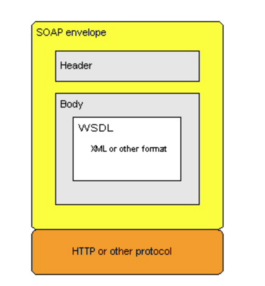
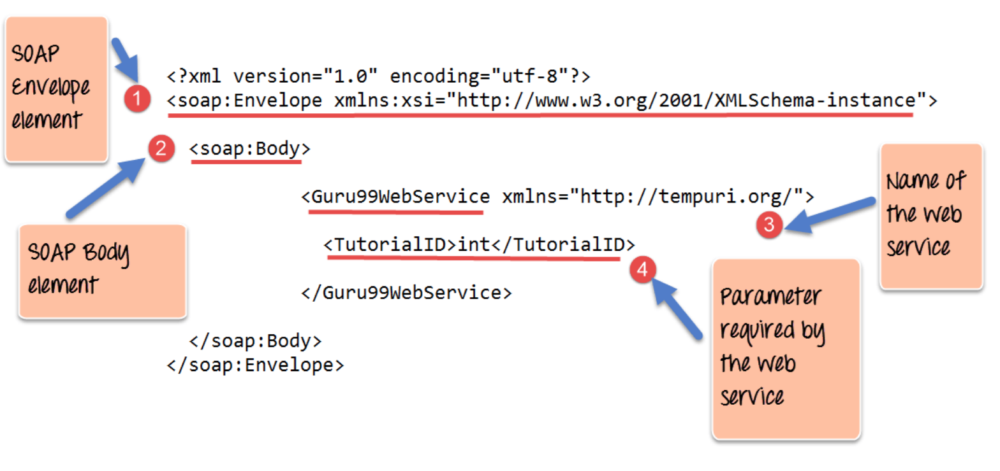
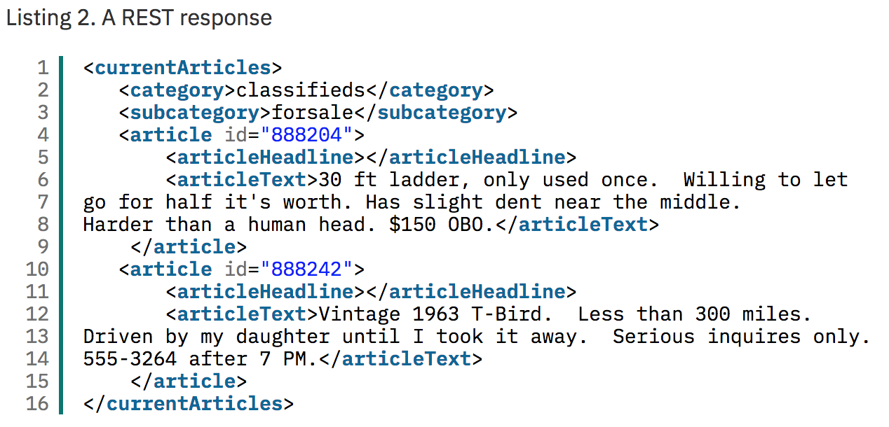

#### SOAP/WS vs ReST

- Two different architectural design to call services over HTTP
- SOAP/WS is built upon the paradigm of the Remote Procedure Call; practically, a language independent function call that spans another system
- ReST is centered around resources, and the way they can be manipulated (added, deleted, etc.) remotely
- ReST is more of a style of using HTTP than a separate protocol, while SOAP/WS is a stack of protocols that covers every aspect of using a remote service, from service discovery, to service description, to the actual request/response
- ReST makes use of the different HTTP Methods (GET, POST, PUT, DELETE, etc)


##### SOAP

```
**UDDI: The idea was to provide a way for companies to register their 
services in a global registry, and search that global registry for 
services they may be interested in using
```

- UDDI: The Uniform Description Discovery and Integration is a protocol to access a registry of services
- WS-* (web service specifications on top of others) Refers to additional attendant standards for SOAP web services

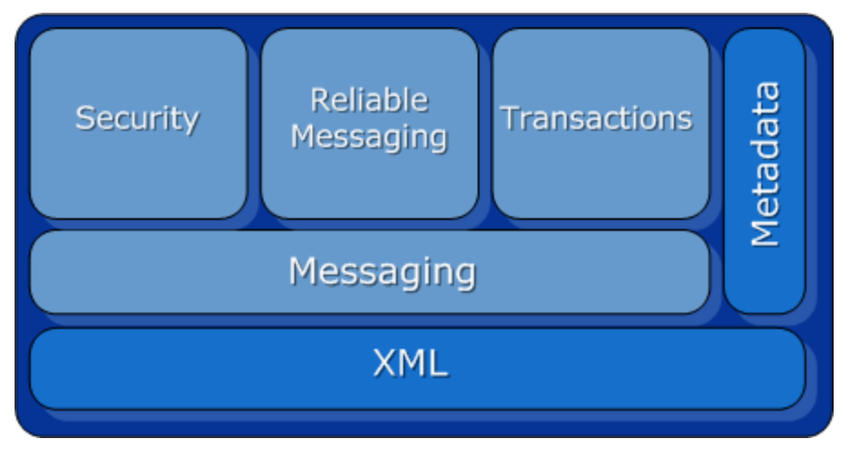

- These extensions(UDDI and WS-*) go in the SOAP headers for additional functionality
- WSDL: The _Web Services Description Language_ is an XML based interface description language that is used for describing the functionality offered by a web service.
- WSDL provides a machine-readable description of how the service can be called, what parameters it expects, and what data structures it returns. (NOTE: WSDL defines ports, but these are service ports -endpoints- not to be confused with HTTP ports -which are numbers.)

### The OGC Stack

The OpenGIS Consortium (OGC) is a non-profit group of organizations (companies, universities, state agencies, etc.) that share the common goal of defining standards for all things geo-spatial,e.g data with geographic information. It defined a set of standards that _define a family of SOAPbased web-services to support access to geo-spatial data_

OGC web-services cover different ways of interacting with geo-spatial data:

- Finished maps (as the ones you see on Google Maps)
- Vector data (just the geometry, in practice a collection of points)
- Raster data (a mathematical matrix)
- Metadata (information about the geo-spatial data available)

---
For each of this ways, there is one or more OGC Services:

- Finished maps: WMS, WMTS, SLD
- Vector data: WFS, FE
- Raster data: WCS
- Metadata: CSW
- Processing (remote execution/computation on data): WPS

#### Vector data

The relevant service for dealing with vector data is WFS (Web Feature Service), which allows the selection of geospatial data using their location and/or their contents.

```
**
Web Feature Service (WFS) Interface Standard provides an interface 
allowing requests for geographical features across the web using 
platform-independent calls

One can think of geographical features as the "source code" behind 
a map, whereas the WMS interface or online tiled mapping portals like 
Google Maps return only an image, which end-users cannot edit or 
spatially analyze
```

In OGC-speak, a feature is a vector description of a geographic object and associated data (say: the location of a restaurant, its name, address,type, etc). A set of homogeneous features is a feature type (say, all the restaurants).

Interaction with a WFS data source with following steps:

- Retrieving the list of feature types available from that service
- Retrieving information (metadata,which is "location" and etc) about a feature type
- Retrieving the actual data(data for location,127 lect st,xxxx)

##### Vector Data Selection in WFS

WFS is a SOAP-style of Web Service, and it makes heavy use of XML to request services and to represent returned data (although returned data can be expressed in other format, such as JSON).

Interaction translate into WFS requests:

- Retrieving the list of feature types available: GetCapabilities
- Retrieving information about a feature type: DescribeFeatureType
- Retrieving the actual data: GetFeatur

** AURIN QGIS play as WFS Client

### ReST

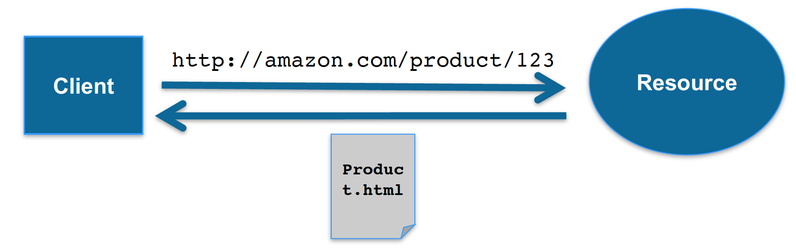

1. Client requests Resource through Identifier (URL)
2. Server/proxy sends representation of Resource
3. This puts the client in a certain state.(Change from request state to obtain state)
4. Representation contains URLs allowing navigation.
5. Client follows URL to fetch another resource.
6. This transitions client into yet another state.
7. Representational State Transfer!

** each link is representation of different pages(which is state)

#### Resource-Oriented Architecture (ROA)

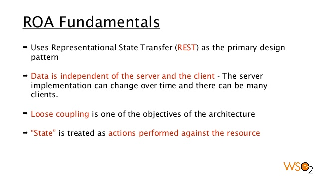

```

A resource-oriented architecture (ROA) is the structural design 
supporting the internetworking of resources. A resource is any entity 
that can be identified and assigned a uniform resource identifier (URI)

These resources are software components (discrete pieces of code and/or 
data structures) which can be reused for different purposes. ROA design 
principles and guidelines are used during the phases of software 
development and system integration.

REST takes a resource-based approach to web-based interactions. With REST,
you locate a resource on the server, and you choose to either update that 
resource, delete it or get some information about it.

With SOAP, the client doesn't choose to interact directly with a resource,
but instead calls a service, and that service mitigates access to the 
various objects and resources behind the scenes.

```

A ROA is a way of turning a problem into a RESTful web service: an arrangement of URIs, HTTP, and XML that works like the rest of the Web

To make it ROA, user might:

- want to create a hypertext link to it
- make or refute assertions about it
- retrieve or cache a representation of it
- include all or part of it by reference into another representation
- annotate it
- or perform other operations on it

##### Mapping Actions to HTTP Methods

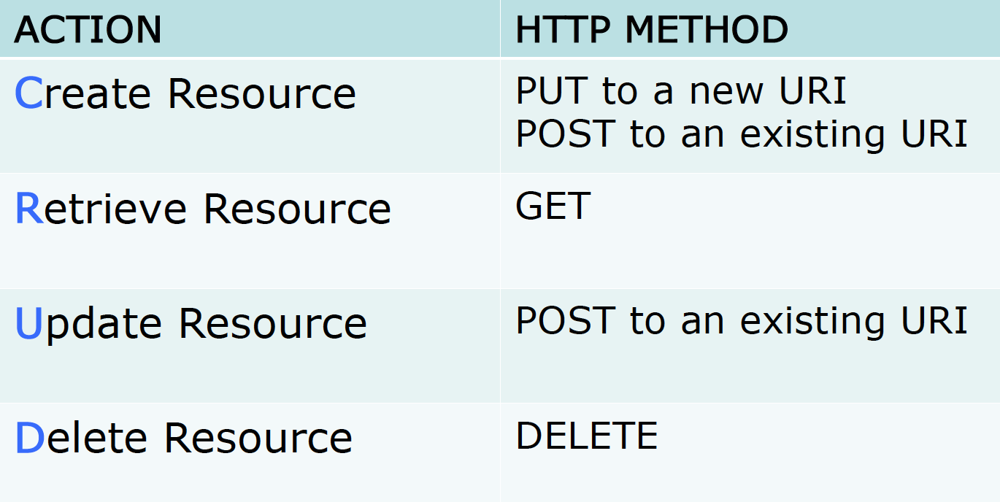

- PUT should be used when target resource url is known by the client
- POST should be used when target resource URL is server generated.

##### A Generic ROA Procedure
 
1. Figure out the data set
2. Split the data set into resources and for each kind of resource:
3. Name the resources with URIs
4. Expose a subset of the uniform interface
5. Design the representation(s) accepted from the client
6. Design the representation(s) served to the client
7. Integrate this resource into existing resources, using hypermedia links and forms to link these resources( basic ReST)

##### ReST Best Practices

- Keep your URIs short – and create URIs that don’t change.
- URIs should be opaque identifiers that are meant to be discovered by following hyperlinks, not constructed by the client.
- Use nouns, not verbs in URLs

```
The URI generic syntax consists of a hierarchical sequence of five 
components:

URI = scheme:[//authority]path[?query][#fragment]

authority = [userinfo@]host[:port]

Examples of URI:

           userinfo      host      port
          ┌───┴──┐ ┌──────┴──────┐ ┌┴┐
  https://john.doe@www.example.com:123/forum/questions/?tag=networking&order=newest#top
  └─┬─┘   └─────────────┬────────────┘└───────┬───────┘ └────────────┬────────────┘ └┬┘
 scheme             authority               path                   query         fragment

  ldap://[2001:db8::7]/c=GB?objectClass?one
  └─┬┘   └─────┬─────┘└─┬─┘ └──────┬──────┘
 scheme    authority  path       query

  mailto:John.Doe@example.com
  └──┬─┘ └─────────┬────────┘
  scheme         path

```

- Make all HTTP GETs side-effect free. Doing so makes the request "safe".
- Use links in your responses to requests! Doing so connects your response with other data. It enables client applications to be "self-propelled". That is, the response itself contains info about "what's the next step to take". Contrast this to responses that do not contain links. Thus, the decision of "what's the next step to take" must be made out-of-band.
- Minimize the use of query strings. For example:

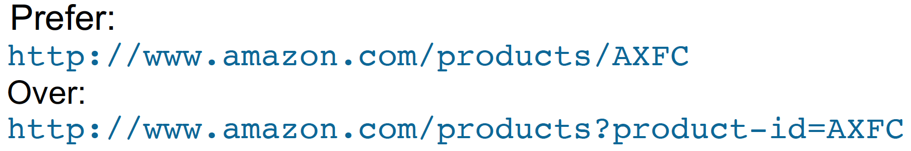

- Use HTTP status codes to convey errors/success
- In general, keep the REST principles in mind. In particular:
    - Addressability
    - Uniform Interface
    - Resources and Representations instead of RPC
    - HATEOAS(Including hypermedia links with the responses)

##### Uniform Interface

Four more constraints:

- Identification of Resources: All important resources are identified by one (uniform) resource identifier mechanism (hyperlinks internally)
- Manipulation of Resources through representations: Each resource can have one or more representations, application/xml, application/json, text/html, etc. Clients and servers negotiate to select representation.
- Self-descriptive messages: Requests and responses contain not only data but additional headers describing how the content should be handled. Such as if it should be cached, authentication requirements, etc. Access methods (actions) mean the same for all resources (universal semantics)

##### HATEOAS

- Hyper Media as the Engine of Application State
- Resource representations contain links to identified resources
- links make interconnected resources navigable
- without navigation, identifying new resources is servicespecific (SOAP)
- RESTful applications navigate instead of calling

##### HTTP Methods

- Safe methods: Don't change the resource on the server side. For example using a GET or a HEAD request on a resource URL should NEVER change the resource. Safe methods can be cached and prefetched without any repercussions or side-effect to the resource
- Idempotent methods: These are methods which are safe from multiple calls i.e. they produce same result irrespective of how many times you call them. They change the resource in Server every time you call them but the end result is always same

```
int i = 30; // idempotent

i++; // not idempotent
```

- GET, OPTIONS, HEAD – Safe
- PUT, DELETE – Idempotent
- POST – Neither safe nor idempotent


### Versioning Systems

- Managing changes to documents, computer programs, large web sites, and other collections of information
- Work simultaneously on big projects and keep track of changes
- Be able to simply revert back to a specific checkpoint/milestone in any project
- Create necessary redundancy by duplicating codes and resources to avoid data loss

#### Types of Code Versioning Systems

- Local (Revision Control System (RCS))
    - Storing the difference between these files(different versions) in a database. However, only single developer work
- Centralised (Concurrent Versions System (CVS), Subversion (SVN), Vesta)
    - Any local machine can check out any version of these files from the central server and uploaded back (aka committing) to central server. However, outage would stop collaboration
- Decentralised (Git, Mercurial, Bitbucket )


## Lecture 8

**Challenges of Big Data Analytics:**

- Reading and writing distributed datasets
- Preserving data in the presence of failing data nodes
- Supporting the execution of MapReduce tasks
- Being fault-tolerant (a few failing compute nodes may slow down the processing, but not stop it)
- Coordinating the execution of tasks across a cluster

### Apache Hadoop

Started as a way to distribute files over a cluster and execute MapReduce tasks, and additional tools added for further functionality

#### Hadoop Distributed File System (HDFS)

The core of Hadoop is a fault tolerant file system that has been explicitly designed to span many nodes.

HDFS blocks are much larger than blocks used by an ordinary file system (4 kB versus 128 MB)

- Reduced need for memory to store information about where the blocks are (metadata)
- More efficient use of the network (with a large block, a reduced number of connections need to be kept open)
- Reduced need for seek operations on big files
- Efficient when most data of a block have to be process (reduce overheads)

```

HDFS implement a distributed file system that provides high-performance
access to data across highly scalable Hadoop clusters.

1.When HDFS takes in data, it breaks the information down into separate
blocks and distributes them to different nodes in a cluster, thus
enabling highly efficient parallel processing.

2. The file system replicates, or copies, each piece of data multiple
times and distributes the copies to individual nodes, placing at least
one copy on a different server rack than the others. As a result, the
data on nodes that crash can be found elsewhere within a cluster. This
ensures that processing can continue while data is recovered.
(fault-tolerant)

3.The HDFS architecture consists of clusters, each of which is accessed
through a single NameNode software tool installed on a separate machine
to monitor and manage the cluster's file system and user access
mechanism. The other machines install one instance of DataNode to manage
cluster storage.


**Fault tolerance is the property that enables a system to continue 
operating properly in the event of the failure

```

#### HDFS Architecture

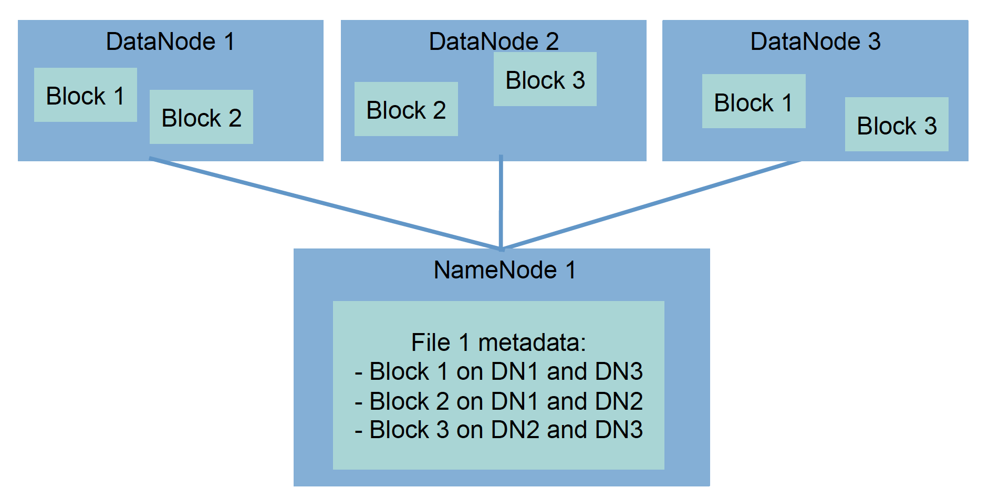

A HDFS file is a collection of blocks stored in _datanodes_,
with metadata (such as the position of those blocks) that is
stored in _namenodes_

#### Hadoop Resource Manager (YARN)

- The other main component of Hadoop is the MapReduce task manager, YARN (Yet Another Resource Negotiator)
- YARN deals with executing MapReduce jobs on a cluster. It is composed of a _central Resource Manager (on the master)_ and _many Node Managers that reside on slave machines_.
- Every time a MapReduce job is scheduled for execution on a Hadoop cluster, YARN starts an Application Master that negotiates resources with the Resource Manager and starts Containers on the slave nodes (Based on allocated resources (containers) ApplicationMaster request NodeManager to start Containers, resulting in executing task on a node.)

```
All resource utilization on a particular node is taken care by Node
Manager. Resource manager looks at overall cluster resource, and
application manager manages progress of application.

1. NodeManagers take instructions from the ResourceManager and manage
resources available on a single node.

2.ApplicationMasters are responsible for negotiating resources with the
ResourceManager and for working with the NodeManagers to start the
containers.
```

#### Apache Spark

##### Why Spark?

- While Hadoop MapReduce works well, it is geared towards performing relatively simple jobs on large datasets.
- However, when complex jobs are performed (say, machine learning or graph-based algorithms), there is a _strong incentive for caching data in memory and in having finer-grained control on the execution of jobs_.
- Apache Spark was designed to _reduce the latency inherent in the Hadoop approach for the execution of MapReduce jobs_.
- Spark can operate within the Hadoop architecture, using YARN and Zookeeper to manage computing resources, and storing data on HDFS.

```
Hadoop Mapreduce vs Spark

The key difference between them lies in the approach to processing: 
Spark can do it in-memory, while Hadoop MapReduce has to read from and 
write to a disk. As a result, the speed of processing differs 
significantly – Spark may be up to 100 times faster. However, the 
volume of data processed also differs: Hadoop MapReduce is able to work 
with far larger data sets than Spark.

Tasks Hadoop MapReduce is good for:
- Linear processing of huge data sets. Hadoop MapReduce allows parallel 
processing of huge amounts of data. It breaks a large chunk into smaller 
ones to be processed separately on different data nodes and 
automatically gathers the results across the multiple nodes to return a 
single result. In case the resulting dataset is larger than available 
RAM, Hadoop MapReduce may outperform Spark.

- Economical solution, if no immediate results are expected. Our Hadoop 
team considers MapReduce a good solution if the speed of processing is 
not critical. For instance, if data processing can be done during night 
hours, it makes sense to consider using Hadoop MapReduce

Tasks Spark is good for:
- Fast data processing. In-memory processing makes Spark faster than 
Hadoop MapReduce – up to 100 times for data in RAM and up to 10 times 
for data in storage.

- Iterative processing. If the task is to process data again and again – 
Spark defeats Hadoop MapReduce. Spark’s Resilient Distributed Datasets 
(RDDs) enable multiple map operations in memory, while Hadoop MapReduce 
has to write interim results to a disk.

- Near real-time processing. If a business needs immediate insights, 
then they should opt for Spark and its in-memory processing.

- Graph processing. Spark’s computational model is good for iterative 
computations that are typical in graph processing. And Apache Spark has 
GraphX – an API for graph computation.

-Machine learning. Spark has MLlib – a built-in machine learning library,
while Hadoop needs a third-party to provide it. MLlib has out-of-the-box 
algorithms that also run in memory. Besides, there is a possibility of 
tuning and adjusting them.

- Joining datasets. Due to its speed, Spark can create all combinations 
faster, though Hadoop may be better if joining of very large data sets 
that requires a lot of shuffling and sorting is needed.

**In-memory processing means data stored in RAM for processing

```

#### Spark Architecture

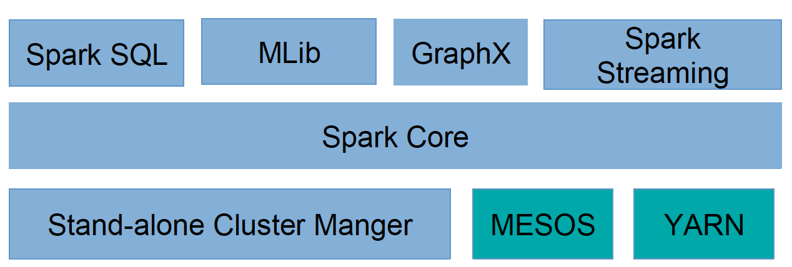

- Spark is mostly written in Scala.the APIs of Spark can be accessed by different languages: R, Python, Java
- Scala is a multi-paradigm language (both functional and object-oriented) that runs on the Java Virtual Machine and can use Java libraries and Java objects.

#### Spark Runtime Architecture

Applications in Spark are composed of different components including:

- **Job**: is the overall processing that Spark is directed to perform by a driver program

```
The job is parallel computation consisting of multiple tasks that get 
spawned in response to actions in Apache Spark.
```

- **Task**: is a single transformation operating on a single partition of data on a single node

```
A task is a unit of work that is sent to the executor. Each stage has 
some task, one task per partition. The Same task is done over different 
partitions of RDD.
```

- **Stage**: is a set of tasks operating on a single partition
- **Executors**: the processes in which tasks are executed
- **Cluster Manager**: the process assigning tasks to executors

```
Spark relies on cluster manager to launch executors and in some cases, 
even the drivers are launched through it
```

- **Driver program**: the main logic of the application

```
The main() method of the program runs in the driver. The driver is the 
process that runs the user code that creates RDDs, and performs 
transformation and action, and also creates SparkContext. When the Spark 
Shell is launched, this signifies that we have created a driver program. 
On the termination of the driver, the application is finished.

The driver program splits the Spark application into the task and 
schedules them to run on the executor
```

- A Job is composed of more than one stage when data are to be transferred amongst nodes (shuffling)
- The fewer the number of stages, the faster the computation (shuffling data across the cluster is slow)

- **Spark application**: Driver program + Executors

```
The Spark application is a self-contained computation that runs 
user-supplied code to compute a result.
```

- **Spark Context**: the general configuration of the job
    - 

```
Works of Spark Context are:
- Getting the current status of spark application
- Canceling the job
- Canceling the Stage
- Running job synchronously
- Running job asynchronously
- Accessing persistent RDD
- Unpersisting RDD
- Programmable dynamic allocation
```

##### Local Mode

In local mode, every Spark component runs within the same
JVM. However, the Spark application can still run in parallel,
as there may be more than one executor active. (Local mode
is good when developing/debugging)

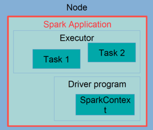
```
 In this non-distributed single-JVM deployment mode, Spark spawns all 
 the execution components - driver, executor, LocalSchedulerBackend, and 
 master - in the same single JVM
```
##### Cluster Mode

In cluster mode, every component, including the driver program, is executed on the cluster; hence, upon launching, the job can run autonomously. This is the common way of running non-interactive Spark jobs.
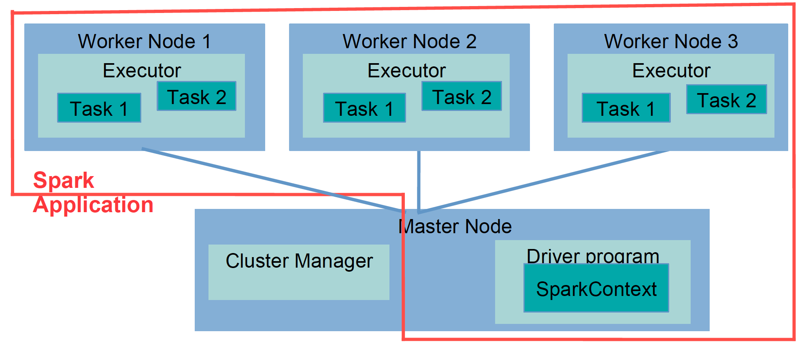

##### Client Mode

In client mode, the driver program talks directly to the executors on the worker nodes. Therefore, the machine hosting the driver program has to be connected to the cluster until job completion. Client mode must be used when the applications are interactive, as happens in the R, Python or Scala Spark shells.
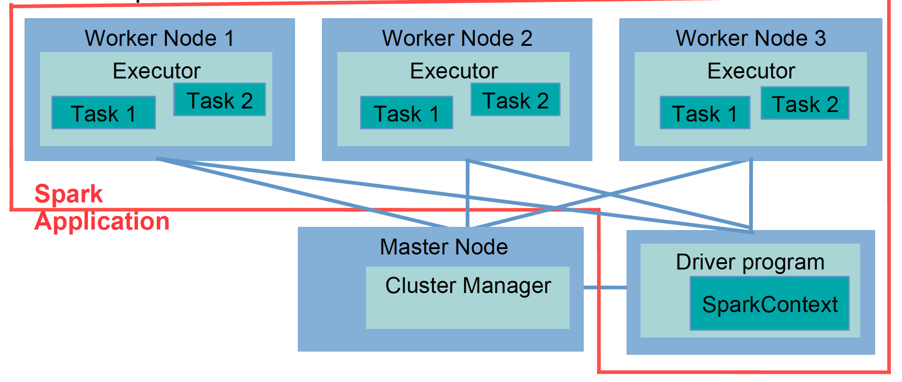

##### Spark Context

- The deployment mode is set in the Spark Context, which is also used to set the configuration of a Spark application, including the cluster it connects to in cluster mode.
- Spark Contexts can also be used to tune the execution by setting the memory, or the number of executors to use.

#### Resilient Distributed Dataset

```
- Resilient Distributed Datasets (RDD) is a fundamental data structure
of Spark.
- It is an immutable distributed collection of objects. Each dataset in
RDD is divided into logical partitions, which may be computed on different nodes of the cluster.
- Formally, an RDD is a read-only, partitioned collection of records.
```

Resilient Distributed Datasets (RDDs) are the way data are stored in Spark during computation, and understanding them is crucial to writing programs in Spark:

- Resilient (data are stored redundantly, hence a failing node would not affect their integrity)
- Distributed (data are split into chunks, and these chunks are sent to different nodes)
- Dataset (a dataset is just a collection of objects, hence very generic)

##### How to build an RDD

```
1. Parallelized collection (parallelizing)
RDDs are generally created by parallelized collection i.e. by taking an
existing collection in the program and passing it to SparkContext’s
parallelize() method.


scala> val no = Array(1, 2, 3, 4, 5,6,7,8,9,10)

scala> val noData = sc.parallelize(no)


2. External Datasets (Referencing a dataset)
Distributed dataset can be formed from any data source supported by 
Hadoop, including the local file system, HDFS, Cassandra, HBase etc. In 
this, the data is loaded from the external dataset.

scala> val data = sc.textFile("data.txt")

```

##### Properties of RDDs

- RDDs are immutable, once defined, they cannot be changed (this greatly simplifies parallel computations on them, and is consistent with the functional programming paradigm)
- RDDs are transient, they are meant to be used only once, then discarded (but they can be cached, if it improves performance)
- RDDs are lazily-evaluated, the evaluation process happens only when data cannot be kept in an RDD, as when the number of objects in an RDD has to be computed, or an RDD has to be written to a file (these are called actions), but not when an RDD are transformed into another RDD (these are called transformations)

## Lecture 9

```
A Virtual Machine Monitor/Hypervisor (VMM) is a software program that 
enables the creation, management and governance of virtual machines (VM) 
and manages the operation of a virtualized environment on top of a 
physical host machine.VMM manages the backend operation of these VMs by 
allocating the necessary computing, memory, storage and other 
input/output (I/O) resources.VMM also provides a centralized interface 
for managing the entire operation, status and availability of VMs that 
are installed over a single host or spread across different and 
interconnected hosts
```

- Virtual Machine Monitor/Hypervisor
    - The environment of the VM should appear to be the same as the physical machine
    - Minor decrease in performance only
    - Appears as though in control of system resources
- Virtual Machine: A representation of a real machine using hardware/software that can host a guest operating system
- Guest Operating System: An operating system that runs in a virtual machine environment that would otherwise run directly on a separate physical system

```
Guest OS is what you have created in the virtual machine and host is 
what your laptop or pc actually run. Host OS uses the actual hardware 
for the working whereas the Guest OS uses the virtual hardware like 
number of cores and type and size of hard drive defined by the user 
while adding a virtual machine.

Guest and Host OS works on the configurations used by you, if you user 
higher amount of cores/ threads in setting your virtual machine the 
Guest OS will get higher speed.

**I installed  Virtual Machine say VirtualBox (hypervisor) and then 
deployed a centos and a redhat os inside that as guest OS.

```

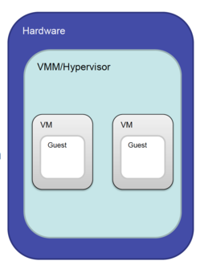

### What Happens in a VM

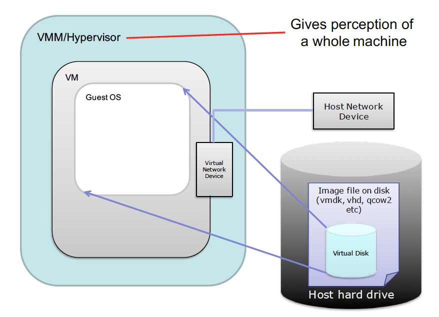

- VMDK (Virtual Machine Disk): is a file format that describes containers for virtual hard disk drives to be used in virtual machines (virtual disk)

```
Th descriptor file describes the size and geometry of the virtual disk 
file
```

- VHD (virtual disk)

```
VHD (Virtual Hard Disk) is a file format which represents a virtual hard 
disk drive (HDD). It may contain what is found on a physical HDD, such 
as disk partitions and a file system, which in turn can contain files 
and folders. It is typically used as the hard disk of a virtual machine.
```

- qcow2 (QEMU Copy On Write) file format for disk image files used by QEMU. It uses a disk storage optimization strategy that delays allocation of storage until it is actually needed.

### Motivation

- Server Consolidation
    - Increased utilisation
    - Reduced energy consumption
- Personal virtual machines can be created on demand
    - No hardware purchase needed
    - Public cloud computing
- Security/Isolation
    - Share a single machine with multiple users
- Hardware independence
    - Relocate to different hardware


### Classification of Instructions

- Privileged Instructions: instructions that trap to use the real os if the processor is in user mode and do not trap in kernel mode(which means instructions only works in kernel mode)

```
If there are any instructions that could alter some parts of OS or any 
of your resources ,IO systems ,they are marked “PRIVILEGED”

If user gives privileged instructions, then it is traped
If kernel gives privileged instructions, then it is not traped
```

- Sensitive Instructions: instructions whose behaviour depends on the mode or configuration of the hardware
    - Different behaviours depending on whether in user or kernel mode
        - e.g. POPF interrupt (for interrupt flag handling)
```
Sensitive Instructions are protected instructions as they provide
control over hardware resource allocation. Virtual machines should not
be allowed to execute these instructions directly because they can introduce unfairness

Executing	    Real Processor Mode	    Action

privileged	        user	         traps to real os
privileged	        privileged	 executes fully
sensitive	        user	         executes (reduced) effect (no trap)
sensitive	        privileged	 executes (full) effect

```

- Innocuous Instructions: instructions that are neither privileged nor sensitive. Instructions does not change or affect system configuration or resources. A efficient VMM allows   the direct execution of the instructions.
    - Read data, add numbers etc

### Popek and Goldberg's Theorem

 For any conventional third-generation computer, an effective VMM may be constructed if the set of sensitive instructions for that computer is a subset of the set of privileged instructions.

 ```
 Intuitively, the theorem states that to build a VMM it is sufficient 
 that all instructions that could affect the correct functioning of the 
 VMM (sensitive instructions) always trap and pass control to the VMM. 
 This guarantees the resource control property. Non-privileged 
 instructions must instead be executed natively (i.e., efficiently). The 
 holding of the equivalence property also follows.

 ```

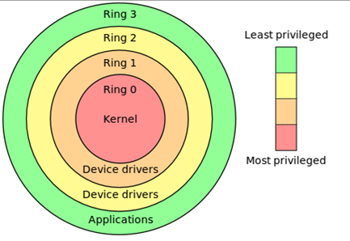

```

Most modern operating systems use level 0 for the kernel/executive, and 
use level 3 for application programs. Any resource available to level n 
is also available to levels 0 to n, so the privilege levels are rings. 
When a lesser privileged process tries to access a higher privileged 
process, a General Protection Fault is reported by the OS.

Programs that run in Ring 0 can do anything with the system, and code 
that runs in Ring 3 should be able to fail at any time without impact to 
the rest of the computer system. Ring 1 and Ring 2 are rarely used
```

- Ring 0 is the level with the most privileges and interacts most directly with the physical hardware such as the CPU and memory
- Ring 1: Typically device drivers

```
A driver provides a software interface to hardware devices, enabling 
operating systems and other computer programs to access hardware 
functions
```

### Typical Virtualisation Strategy

**VMM needs to support:**

**De-privileging:**

- VMM emulates the effect of privileged instructions whose execution traps into the VMM(similar to OS).If the privileged instructions happens in GuestOS, then VMM trap it and emulate the function of the privileged instruction using handler to execute it or not based on privileges.(trap-and-emulate)
- Running GuestOS at a lower hardware priority level than the VMM


**Primary/shadow structures:**

- VMM maintains “shadow” copies of critical structures whose “primary” versions are manipulated by the Guest OS, e.g. memory page tables
- Primary copies needed to insure correct versions are visible to Guest OS

**Memory traces:**

- Controlling access to memory so that the shadow and primary structure remain coherent
- Common strategy: write-protect primary copies so that update operations cause page faults which can be caught, interpreted, and addressed

### Aspects of VMMs

#### Full virtualisation vs Para-virtualisation

##### Full virtualisation

 Full virtualization requires that every salient feature of the hardware be reflected into one of several virtual machines – including the full instruction set, input/output operations, interrupts, memory access, and whatever other elements are used by the software that runs on the bare machine, and that is intended to run in a virtual machine. In such an environment, any software capable of execution on the raw hardware can be run in the virtual machine and, in particular, any operating systems.

- allow an unmodified guest OS to run in isolation by simulating full hardware (e.g. VMWare)
- Guest OS has no idea it is not on physical machine

**Advantages:**

- Guest is unaware it is executing within a VM
- Guest OS need not be modified
- No hardware or OS assistance required
- Can run legacy OS

**Disadvantages:**

- can be less efficient, may trap a lot of thing

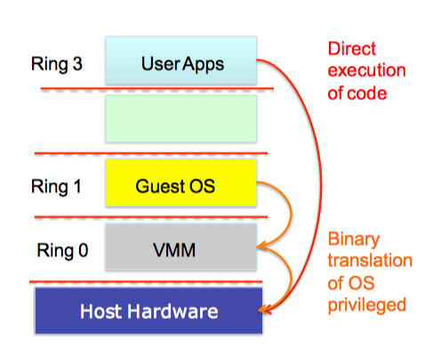

- VMM run Ring 0
- Apps run in Ring 3
- Virtualisation (Guest OS) uses extra rings; VMM traps privileged instructions and translates to hardware specific instructions

##### Para-virtualisation

- VMM/Hypervisor exposes special interface to guest OS for better performance. Requires a modified/hypervisoraware Guest OS (e.g. Xen)
- Paravirtualization is virtualization in which the guest operating system (the one being virtualized) is aware that it is a guest and accordingly has drivers that, instead of issuing hardware commands, simply issue commands directly to the host operating system.

**Advantages:**

- Lower virtualisation overheads, so better performance, e.g. Xen

**Disadvantages:**

- Need to modify guest OS
- Less portable
- Less compatibility

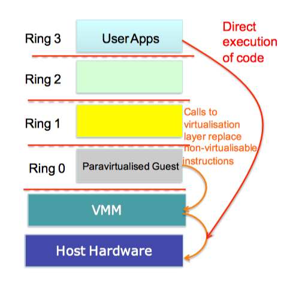

#### Hardware-assisted Virtualization vs Binary Translation

##### Hardware-assisted virtualisation

Hardware-assisted virtualization changes the access to the operating system itself.  x86 operating systems are designed to have direct access to system resources to run. With software virtualization the VMM emulates the required hardware to the operating system. With hardware-assisted virtualization the operating system has direct access to resources without any emulation or OS modification.(e.g KVM)

- New processors typically have this
- Requires that all sensitive instructions trappable

**Advantages:**

- Good performance
- Easier to implement
- Advanced implementation supports hardware assisted DMA, memory virtualisation, …

**Disadvantages:**

- Needs hardware support

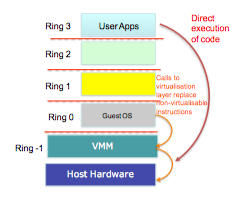

- New Ring -1 supported Page tables, virtual memory management, DMA for high speed reads etc

##### Binary Translation

Trap and execute occurs by scanning guest instruction stream and replacing sensitive instructions with emulated code (e.g. VMWare)

```
It translates kernel code (privileged instructions) to replace 
nonvirtualizable instructions with new sequences of instructions that 
have the intended effect on the virtual hardware.

So the privileged instructions are translated into other instructions, 
which access the virtual BIOS, memory management, and devices provided 
by the Virtual Machine Monitor, instead of executing directly on the 
real hardware.
```

```
*** Privileged and sensitive instructions and trap
A machine has at least two modes (a) user mode and (b) system mode. 
Typically, applications run in user mode and the operating system runs 
in system mode. In system mode, the code/program can see and manipulate 
the machine without restrictions. In user mode, the code/program has 
some limitations in what it can do, e.g. it can't access all of the 
machine's memory without acquiring permission first.

Instructions are either (a) privileged or (b) not privileged. Privileged 
instructions trap when executed in user mode. Trapping means that the 
machine is forced into system mode whereby it executes some code of the 
operating system to deal with the situation. In a sense, they alert the 
operating system when executed.

Instructions can also be either (a) sensitive or (b) not sensitive. 
Sensitive instructions modify part of the machine's resources, or, 
exhibit different behaviour depending if they are executed in user mode 
or system mode.
```

**Advantage:**

- Guest OS need not be modified
- No hardware or OS assistance required
- Can run legacy OS

**Disadvantages:**

- Overheads
- Complicated
- Need to replace instructions “on-the-fly”
- Library support to help this, e.g. vCUDA

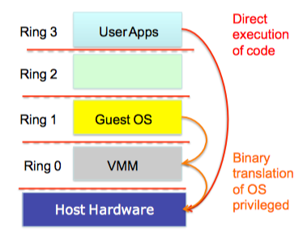

#### Bare Metal Hypervisor vs Hosted Virtualization

##### Bare Metal Hypervisor

VMM runs directly on actual hardware

- Boots up and runs on actual physical machine
- VMM has to support device drivers, all hardware management

##### Hosted Virtualisation

VMM runs on top of another operating system

#### Operating System Level Virtualization

A type of server virtualization technology which works at the OS layer. The physical server and single instance of the operating system is virtualized into multiple isolated partitions, where each partition replicates a real server. The OS kernel will run a single operating system and provide that operating system functionality to each of the partitions.

```
tailoring a standard operating system so that it can run different 
applications handled by multiple users on a single computer at a time. 
The operating systems do not interfere with each other even though they 
are on the same computer.

 the operating system is altered so that it operates like several 
 different, individual systems. The virtualized environment accepts 
 commands from different users running different applications on the 
 same machine. The users and their requests are handled separately by 
 the virtualized operating system.
```

- Lightweight VMs
- Instead of whole-system virtualisation, the OS creates mini-containers
- Example, LXC, Docker, OpenVZ, FreeBSD Jails etc

**Advantages:**

- Lightweight
- Many more VMs on same hardware
- Can be used to package applications and all OS dependencies into container

**Disadvantages:**

- Can only run apps designed for the same OS
- Cannot host a different guest OS
- Can only use native file systems
- Uses same resources as other containers

#### Memory Virtualisation

Conventionally page tables store the logical page number -> physical page number mappings

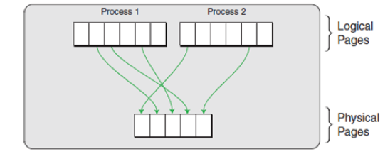

**in a VM**

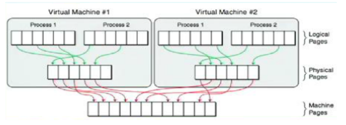

#### Shadow Page Tables

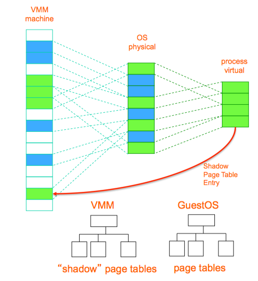

- VMM maintains shadow page tables in lock-step with the page tables
- Adds additional management overhead
- Hardware performs guest -> physical and physical -> machine translation

```

Shadow page tables are used and maintained by the VMM to keep track of
the state in which the guest "thinks" its page tables should be.
The guest can't be allowed access to the host hardware page tables
because then it would essentially have control of the machine.
the VMM keeps the "real" mappings (guest virtual -> host physical)in the
hardware when the relevant guest is executing, and keeps a
representation of the page tables that the guest thinks it's using "in
the shadows,"

```

### OpenStack

OpenStack is a collection of open source technologies delivering a massive scalable cloud operating system. Often used through web-based dashboards, through command-line tools, or programmatically through ReSTful APIs.OpenStack software controls cloud

### Containerization

#### Virtualization vs Containerization

- The many advantages of virtualizaDon, such as applicaDon containment and horizontal scalability, come at a cost: resources. The guest OS and binaries can give rise to duplicaDons between VMs wasDng server processors, memory and disk space and limiDng the number of VMs each server can support.
- ContainerizaDon allows virtual instances to share a single host OS (and associated drivers, binaries, libraries) to reduce these wasted resources since each container only holds the applicaDon and related binaries. The rest are shared among the containers.

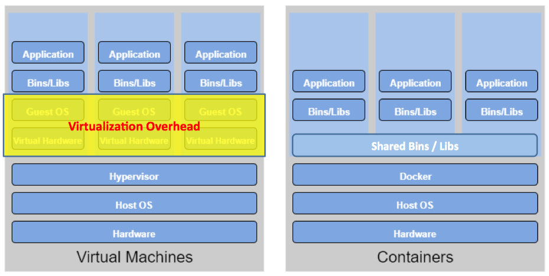
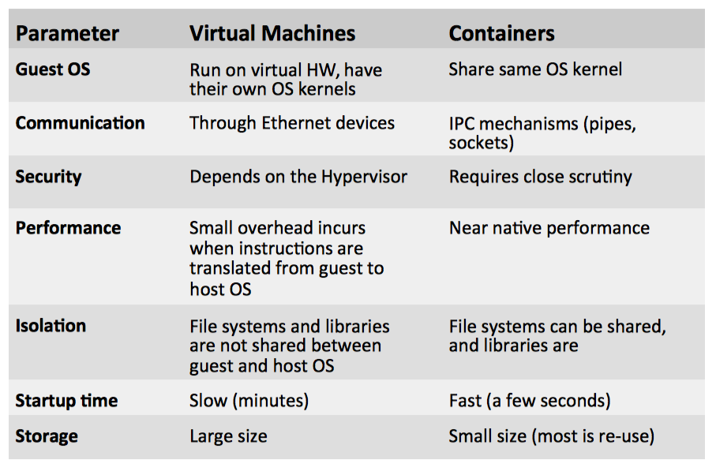

When deploying applicaDons on the cloud, the base computaDon unit is a Virtual Machine. Usually Docker containers are deployed on top of VMs.

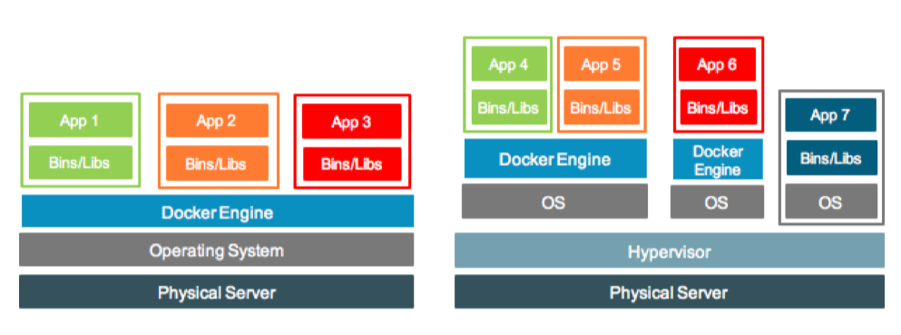

##### Are Containers better than VMs?

Depends on:

- The size of the task on hand
- The life span of the applicaDon
- Security concerns
- Host operation system, e.g. running Docker on Windows servers

##### What is a Container?

- Similar concept of resource isolation and allocation as a virtual machine.
- Without bundling the entire hardware environment and full OS.
- Container technologies: Rocket (rkt), LxD, Docker ...
- Docker is currently the leading software container platform

##### What are Container Orchestration Tools?

Container orchestration technologies provides a framework for integrating and managing containers at scale

- Simplify container management processes
- Help to manage availability and scaling of containers

### Docker

It uses resource isolation features of the Linux kernel to allow independent “containers” to run within a single Linux instance.

#### Docker Nomenclature

- **Container:** a process that behaves like an independent machine, with its own operaDng system, file system, network interfaces and applications.
- **Image:** a blueprint for a container, a container is an instance of an image.
- **Dockerfile:** the recipe to create an image. Every instrucDon in the recipe is a layer that is stored independently, so that only changed layers need to be re-run or transferred, the rest will be cached.
- **Docker registry:** a repository of Docker images. The most important one is the Docker Hub (hips://hub.docker.com)
- **Docker Compose:** Compose is a tool for defining and running multi-containers Docker applicaDons. With Compose you can create and start all services from a pre-defined YAML configuraDon file.

#### Manage Data in Docker

By default all files created inside a container are stored on a writable container layer.

- Data doesn’t persist when a container is no longer running.
- It is difficult to move the data out of a container.
- It is also difficult to move the data into a container.

Docker has two options for containers to store files in the host machine, so that the files are persisted even after the container stops.

- Docker volumes (Managed by Docker, /var/lib/docker/volume/)
- Bind mounts (Managed by user, any where on the file system)

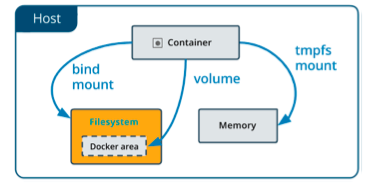

#### Networking

- Network mode “host”: every container uses the host network stack; which means all containers share the same IP address, hence ports cannot be shared across containers (Linux only, not for Mac or Windows)
- With the “bridge” option, containers can re-use the same port, as they have different IP addresses, and expose a port of their own that belongs to the hosts, allowing the containers to be somewhat visible from the outside.

Lecture 12

### Security and Clouds

#### Technical Challenges

- Authentication
- Authorization
- Audit / Accounting
- Confidentiality
- Privacy
- Fabric management
- Trust

#### Non Technical Challenges

- Single sign-on
- Auditing
- Deletion
- Liability
- Licensing
- Workflows
- The Ever Changing Technical/Legal Landscape