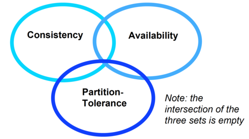

# Cluster and Cloud Computing

## Contents

- [Lecture 1](#lecture-1)
- [Lecture 3](#lecture-3)
- [Lecture 4](#lecture-4)
- [Lecture 5](#lecture-5)
- [Lecture 6](#lecture-6)

---

## Lecture 1

**Computing and Communication Technologies (r)evolution: 1960-:**


- **Centralised system:** Single physical (centralised) system. All resources (processors, memory and storage) fully shared and tightly coupled within one integrated OS
- **Parallel system:** All processors (_each processor in all the processors_)either tightly coupled with centralised shared memory or loosely coupled with _distributed memory_(refer to pictures below). Interprocess communication through shared memory or throughsome form of message passing


- **Distributed system:** Multiple autonomous computers with their own private memory, communicating through some form of message passing over a computer network
- **Cloud computing:** It is distributed computing over a network and has the ability to run a program on many connected computers at the same time.

**Cloud Characteristics:**

- _On-demand self-service_: A consumer can provision computing capabilities as needed without requiring human interaction with each service provider.
- _Networked access_: Capabilities are available over the network and accessed through standard mechanisms that promote use by heterogeneous client platforms.
- _Resource pooling_: The provider's computing resources are pooled to serve multiple consumers using a multi-tenant model potentially with different physical and virtual resources that can be dynamically assigned and reassigned according to consumer demand.
- _Rapid elasticity_: Capabilities can be elastically provisioned and released, in some cases automatically, to scale rapidly upon demand.
- _Measured service_: Cloud systems automatically control and optimize resource use by leveraging a metering capability at some level of abstraction appropriate to the type of service.

**Grid Architecture:**


## Lecture 3

**Compute Scaling:**

- _Vertical Computational Scaling_ (quality,improving performance of processors): Have faster processors, Limits of fundamental physics/matter (nanoCMOS)
- _Horizontal Computational Scaling_(quantity of processors): Have more processors (Easy to add more, cost increase not so great,but harder to design, develop, test, debug, deploy, manage, understand)

**ADD MORE:**

- Single machine multiple cores
- Loosely coupled cluster of machines (Pooling/sharing of resources)
- Tightly coupled cluster of machines (Typical HPC/HTC set-up,SPARTAN)
- Widely distributed clusters of machines
- Hybrid combinations of the above


- **T(1)** = time for serial computation
- **T(N)** = time for N parallel computations
- **S(N)** = speed up
- Proportion of speed up depends on parts of program that can’t be parallelised

**Amdahl's Law:**


- If 95% of the program can be parallelized, the theoretical maximum speedup using parallel computing would be 20×, no matter how many processors are used
- If the non-parallelisable part takes 1 hour, then no matter how many cores you throw at it it won’t complete in <1 hour.

****Overheads:** overhead is any combination of excess or indirect computation time, memory, bandwidth, or other resources that are required to perform a specific task (It's like when you need to go somewhere, you might need a car. But, it would be a lot of overhead to get a car to drive down the street, so you might want to walk. However, the overhead would be worth it if you were going across the country.)


**Gustafson-Barsis's Law:** programmers tend to set the size of problems to use the available equipment to solve problems within a practical fixed time. _Faster (more parallel) equipment available, larger problems can be solved in the same time_

**Computer Architecture:**

- CPU for executing programs
- Memory that stores/executing programs and related data
- I/O systems (keyboards, networks, …)
- Permanent storage for read/writing data into out of memory(hard disk)
- Balance of all of these
- different ways to design/architect computers


### Approaches for Parallelism
**Explicit vs Implicit Parallelisation:**

- _Implicit Parallelism_: Supported by parallel languages and parallelizing compilers that take care of identifying parallelism, the scheduling of calculations and the placement of data
- _Explicit Parallelism_:the programmer is responsible for most of the parallelization effort such as task decomposition, mapping tasks to processors, inter-process communications

**Hardware Parallelisation:**


- Cache: much faster than reading/writing to main memory,instruction cache, data cache (multilevel) and translation lookaside buffer used for virtual-physical address translation

Parallelisation by adding extra CPU to allow more instructions to be processed per cycle.


Multiple cores that can process data and perform computational tasks in parallel(L1 cache on single cores; L2 cache on pairs of cores; L3 cache
shared by all cores, (higher hit rates
but potentially higher latency))


Two (or more) identical processors connected to a single, shared main memory, with full access to all I/O devices, controlled by a single OS instance that treats all processors equally. Each processor executes different programs and works on different data but with capability of sharing common resources (memory, I/O device, …). Processors can be connected in a variety of ways: buses, crossbar switches, meshes. More complex to program since need to program both for CPU and inter-processor communication (bus).


**Non-uniform memory access (NUMA)** provides speed-up by allowing a processor to access its own local memory faster than non-local memory. Improved performance as long as data are localized to specific processes/processors. Key is allocating memory/processors to avoid scheduling/locking and (expensive) inter-processor communication

**OS Parallelism:**

- parallel(real parallel) vs interleaved semantics(context switch)
- Compute parallelism (Native threads, Fork, Spawn, Join; Green threads Scheduled by a virtual machine instead of natively by the OS)
- Data parallelism(Caching)

**Software Parallelism:**

- Deadlock – processes involved constantly waiting for each other
- Livelock – processes involved in livelock constantly change with regard to one another, but none are progressing

**Message Passing Interface:**(message passing in parallel
systems)


Data Parallelism


**Distribution system challenges:** A distributed system is one in which the failure of a computer you didn't even know existed can render your own computer unusable (**Assumptions)

****Bandwidth:** Bandwidth is the capacity of a wired or wireless network communications link to transmit the maximum amount of data from one point to another over a computer network or internet connection in a given amount of time -- usually one second.

****Topology:** A network topology is the arrangement of a network, including its nodes and connecting lines. There are two ways of defining network geometry: the physical topology and the logical (or signal) topology.

- physical topology: the actual geometric layout of workstations(star or ring network)
- some networks are physically laid out in a star configuration, but they operate logically as bus or ring networks

**Incorrected Assumptions in distributed system:**

```
1. The network is reliable
2. Latency is zero
3. Bandwidth is infinite
4. The network is secure
5. Topoogy doesn't change
6. There is one administrator
7. Transport cost is zero
8. The network is homogeneous
9. Time is ubiquitous
```

**Design Stages of Parallel Programs:**(through steps)

1. Partitioning: Decomposition of _computational activities(procedures) and data_ into smaller tasks(Master-worker,pipeline, divide and conquer)
2. Communication: Flow of information and coordination among tasks that are created in the partitioning stage
3. Agglomeration(collection of things):
    - Tasks and communication structure created in the above stages are evaluated for performance and implementation cost
    - Tasks may be grouped into larger tasks to improve communication
    - Individual communications can be bundled
4. Mapping / Scheduling: Assigning tasks to processors such that job completion time is minimized and resource utilization is maximized

**Master-Slave model:** Master decomposes the problem into small tasks(different processes), distributes to workers and gathers partial results to produce the final result


**Single-Program Multiple-Data:**

- Each process executes the same piece of code, but on different parts of the data
- Data is typically split among the available processors


**Data Pipelining:** Suitable for applications involving multiple stages of execution, that typically operate on large number of data sets.


**Divide and Conquer:**

- A problem is divided into two or more sub problems, and each of these sub problems are solved independently, and their results are combined
- 3 operations: split, compute, and join
- Master-slave is like divide and conquer with master doing both split and join operation


**Speculative Parallelism:**(Used when it is quite difficult to achieve parallelism through the previous paradigms)

- Problems with complex dependencies - use “look ahead “execution
- If the value of V is predictable, we can execute C speculatively using a predicted value in parallel with P.

    - If the prediction turns out to be correct, we gain performance since C doesn’t wait for P anymore.
    - If the prediction is incorrect (which we can find out when P completes), we have to take corrective action, cancel C and restart C with the right value of V again


## Lecture 4

**Supercomputer:** any single computer system (itself a contested term) that has exceptional processing power for its time.

**High-performance computing (HPC):** any computer system whose architecture allows for above average performance. A system that is one of the most powerful in the world, but is poorly designed, could be a "supercomputer". _High-performance computing (HPC) is the use of super computers and parallel processing techniques for solving complex computational problems. A highly efficient HPC system requires a high-bandwidth, low-latency network to connect multiple nodes and clusters._

**Clustered computing:**

- Clustered computing is when two or more computers serve a single resource
- This improves performance and provides redundancy in case of failure system
- For example, there are a collection of smaller computers strapped together with a high-speed local network, although a low-speed network system could certainly be used.

****The clustered HPC is the most efficient, economical, and scalable method, and for that reason it dominates supercomputing today.**

**Cluster and Parellel:** With a cluster architecture, applications can be more easily parallelised across them. Parallel computing refers to the submission of jobs or processes over multiple processors and by splitting up the data or tasks between them._The core issue is that high performance compute clusters is just speed and power but also usage, productivity, correctness, and reproducibility_

**HPC Cluster Design:**


**Degree of parallelisation by using Flynn's Taxonomy of Computer
Systems:** each process is considered as the execution of a pool of instructions (instruction stream) on a pool of data (data stream)


**Limitations of Parallel Computation:** Parallel programming and multicore systems should mean better performance

- Speedup (p) = Time (serial)/ Time (parallel)
- Correctness in parallelisation requires synchronisation (locking). Synchronisation and atomic operations causes loss of performance, communication latency.
- Amdahl's law, establishes the maximum improvement to a system when only part of the system has been improved. Gustafson and Barsis noted that Amadahl's Law assumed a computation problem of fixed data set size.

**Shared Memory Parallel Programming:** 

- multithreading programming, whereby a master thread forks a number of sub-threads and divides tasks between them. The threads will then run concurrently and are then joined at a subsequent point to resume normal serial application.
- One implementation of multithreading is OpenMP (Open Multi-Processing). It is an Application Program Interface that includes directives for multi-threaded, shared memory parallel programming.
- However, OpenMP is limited to a single system unit (no distributed memory) and is thread-based rather than using message passing.


**Distributed Memory Parallel Programming:** MPI (Message Passing
Interface), along with implementation as OpenMPI. It leads to connecting several systems together to form clusters of computers to work together to solve a single computational workload.

- The core principle is that many processors should be able cooperate to solve a problem by passing messages to each through a common communications network
- However, it requires explicit programmer effort, The programmer is responsible for identifying opportunities for parallelism and implementing algorithms for parallelisation using MPI

**MPI Communication (Game):**  A very popular and basic use of MPI Send and Recv routines is a ping-ping program. Because it can be used to test latency within and between nodes and partitions if they have different interconnect (like on Spartan).

- **routines** here which manage the communication in the ping-pong activity

    - MPI_Status()
    - MPI_Request()
    - MPI_Barrier()
    - MPI_Wtime()

## Lecture 5

### NIST definition: “Cloud computing is a model for enabling ubiquitous, convenient, on-demand network access to a shared pool of configurable computing resources (e.g., networks, servers, storage, applications, and services) that can be rapidly provisioned and released with minimal management effort or service provider interaction.”

**The Most Common Cloud Models:**


### Deployment Models

**Public Clouds:** Public clouds are the most common way of deploying cloud computing. The cloud resources (like servers and storage) are owned and operated by a third-party cloud service provider and delivered over the Internet. With a public cloud, all hardware, software and other supporting infrastructure are owned and managed by the cloud provider. In a public cloud, you share the same hardware, storage and network devices with other organisations or cloud “tenants”. You access services and manage your account using a web browser. Public cloud deployments are frequently used to provide web-based email, online office applications, storage, and testing and development environments

- Pros
    - Utilty computing
    - Can focus on core business
    - Cost-effective
    - “Right-sizing”
    - Democratisation of computing
- Cons
    - Security
    - Loss of control
    - Possible lock-in
    - Dependency of Cloud provider continued existence

**Private Clouds:** A private cloud consists of computing resources used exclusively by one business or organisation. The private cloud can be physically located at your organisation’s on-site data centre, or it can be hosted by a third-party service provider. But in a private cloud, the services and infrastructure are always maintained on a private network and the hardware and software are dedicated solely to your organisation. In this way, a private cloud can make it easier for an organisation to customise its resources to meet specific IT requirements. Private clouds are often used by government agencies, financial institutions and any other medium to large-sized organisations with business-critical operations seeking enhanced control over their environment.

- Pros
    - Control
    - Consolidation of resources
    - Easier to secure
    - More trust
- Cons
    - Relevance to core business? e.g. Netflix moved to Amazon
    - Staff/management overheads
    - Hardware obsolescence(outdated and no longer used)
    - Over/under utilisation challenges

**Hybrid Clouds:** In a hybrid cloud, data and applications can move between private and public clouds for greater flexibility and more deployment options. For instance, you can use the public cloud for high-volume, lower-security needs such as web-based email, and the private cloud (or other on-premises infrastructure) for sensitive, business-critical operations like financial reporting. In a hybrid cloud, “cloud bursting” is also an option. This is when an application or resource runs in the private cloud until there is a spike in demand (such as a seasonal event like online shopping or tax filing), at which point the organisation can “burst through” to the public cloud to tap into additional computing resources

- Pros
    - Cloud-bursting, Use private cloud, but burst into public cloud when needed
- Cons
    - How do you move data/resources when needed?
    - How to decide (in real time?) what data can go to public cloud?
    - Is the public cloud compliant with PCI-DSS (Payment Card Industry – Data Security Standard)?

### Delivery Models


**Infrastructure as a service (IaaS):**

- Infrastructure as a service (IaaS) is an instant computing infrastructure, provisioned and managed over the Internet. Quickly scale up and down with demand, and only pay for what you use.
- IaaS helps you avoid the expense and complexity of buying and managing your own physical servers and other data centre infrastructure. Each resource is offered as a separate service component, and you only need to rent a particular one for as long as you need it. The cloud computing service provider manages the infrastructure, while you purchase, install, configure and manage your own software – operating systems, middleware and applications.
- For example, Website hosting, High-performance computing,Big data analysis

**Platform as a service (PaaS):**

- PaaS allows you to avoid the expense and complexity of buying and managing software licences, the underlying application infrastructure and middleware or the development tools and other resources. You manage the applications and services that you develop, and the cloud service provider typically manages everything else.
- For example, PaaS provides a framework that developers can build upon to develop or customise cloud-based applications.It has pre-coded application components built into the platform, such as workflow, directory services, security features, search and so on

**Software as a service (SaaS):**

- Software as a service (SaaS) allows users to connect to and use cloud-based apps over the Internet. Common examples are email(web-based email service such as Outlook, Hotmail or Yahoo! Mail), calendaring and office tools (such as Microsoft Office 365).
- SaaS provides a complete software solution that you purchase on a pay-as-you-go basis from a cloud service provider. You rent the use of an app for your organisation, and your users connect to it over the Internet, usually with a web browser. All of the underlying infrastructure, middleware, app software and app data are located in the service provider’s data centre. The service provider manages the hardware and software, and with the appropriate service agreement, will ensure the availability and the security of the app and your data as well. SaaS allows your organisation to get up and running quickly with an app, at minimal upfront cost.


****OpenStack** is a cloud operating system that controls large pools of compute, storage, and networking resources throughout a datacenter, all managed through a dashboard that gives administrators control while empowering their users to provision resources through a web interface. It makes horizontal scaling easy, which means that tasks that benefit from running concurrently can easily serve more or fewer users on the fly by just spinning up more instances.

**Automation:** ??

**Classification of Scripting tools:**

- Cloud-focused, Only used to interact with Cloud services
    - Apache JClouds (Java-based - supports mulBple clouds)
    - Boto (Python – supports AWS and OpenStack)
    - OpenStackClient (Python - supports OpenStack)
    - CloudFormaBon (YAML/JSON - supports AWS, OpenStack Heat)
- Shell scripts
    - Bash
    - Perl
- Configuration management (CM) tools, refers to the process of systematically handling changes to a system in a way that it maintains integrity over time. Automation is the mechanism used to make servers reach a desirable state.
    - Chef (uses Ruby for creaBng cookbooks)
    - Puppet (uses its own configuraBon language)
    - Ansible (use YAML to express playbooks)
    - Fabric (Python library that uses SSH for applicaBon deployment and administraBon tasks)
    - Terraform, SaltStack, Docker, …


**Ansible:** Automation should not be more complex than the task(For example, to update thousands of instances)

- Ansible is a radically simple IT automation engine that automates cloud provisioning, configuration management, application deployment, intra-service orchestration, and many other IT needs.

****Playbooks** are Ansible’s configuration, deployment, and orchestration language.Playbooks are designed to be human-readable and are developed in a basic text language

#### Ansible: Structure

- Ansible scripts are called playbooks
- Scripts writen as simple YAML files
- Structured in a simple folder hierarchy


#### Ansible: Inventory

- Description of the nodes that can be accessed by Ansible
- By default, stored in .INI file
- Can be groupe

```
[webservers]
foo.example.com
bar.example.com

[dbservers]
one.example.com
two.example.com
three.example.com
```

#### Ansible: Playbooks

- Executed sequentially from a YAML file


#### Ansible: Features

- Easy to learn
    - Playbooks in YAML, Templates in Jinja2, Inventory in .INI file
    - SequenBal execuBon
- Minimal requirements
    - No need for centralized management servers/daemons
    - Single command to install (pip install ansible)
    - Uses SSH to connect to target machine
- Idempotent (repeatable):
    - Executing N times no different to executing once
    - Prevents side-effects from re-running scripts
- Extensible:
    - Write your own modules
- Supports push or pull
    - Push by default but can use cron job to make it pull
- Rolling updates
    - Useful for continuous deployment/zero downtime deployment
- Inventory management
    - Dynamic inventory from external data sources
    - Execute tasks against host patterns
- Ansible Vault for encrypted data
- Ad-hoc commands
    - When you need to execute a one-off command against your inventory
        - e.g. ansible -i inventory_file -u ubuntu -m shell -a “reboot”
- Ansible Tower: Enterprise mission control for Ansible 
    - (Dashboard, System Tracker, etc)

## Lecture 6

### “Big data” Challenges and Architectures

**The four “Vs” :**

- Volume, (Giga, Tera, Peta)
- Velocity, how fast new data being brought in to the system and analysis performed
- Variety: the variability and complexity of data schema(number of types of data). The more complex the data schema(s) you have, the higher the probability of them changing along the way, adding more complexity.
- Veracity: the level of trust in the data accuracy (provenance); the more diverse sources you have, the more unstructured they are, the less veracity you have.

**Why DBMSs(database management system) for Distributed Environments:**

- Relational DBMSs rely on normalized data models to ensure consistency
- It makes sense to use DBMSs that are built upon data models that are not relational (tables and relationships amongst tables and the entities they describe)

**DBMSs for Distributed Environments:**

- A _key-value store_ is a DBMS that allows the retrieval of a chunk of data given a key: fast, but crude (e.g. Redis, PostgreSQL Hstore, Berkeley DB)
- A _BigTable_ DBMS stores data in columns grouped into column families, with rows potentially containing different columns of the same family (e.g. Google BigTable, Apache Accumulo)


- A _Document-oriented_ DBMS stores data as structured documents, usually expressed as XML or JSON (e.g. Apache CouchDB, MongoDB)

**The Tale of Two Clusters:**(1. spread over loads and horizontal scability  2. redunancy->one machine failed is not the end of word)

- Distributed databases are run over “clusters”, that is, sets of connected computers
- Clusters are needed to:
    - Distribute the computing load over multiple computers, e.g. to improve availability
    - Storing multiple copies of data, e.g. to achieve redundancy
- Consider two document-oriented DBMSs (CouchDB and MongoDB) and their typical cluster architectures

#### MongoDB Cluster Architecture


****MongoDB replica set and shard:**

- **replica set**
    - MongoDB replication stores multiple copies of data across different databases in multiple locations, and thus protects data when the database suffers any loss, increasesing data availability by creating data redundancy.
    - A replica set consists of a group of mongod (read as Mongo D) instances that host the same data set.(That is Node A.* in the picture above)
    - In a replica set, the primary mongod receives all write operations and the secondary mongod replicates the operations from the primary and thus both have the same data set. The primary node receives write operations from clients.
    - A replica set can have only one primary and therefore only one member of the replica set can receive write operations
    - When the primary becomes unavailable, the replica set nominates a secondary as the primary
    - Secondary members in a replica set asynchronously apply operations from the primary
- **shard** 
    - Sharding in MongoDB is the process of distributing data across multiple servers for storage. With an increase in the data size, a single machine may not be able to store data or provide an acceptable read and write throughput. MongoDB sharding supports horizontal scaling and thus is capable of distributing data across multiple machines
    - Each shard serves as an independent database, and together, shards make a single logical database. MongoDB sharding reduces the number of operations each shard handles and as a cluster grows, each shard handles fewer operations and stores lesser data. As a result, a cluster can increase its capacity and input horizontally.
    - A shard is a replica set or a single mongod instance that holds the data subset used in a sharded cluster. Shards hold the entire data set for a cluster. Each shard is a replica set that provides redundancy and high availability for the data it holds
- **features of arbiters**
    - They DO NOT maintain a dataset
    -  Their primary function is to select the primary node
    - They do not store data and hence need no additional hardware

- Sharding is done at the replica set level, hence it involves more than one cluster (a shard is on top of a replica set)
- Only the primary node in a replica set answers write requests, but read requests can -depending on the specifics of the configuration- be answered by every node (including secondary nodes) in the set
- Updates flow only from the primary to the secondary
- If a primary node fails, or discovers it is connected to a minority of nodes, a secondary of the same replica set is elected as the primary
-  Arbiters (MongoDB instances without data) can assist in breaking a tie in elections.
- Data are balanced across replica sets
- Since a quorum has to be reached, it is better to have an odd number of voting members (the arbiter in this diagram is only illustrative)

#### CouchDB Cluster Architecture


- All nodes answer requests (read or write) at the same time
- When a node does not contain a document (say, a document of Shard A is requested to Node 2), the node requests it from another node (say, Node 1)and returns it to the client
- Nodes can be added/removed easily, and their shards are re-balanced automatically upon addition/deletion of nodes
- In this example there are 3 nodes, 4 shards and a replica number of 2

#### MongoDB vs CouchDB Clusters

- MongoDB clusters are considerably more complex than CouchDB ones
- MongoDB clusters are less available, as - by default - only primary nodes can talk to clients for read operations, (and exclusively so for write operations)
- MongoDB software routers (MongoS) must be embedded in application servers, while any HTTP client can connect to CouchDB
- Some features (such as unique indexes or geo-spatial indexes) are not supported in MongoDB sharded environments
- Losing two nodes out of three in the CouchDB example architecture,means losing access to one quarter of data, while losing two nodes in the MongoDB example architecture implies losing access to half the data (although there are ten nodes in the cluster instead of three)

#### Brewer’s CAP Theorem

- Consistency: every client receiving an answer receives _the same answer_ from all nodes in the cluster
- Availability: every client receives _an answer_ from any node in the cluster
- Partition-tolerance: the cluster _keeps on operating_ when one or more nodes cannot communicate with the rest of the cluster

**pick any two...



### Introduction to SOA

**What's in an Architecture?**

- A system architecture is the way different software components are distributed on computing devices, and the way in which they interact with each other
- standard graphic way, UML deployment diagram, which is diagrams used to describe the physical components (hardware), their distribution, and association.