<!-- markdownlint-disable MD033 -->
<!-- markdownlint-disable MD007 -->
<!-- markdownlint-disable MD026 -->
<!-- markdownlint-disable MD040 -->
<!-- markdownlint-disable MD024 -->

# Distributed system

## Contents

- [Introduction](#Introduction)
- [Models](#Models)
- [Interprocess Communication](#Interprocess-Communication)
- [Remote Invocation](#Remote-Invocation)
- [Indirect Communicationn](#Indirect-Communication)
- [OS Support](#OS-Support)

---

## Introduction

### Distributed System definitions

- A system in which hardware or software components located at networked computers communicate and coordinate their actions only by passing message
- A collection of independent computers that appears to its users as a single coherent system

**A Computer Network:** Is a collection of spatially separated, interconnected computers that exchange messages based on specific protocols. Computers are addressed by IP addresses.

**A Distributed System:** Multiple computers on the network working together as a system. The spatial separation of computers and communication aspects are hidden from users.

### Why Distributed Systems?

- Resource Sharing:
    - Hardware Resources (Disks, printers, scanners etc)
    - Software Resources (Files, databases etc)
    - Other (Processing power, memory, bandwidth)

- Benefits of resource sharing:
    - Economy
    - Reliability
    - Availability
    - Scalability

### Consequences (problem) of Distributed Systems:

- Concurrency (having mulitple processes/threads on different computer, executed out-of-order or in partial order)
- No global clock (not all computers having the exact same time)
- Independent failures

### Computer Networks

Common distributed systems are based on widely used computer networks, e.g.:

- **The Internet**, a large number of interconnected collection of computer networks of different types
    - computers interacting by message passing using a common means of communication(Internet protocol)
    - Many different services (applications) (World Wide Web (www), email, file transfer)
    - A number of Intranets linked by backbones
    - Internet Service Providers (ISPs), that provide access to the services on the Internet while providing local service such as email and web hosting. Without a subscription with an ISP, you won't have a connection to the Internet.
    - A backbone network link with high transmission capacity
    - Communication via Satellite, fiber optic cables and other high-bandwidth circuits
    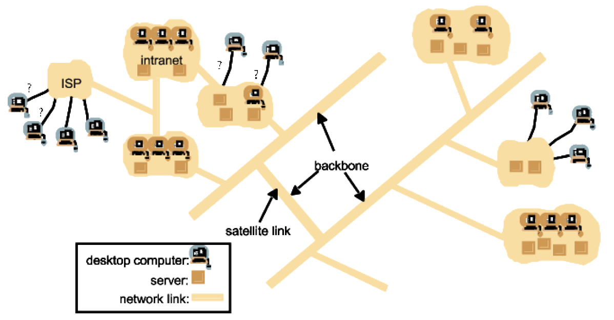

```
Backbone connection:
1. At the local level, a backbone is a line or set of lines that local
area networks connect to for a wide area network connection or within a
local area network to span distances efficiently (for example, between
buildings).
2. On the Internet or other wide area network, a backbone is a set of
paths that local or regional networks connect to for long-distance
interconnection.
```

- **Intranets**, a portion of the Internet that is accessed only  by authorized person of organizations
    - A boundary that can be configured to enforce local security policies
    - Several local area connection (LANs) linked by backbone connections
    - A connection to the Internet via a router allowing users within the intranet to access services on the Internet
    - Firewalls to protect an intranet by preventing unauthorized messages leaving or entering by filtering incoming and outgoing messages e.g. by source or destination
    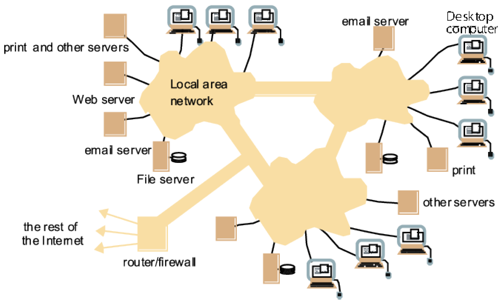
- **Wireless networks**, allows the integration of small and portable computing devices into distributed systems
    - Mobile Computing (Nomadic Computing)
    - Ubiquitous Computing
    - Internet of Things
    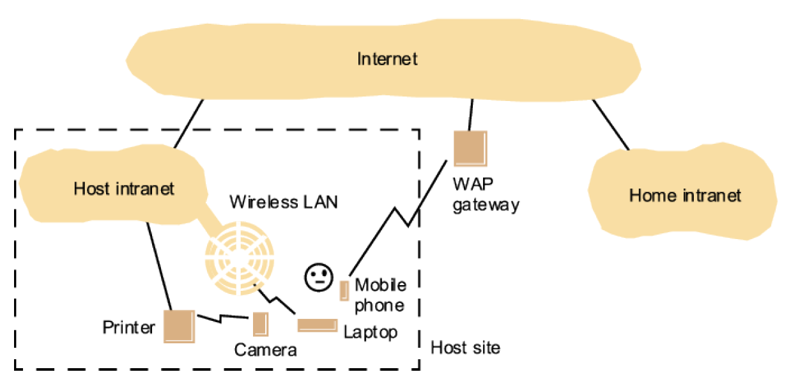

### Distributed system challenges

- **Heterogeneity**, Distributed systems use hardware and software resources of varying characteristics (heterogeneous resources):
    - Networks
    - Computer Hardware
    - Operating Systems
    - Programming Languages
    - Implementation by different developers

    Some approaches for handling heterogeneity issues are:
    - Using standard protocols
    - Using agreed upon message formats and data types
    - Adhering to an agreed upon Application Program Interfaces (APIs)
    - Using Middleware
    - Portable code

    Middleware is a software layer between the application layer and the operating systems, and certain   middleware solutions address some heterogeneity issues but not others

    Middleware Models:
    - Distributed File Systems
    - Remote Procedure Call (RPC) (procedural languages)
    - Remote Method Invocation (RMI) (object-oriented languages)
    - Distributed Documents
    - Distributed Data Bases

    Mobile code is sent from one computer to the anther to run at the destination (e.g. Java applets):
    - Code that is compiled to run in one OS does not run in another:
        - different hardware
        - different OS versions
    - Virtual Machine approach provides a way of making code executable on any hardware - compiler produces code that is interpreted by the virtual machine
    - Cross-platform compilation and code portability is another way, that compiles source code to multiple targets.

- Openness, refers to the ability of extend the system in different ways by adding hardware or software resources. Following are some approaches to address openness:
    - Publishing key interfaces
    - Allowing a uniform communication mechanism to communicate over the published interfaces
    - Ensuring all implementations adhere to the published standards

- Security
    - There has three aspects of security:
        - Confidentiality (protection against disclosure to unauthorized individuals)
        - Integrity (protection against alteration and corruption)
        - Availability (protection against interference with the means of access)
    - Security Mechanisms:
        - Encryption (e.g. Blowfish, RSA)
        - Authentication (e.g. passwords, public key authentication)
        - Authorization (e.g. access control lists)
    - Types of security challenges have not yet been resolved completely:
        - Denial of service attacks
        - Security against mobile code (executables as attachments)

- Scalability, A system is considered to be scalable if it can handle the growth of the number of users. Scalability Challenges:
    - Cost of physical resources: For a system with n users to be scalable, the quantity of physical resources required to support the system should be O(n) - if one file server can support 20 users, then two servers should be able to support 40 users.
    - Controlling the performance loss: Complexity of algorithms that are used for searches, lookup etc should be scalable - for example a search algorithm for n data items requiring O(log(n)) search steps is scalable but one that requires n^2 is not.
    - Resources should not run out: e.g. 32-bit Internet IP addresses running out requiring a new version of 128-bit address.
    - Avoiding Performance bottlenecks: Decentralized architectures and algorithms can be used to avoid performance bottlenecks.

    ```
    The term “bottleneck” refers to both an overloaded network and the
    state of a computing device in which one component is unable to keep
    pace with the rest of the system, thus slowing overall performance
    ```

- Failure Handling
    - **Detecting**: some types of failures can be detected, e.g. checksums can be used to detect corrupted data in a message, and some kinds of failure are hard to be certain about, e.g. the failure of a remote server.
    - Masking: some failures that have been detected can be hidden or made less severe, e.g. timeout and message retransmission.

    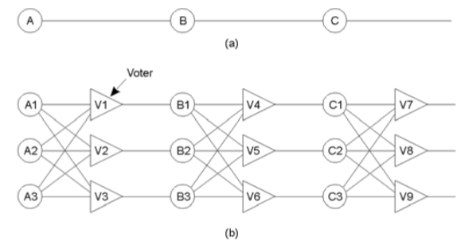

    - **Tolerating**: it is sometimes impractical to try and handle every failure that occurs, sometimes it is better to tolerate them, e.g. failure is reported back to the user, e.g. web server not being available, try again later, or video is rendered with errors
    - **Recovery**: failure sometimes leads to corrupted data and software can be designed so that it can recover the original state after failure, e.g. implementing a roll back mechanism.
    - **Redundancy**: services can be made to tolerate failures using redundant components, e.g. multiple servers that provide the same service, as so called fail over.

- Concurrency
    - Multiple clients can access the same resource at the same time, in some cases for updates
    - One approach to handling concurrency is making access sequential - slows down the system
    - Semaphores supported by the operating system is a well accepted mechanism to handle concurrency

    ```
    Mutex: exclusive-member access to a resource
    Semaphore: n-member access to a resource
    ```

- Transparency, the aspect of hiding the components of a distributed system from the user and the application programmer. Types of  transparencies:

    - Access transparency
    - Location transparency
    - Concurrency transparency
    - Replication transparency
    - Failure transparency
    - Mobility transparency
    - Performance transparency
    - Scaling transparency

### World Wide Web

The three main standard technological components used in the web
are:

- HypterText Markup Language (HTML) - This is a language for specifying the contents and layout of pages to be displayed by browsers.
- Uniform Resource Locators (URLs) - These identify the resources stored on the web. A URL has two components: scheme and scheme-specific-identifier. Scheme - declares the type of resource. Scheme-specific-identifier - identifies the resource. E.g., mailto:xxx@yahoo.com
- HyperText Transfer Protocol (HTTP) - This is the protocol used for transferring resources between web servers and clients (e.g. browsers). The main features are:
    - Uses request-reply interactions
    - Supports different content types
    - Requires one request per resource
    - Supports simple access control

### Dynamic pages

- Static web pages allow data to be made available for retrieval
- Dynamic web pages allow users to interact with resources by taking user input, executing programs and returning results
- Programs executed on the request can take different forms

### Summary

- Communication networks that enable distributed systems are the Internet, intranets and wireless networks
- Resource sharing is the main motivation for distributed systems
- There are many challenges associated with these systems - Heterogeneity, Openness, Security, Scalability, Failure handling, Concurrency,Transparency

## Models

A pyhsical model considers: - underlying hardware elements

An architectural model considers:

- Architectural elements - components of the system that interact with one another
- Architectural patterns - the way components are mapped to the underlying system
- Associated middleware solutions - existing solutions to common problems

Fundamental models define:

- The non-functional aspects of the distributed system such as
    - reliability
    - security
    - performance

### Interfaces

Distributed processes can not directly access each others internal variables or procedures. Passing parameters needs to be reconsidered, in particular, call by reference is not supported as address spaces are not the same between distributed processes. This leads to the notion of an interface. The set of functions that can be invoked by external processes is specified by one or more interface definitions.

- Programmers are only concerned with the abstraction offered by the interface, they are not aware of the implementation details.
- Programmers also need not know the programming language or underlying platform used to implement the service.
- So long as the interface does not change (or that changes are backwards compatible), the service implementation can change transparently.

### Communication paradigms

From low level to high level:

- Interprocess communication are communication between processes in a distributed system, e.g. shared memory, sockets, multicast communication (relatively low-level)
- Remote invocation -- based on a two-way exchange between communicating entities in a distributed system and resulting in the calling of a remote operation, procedure or method, e.g. request-reply protocols, remote procedure calls, remote method invocation
- Indirect communication:
    - space uncoupling -- senders **do not need to know who** they are sending to
    - time uncoupling -- senders and receivers **do not need to exist at the same time**. The message senders sent is stored and picked up at a later moment.
    - E.g.:
    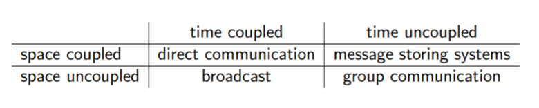

    ```
    Direct communication, sender and receivers exist in the same time and
    know of each other.
    ```

### Roles and responsibilities

- Client, a process that initiates connections to some other process
- Server, a process that can receive connections from some other process
- Peer, can be seen as taking both the role of client and server, connecting to and receiving connections from other peers

### Placement

- mapping services to multiple servers
    - a single service may not make use of a single process and multiple processes may be distributed across multiple machines
- caching
    - storing data at places that are typically closer to the client or whereby subsequent accesses to the same data will take less time
- mobile code
    - transferring the code to the location that is most efficient, e.g. running a complex query on the same machine that stores the data, rather than pulling all data to the machine that initiated the query
- mobile agents
    - code and data together, e.g. used to install and maintain software on a users computer, the agent continues to check for updates in the background

### Architectural Patterns

The two widely used distributed architectures are:

- Client-server: Clients invoke services in servers and results are returned. Servers in turn can become clients to other services.


- Peer-to-peer: Each process in the systems plays a similar role interacting cooperatively as peers (playing the roles of client and server simultaneously).


### Distributed System Architecture Variations

- **A service provided by multiple servers**

Objects may be partitioned (e.g web servers) or replicated across servers (e.g. Sun Network Information Service (NIS)).


- **Proxy servers and caches**
    - Cache is a store of recently used objects that is closer to client
    - New objects are added to the cache replacing existing objects
    - When an object is requested, the caching service is checked to see if an up-to-date copy is available (fetched in not available)

    

- **Mobile Code and Agents**
    - Mobile Code is down loaded to the client and is executed on the client (e.g. applet).
    - Mobile agents are running programs that includes both code and data that travels from one computer to another.

    

- **Network Computers and Thin clients**
    - Network Computers: download their operating system and application software from a remote file system. Applications are run locally.
    - Thin Clients: application software is not downloaded but runs on the computer server - e.g.UNIX. It relies on a network connection to a central server for full computing and don't do much processing on the hardware itself.

    

```
Thin Clients:the idea is to limit the capabilities of thin clients to only
essential applications, and remain "thin" in terms of the client
applications they include.
```

### Layering

A software architecture abstracts software into layers or modules in a single computer. Each layer of software provides a service to the next layer. The layers can are referred to as service layers.

Abstract software layers:


Two important layers for a distributed system are:

- Platform
- Middleware

### Middleware

It is the software that sits between the client-side request on the front end and the back-end resource being requested.The role of middleware is to enable and ease access to those back-end resources.

- Provides value added services - e.g.
    - Naming
    - security
    - transactions
    - persistent storage and
    - event service
- Adds overhead due to the additional level of abstraction
- Communication cannot be completely hidden from applications since appropriate error handling is important

### Tiered architecture

A **layer = a part of your code**, if your application is a cake, this is a slice(vertical slices).

A **tier = a physical machine**, a server.

A tier hosts one or more layers.


### Fundamental Models

Fundamental models allow distributed systems to be analyzed in terms of fundamental properties **regardless of the architecture**. These models help **understand how the non-functional requirements** are supported.

The aspects of distributed systems that will be captured in the fundamental models are:

#### Interaction Model

Models the interaction between processes of a distributed system - e.g. interaction between clients and servers or peers.

- Distributed algorithms specify:
    - Steps taken by each process in the distributed system
    - The transmission of messages between processes

 Two important aspects of interaction modeling are:

##### Performance of communication channels

Three important performance characteristics of communication channels:

- Latency
- Bandwidth
- Jitter, a variation in the delay of received packets


##### Event timing

Each computer in a distributed system has its own internal clock. The timestamps between two processes can vary due to:

- Initial time setting being different
- Differences in clock drift rates

#### Variations of Interaction Models

Two simple models of distributed system interaction are:

- Synchronous system model - assumes known bounds on:
    - the time to execute each step of a process
    - message transmission delay
    - local clock drift rate
- Asynchronous system model - assumes no bound on:
    - process execution speed
    - message transmission delays
    - clock drift rates

#### Failure Model

The failures in processes and channels are presented using the following taxonomy:

##### Omission failures

Omission failures refers to cases where **a process or a communication channel fails to perform what is expected to do**.

- Process omission failures:
    - Normally caused by a process crash
    - Repeated failures during invocation is an indication
    - Timeouts can be used to detect this type of crash
    - A crash is referred to as a fail-stop if other processes can detect certainly that the process crashed

- Communication omission failures:
    - Send omission failure: A message not being transported from sending process to its outgoing buffer
    - Receive omission failure: A message not being transported from the receiving process's incoming message buffer and the receiving process
    - Channel omission failures: A message not being transported from p's outgoing message buffer to q's incoming message buffer

    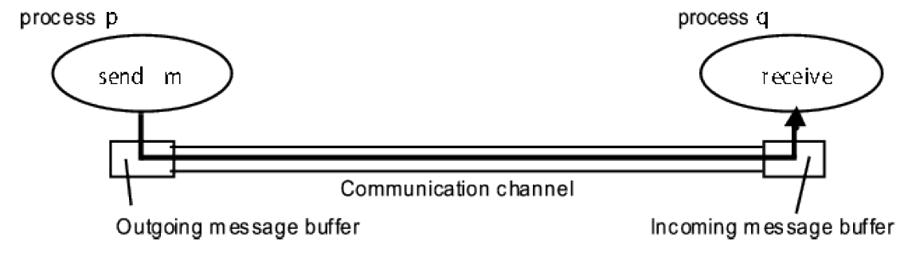

##### Arbitrary failures (Byzantine failure)

Refers to **any type of failure that can occur in a system**. Could be due to:

- Intended steps omitted in processing
- Message contents corrupted
- Non-existent messages delivered
- Real messages delivered more than once

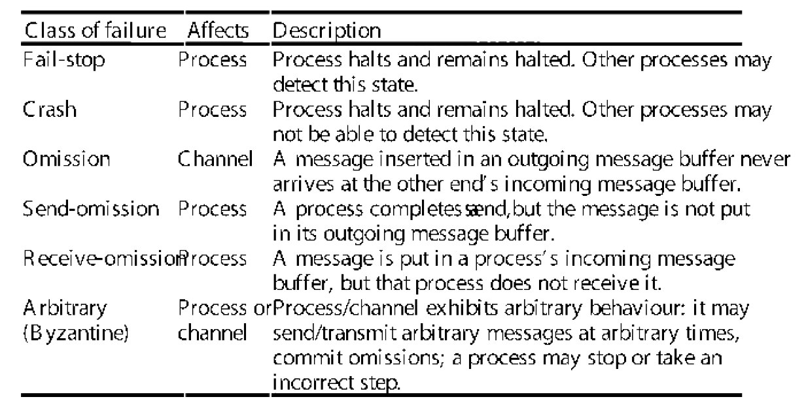

##### Timing failures

These failures occur when **time limits set on** process execution time, message delivery time and clock rate drift. They are particularly relevant to synchronous systems and less relevant to asynchronous systems since the later usually places no or less strict bounds on timing.

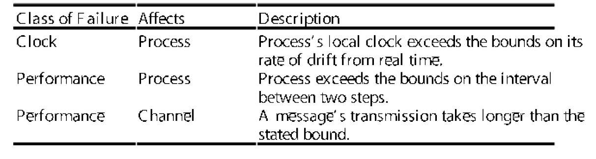

### Reliability of one-to-one communication

Reliable communication can be defined in terms of two properties:

- **validity**: any message in the outgoing buffer is eventually delivered to the incoming message buffer.
- **integrity**: the message is identical to the one sent, and no messages are delivered twice.

### Security Model

Security of a distributed systems is achieved by securing processes, communication channels and protecting objects they encapsulate against unauthorized access.

**Protecting Objects**:

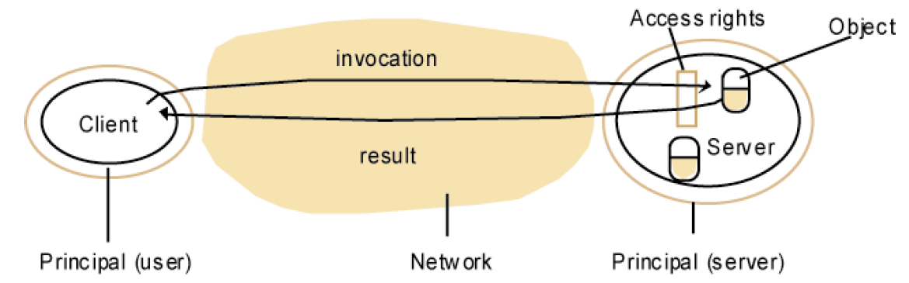

- Access rights specify who is allowed to perform operations on an object
- Each invocation and result is associated with a principal

**Securing Processes and Interactions:**

Enemy (adversary) is one capable of sending any message to any process or reading/copying any message between a pair of processes.

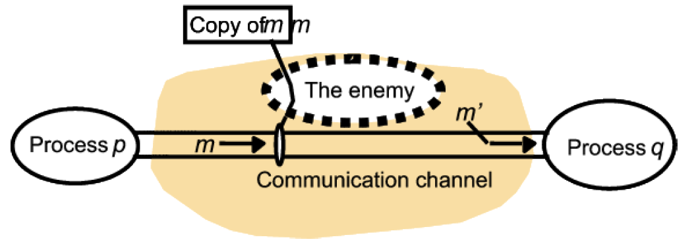

#### Possible threats from an enemy

- Threats to processes: Servers and clients cannot be sure about the source of the message. Source address can be spoofed.
- Threats to communication channels: Enemy can copy, alter or inject messages
- Denial of service attacks: overloading the server or otherwise triggering excessive delays to the service
- Mobile code: performs operations that corrupt the server or service in an arbitrary way

#### Addressing security threats

- Cryptography and shared secrets: encryption is the process of scrambling messages
- Authentication: providing identities of users
- Secure Channel: Encryption and authentication are used to build secure channels as a service layer on top of an existing communication channel. A secure channel is a communication channel connecting a pair of processes on behalf of its principles

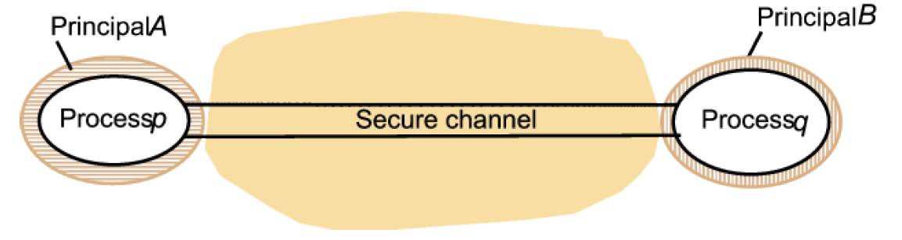

## Interprocess Communication

This and the next chapters deal with middleware:

- This chapter deals with the lower layer of middleware that support basic interprocess communication
- The next one introduces high level communication paradigms (RMI and RPC)

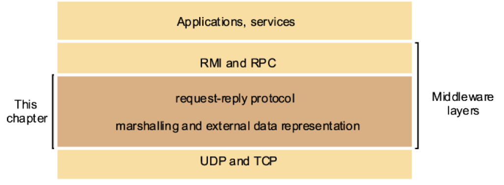

**UDP or User Datagram Protocol**, does not guarantee delivery, while **TCP or Transport Control** Protocols provides a reliable connection oriented protocol.

- Data Representation:
    - Deals with how objects and data used in application programs are translated into a form suitable for sending as messages over the network
- Higher level protocols:
    - Client-server communication: Request-reply protocols
    - Group Communication: Group multicast protocol

### The API for the Internet protocols

- Processes use two message communication functions: send and receive
- A queue is associated with each message destination
- Communication may be synchronous or asynchronous:
    - In synchronous communication, both send and the receive operations are blocking operations. When a send is issued the sending process is blocked until the receive is issued. Whenever the receive is issued the process blocks until a message arrives.
    - In asynchronous communication, the send operation is non-blocking. The sending process returns as soon as the message is copied to a local buffer and the transmission of the message proceeds in parallel. Receive operation can be blocking or non-blocking (nonblocking receives are not normally supported in today's systems).

### Message Destinations

- Messages are sent to an (Internet address, local port) pair
- A port usually has exactly one receiver (except multicast protocols) but can have multiple senders
    - Recent changes allow multiple processes to listen to the same port, for performance reasons
- Location transparency is provided by a name server, binder or OS

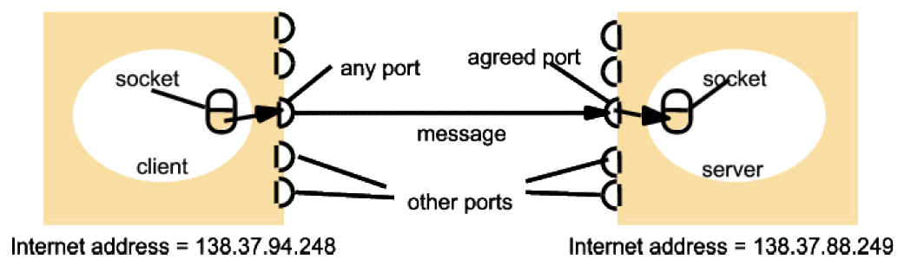

### Socket

A Socket provides an end point for communication between processes.

- For a process to receive messages, its socket must be bound to a local port on one of the Internet addresses of the computer on which it runs.
- Messages sent to a particular port of an Internet address can be only be received by a process that has a socket associated with the particular port number on that Internet address.
- Same socket can be used both for sending and receiving messages.
- Processes can use multiple ports to receive messages.
- Recent changes allow multiple processes to listen on the same port.
- Any number of processes can send messages to the same port.
- Each socket is associated with a single protocol (UDP or TCP).

### UDP datagram communication

- Both the sender and the receiver bind to sockets:
    - Server (receiver) binds its socket to a server port, which is made known to the client
    - A client (sender) binds its socket to any free port on the client machine
    - The receive method returns the Internet address and the port of the sender, in addition to the message allowing replies to be sent
- Message Size:
    - Receiving process defines an array of bytes to receive the message
    - If the message is too big it gets truncated
    - Protocol allow packet lengths of 2^16 bytes but the practical limit is 8 kilo bytes.
- Blocking:
    - Non-blocking sends and blocking receives are used for datagram communication
    - Operation returns when the message is copied to the buffer
    - Message is delivered to the message buffer of the socket bound to the destination port
    - Outstanding or future invocations of the receive on the socket can collect the messages
    - Messages are discarded if no socket is bound to the port
- Timeouts:
    - Receive will wait indefinitely till messages are received
    - Timeouts can be set on sockets to exit from infinite waits and check the condition of the sender
- Receive generally allows receiving from any port. It can also allow to receive from only from a given Internet address and port.
- Possible failures:
    - Data Corruption: checksum can be used to detect data corruption
    - Omission failures: buffers full, corruption, dropping
    - Order: messages might be delivered out of order
- UDP does not suffer from overheads associated with guaranteed message delivery
    - Example uses of UDP:
        - Domain Name Service
        - Voice Over IP (VOIP)

### TCP Stream Communication

- Features of stream abstraction:
    - Message sizes: There is no limit on data size applications can use.
    - Lost messages: TCP uses an acknowledgment scheme unlike UDP. If acknowledgments are not received the messages are retransmitted.
    - Flow control: TCP protocol attempts to match the speed of the process that reads the message and writes to the stream.
    - Message duplication or ordering: Message identifiers are associated with IP packets to enable the recipient to detect and reject duplicates and reorder messages in case messages arrive out of order.
    - Message destinations: The communicating processes establish a connection before communicating. The connection involves a connect request from the client to the server followed by an accept request from the server to the client.
- Steps involved in establishing a TCP stream socket:
    - Client:
        1. Create a socket specifying the server address and port
        2. Read and write data using the stream associated with the socket
    - Server:
        1. Create a listening socket bound to a server port
        2. Wait for clients to request a connection (Listening socket maintains a queue of incoming connection requests)
        3. Server accepts a connection and creates a new stream socket for the server to communicate with the client retaining the original listening socket at the server port for listening to incoming connections. A pair of sockets in client and server are connected by a pair of streams, one in each direction. A socket has an input stream and an output stream.
- When an application closes a socket, the data in the output buffer is sent to the other end with an indication that the stream is broken. No further communication is possible.
- TCP communication issues:
    - There should a pre-agreed format for the data sent over the socket
    - Blocking is possible at both ends
    - If the process supports threads, it is recommended that a thread is assigned to each connection so that other clients will not be blocked.
- Failure Model:
- TCP streams use checksum to detect and reject corrupt packets and sequence numbers to detect and reject duplicates
- Timeouts and retransmission is used to deal with lost packets
- Under severe congestion TCP streams declare the connections to be broken hence does not provide reliable communication
- When communication is broken the processes cannot distinguish between network failure and process crash
- Communicating process cannot definitely say whether the messages sent recently were received
- Use of TCP: HTTP, FTP, Telnet, SMTP

### External data representation and marshalling

- Data structures in programs are flattened to a sequence of bytes before transmission
- Different computers have different data representations. Two ways to enable computers to interpret data in different formats:
    - Data is converted to an agreed external format before transmission and converted to the local form on receipt
    - Values transmitted in the senders format, with an indication of the format used
- External data representation: Agreed standard for representing data structures and primitive data
- Marshalling: Process of converting the data to the form suitable for transmission
- Unmarshalling: Process of disassembling the data at the receiver

Three approaches to external data representation:

#### CORBA's Common Data Representation

- CORBA CDR is the external data representation defined with CORBA 2.0
- Consists of 15 primitive data types including short, long, unsigned short, unsigned long, float, double, char, boolean, octet and any
- Primitive data types can be sent in big-endian or little-endian orderings. Values are sent in the sender's ordering which is specified in the message.
- Marshalling in CORBA - Marshalling operations can be automatically generated from the data type specification defined in the CORBA IDL (interface definition language). CORBA interface compiler generates the marshalling and unmarshalling operations.
- CORBA CDR for a message that contains three fields of a struct whose types are string , string and unsigned long :

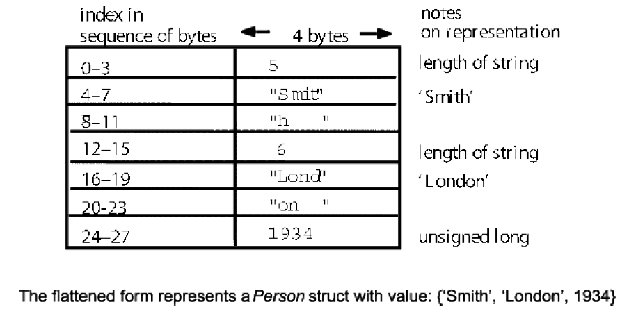

#### Java Object Serialization

- Serialization refers to the activity of flattening an object to be suitable for storage or transmission

 ```
Serialization is the process of converting the state information of an
object instance into a binary or textual form to persist into storage
medium or transported over a network.
 ```

- Deserialization refers to the activity of restoring the state of the object
- When a Java object is serialized:
    - Information about the class of the object is included in the serialization - e.g. name of class, version
    - All objects it references are serialized with it. References are serialized as handles (handle is a reference to an object within the serialized object)
    - During remote method invocation, the arguments and results are serialized and deserialized by middleware.
    - Reflection property supported by Java allows serialization and deserialization to be carried out automatically.
    - The object Person p = new Person("Smith", "London", 1934) in serialized form:

    

#### Extensible markup language (XML)

- A markup language is a textual encoding representing data and the details of the structure (or appearance)
- The XML definition of the ```Person``` structure:

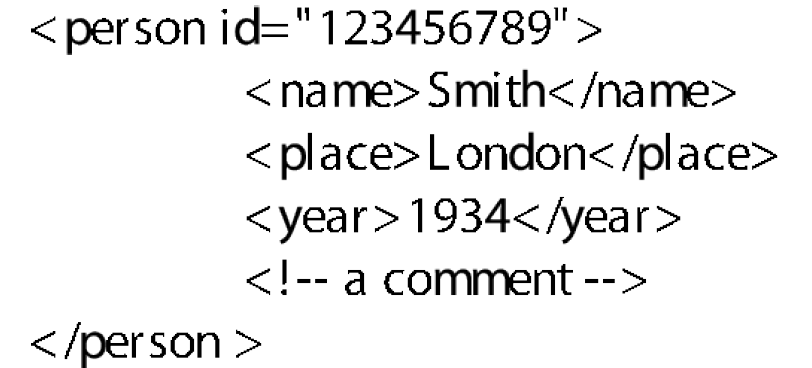

#### JSON, Javascript Object Notation

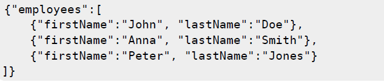

### Group communication

- A multicast operation allows group communication - sending a single message to number of processes identified as a group
- Multicast can happen with or without guarantees of delivery
- Uses of multi cast:
    - Fault tolerance based on replicated services
    - Finding discovery servers, This is where routers, brokers and handlers announce themselves and where you can look them up
    - Better performance through replicated data
    - propagation of event notification

    ```
    Copies are automatically created in other network elements, such as
    routers, switches and cellular network base stations, but only to
    network segments that currently contain members of the group.
    ```

#### IP multicast - example

- Allows a sender to transmit a single packet to a set of computers that form the group
- The sender is not aware of the individual recipients
- The group is identified by a class D Internet address (address whose first 4 bits are 1110 in IPv4)
- IP multicast API:
    - available only for UDP
    - an application can send UDP datagrams to a multicast address and ordinary port numbers
    - an application can join a multicast group by making its socket join the group
    - when a multicast message reaches a computer, copies are forwarded to all processes that have sockets bound to the multicast address and the specified port number
- Failure model: Omission failures are possible. Messages may not get to one or more members due to a single omission

### Overlay networks

The distributed system forms its own communication network over the Internet

- An overlay network can be thought of as a computer network on top of another network. All nodes in an overlay network are connected with one another by means of virtual links and each of these links correspond to a path in the underlying network.
- An example of an overlay network can be distributed systems such as client-server applications and peer-to-peer networks. Such applications or networks act as the overlay networks because all nodes in these applications and networks run on top of the internet.

    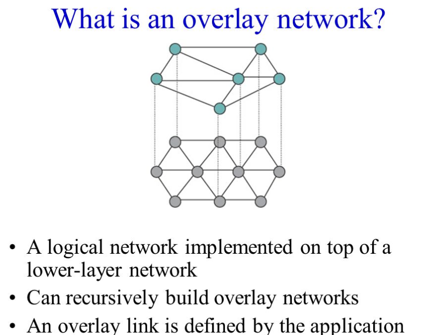

## Remote Invocation

Three widely used models are:

- Remote Procedure Call model - an extension of the conventional procedure call model.
- Remote Method Invocation model - an extension of the object-oriented programming model.

### The Request-Reply protocol

The request-reply protocol is perhaps the most common exchange protocol for implementation of remote invocation in a distributed system. We discuss the protocol based on three abstract  operations: ```doOperation```, ```getRequest``` and ```sendReply``` .

- doOperation: sends a request message to the remote object and returns the reply. The arguements specify the remote object, the method to be invoked and the arguments of that method
- getRequest: acquires a client request via the server port
- sendReply: sends the reply message reply to the client at its internet address and port

#### Typical Message Content

A message in a request-reply protocol typically contains a number of fields as shown below.

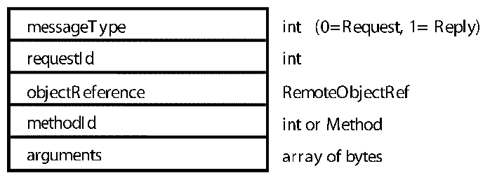

### Design Issues

- Failure model can consider:
    - Handling timeouts
    - Discarding duplicate messages
    - Handling lost reply messages - strategy depends on whether the server operations are idemponent (an operation that can be performed repeatedly)
    - History - if servers have to send replies without re-execution, a history has to be maintained
- Three main design decisions related to implementations of the request/reply protocols are:
    - Strategy to retry request message
    - Mechanism to filter duplicates
    - Strategy for results retransmission

### Exchange protocols

- Three different types of protocols are typically used that address the design issues to a varying degree:
    - the request (R) protocol
    - the request-reply (RR) protocol
    - the request-reply-acknowledge reply (RRA) protocol

### Invocation Semantics

Middleware that implements remote invocation generally provides a certain level of semantics:

- **Maybe invocation semantics**: The remote procedure call may be excecuted once or not at all. Unless the caller receives a result, it is unknown as to whether the remote procedure was called.
- **At-least-once invocation semantics**: Either the remote procedure was executed at least once, and the caller received a response, or the caller received an exception to indicate the remote procedure was not executed at all.
- **At-most-once**: The remote procedure call was either executed exactly once,in which case the caller received a response, or it was not executed at all and the caller receives an exception.

### Fault Tolerance Measures

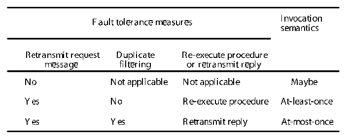

### Transparency

Although location and access transparency are goals for remote invocation, in some cases complete transparency is not desirable due to:

- remote invocations being more prone to failure due to network and remote machines
- latency of remote invocations is significantly higher than that of local invocations

Therefore, many implementations provide access transparency but not complete location transparency. This enables the programmer to make optimisation decisions based on location.

### Client-server communication

- Client-server communication normally uses the synchronous request-reply communication paradigm
- Involves send and receive operations
- TCP or UDP can be used - TCP involves additional overheads:
    - redundant acknowledgements
    - needs two additional messages for establishing connection
    - flow control is not needed since the number of arguments and results are limited

    ```
    Flow control ensure that a sender is not overwhelming a receiver by
    sending packets faster than it can consume.
    ```

### HTTP: an example of a RR protocol

- HTTP protocol specifies the:
    - the messages involved in the protocol
    - the methods, arguments and results
    - the rules for marshalling messages
- Allows content negotiation - client specify the data format they can accept
- Allows authentication - based on credentials and challenges
- Original version of the protocol did not persist connections resulting in overloading the server and the network
- HTTP 1.1 uses persistent connections
- HTTP methods
    - ```GET``` - Request resources from a URL
    - ```HEAD``` - Identical to GET but does not return data
    - ```POST``` - Supplies data to the resources
    - ```PUT``` - Requests the data to be stored with the given URL
    - ```DELETE``` - Requests the server to delete the resource indentified with the given URL
    - ```OPTIONS``` - Server supplies the available options
    - ```TRACE``` - Server sends back the request message
- _Requests_ and _replies_ are marshalled into messages as ASCII text strings:

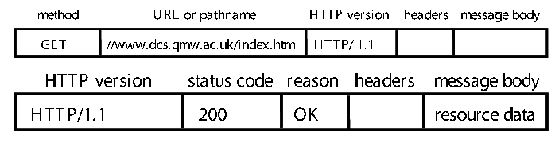

### Remote Procedure Call (RPC)

RPCs enable clients to execute procedures in server processes based on a defined service interface.

```
For example, R=sum(...) sends from client to server, let the server to run
the function and then send back results to clent from server
```

- **Communication Module** Implements the desired design choices in terms of retransmission of requests, dealing with duplicates and retransmission of results.
- **Client Stub Procedure** Behaves like a local procedure to the client. Marshals the procedure identifiers and arguments which is handed to the communication module. Unmarshalls the results in the reply.
- **Dispatcher Selects** the server stub based on the procedure identifier and forwards the request to the server stub.
- **Server stub procedure** Unmarshalls the arguments in the request message and forwards it to the service procedure. Marshalls the arguments in the result message and returns it to the client.

    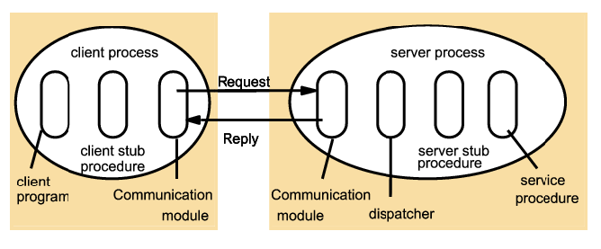

### Object-Oriented Concepts

- **Objects** consists of attributes and methods. Objects communicate with other objects by invoking methods, passing arguments and receiving results.
- **Object References** can be used to access objects. Object references can be assigned to variables, passed as arguments and returned as results.

```
Obejct reference is used to describe the pointer to the memory location
where the Object resides.
```

- **Interfaces** define the methods that are available to external objects to invoke. Each method signature specifies the arguments and return values.
- **Actions** - objects performing a particular task on a target object. An action could result in:
    - The state of the object changed or queried
    - A new object created
    - Delegation of tasks to other objects
- **Exceptions** are thrown when an error occurs. The calling program catches the exception.
- **Garbage collection** is the process of releasing memory used by objects that are no longer in use. Can be automatic or explicitly done by the program.

### Distributed Object Concepts

#### Remote Objects

An object that can receive remote invocations is called a remote object. A remote object can receive remote invocations as well as local invocations. Remote objects can invoke methods in local objects as well as other remote objects.

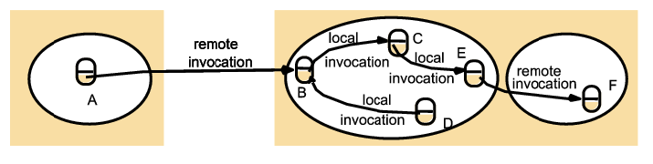

#### Remote Object Reference

A remote object reference is a unique identifier that can be used throughout the distributed system for identifying an object. This is used for invoking methods in a remote object and can be passed as arguments or returned as results of a remote method invocation.

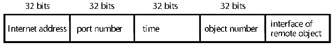

#### Remote Interface

A remote interface defines the methods that can be invoked by external processes. Remote objects implement the remote interface.

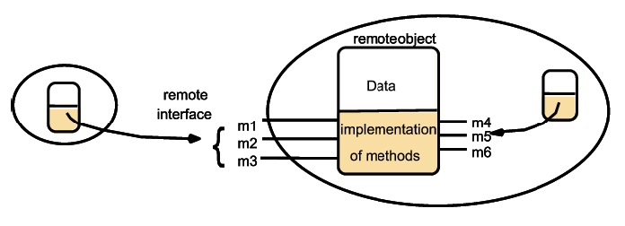

#### Actions in a distributed system

Actions can be performed on remote objects (objects in other processes of computers). An action could be executing a remote method defined in the remote interface or creating a new object in the target process. Actions are invoked using Remote Method Invocation (RMI).

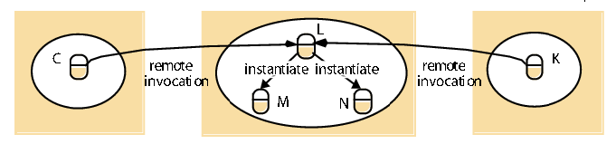

#### Garbage collection in a distributed system

Is achieved through reference counting.

#### Exceptions

Similar to local invocations, but special exceptions related to remote invocations are available (e.g. timeouts).

### Implementation of RMI

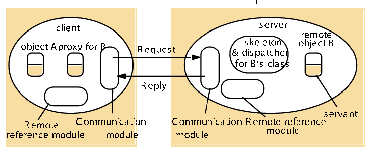

- The **Communication Module** is responsible for communicating messages (requests and replies) between the client and the server. It uses three fields from the message:
    - message type
    - request ID
    - remote object reference

It is responsible for implementing the invocation semantics. The communication module queries the remote reference module to obtain the local reference of the object and passes the local reference to the dispatcher for the class.

- The **Remote reference module** is responsible for:
    - Creating remote object references
    - Maintaining the remote object table which is used for translating between local and remote object references

```
When a remote object reference arrives in a request or reply message, the
remote reference module is asked for the corresponding local object
reference, which may refer to either to a local proxy or a remote object.
```

The remote object table contains an entry for each:

- Remote object reference held by the process
- Local proxy

Entries are added to the remote object table when:

- A remote object reference is passed for the first time
- When a remote object reference is received and an entry is not present in the table

**Servants** are the objects in the process that receive the remote invocation.

- **The RMI software**: This is a software layer that lies between the application and the communication and object reference modules. Following are the three main components.
    - **Proxy**: Plays the role of a local object to the invoking object. There is a proxy for each remote object which is responsible for:
        - Marshalling the reference of the target object, its own method id and the arguments and forwarding them to the communication module.
        - Unmarshalling the results and forwarding them to the invoking object
    - **Dispatcher**: There is one dispatcher for each remote object class. Is responsible for mapping to/ finding an appropriate method in the skeleton based on the method ID.
    - **Skeleton**: Is responsible for:
        - Unmarshalling the arguments in the request and forwarding them to the servant.
        - Marshalling the results from the servant to be returned to the client.

### Developing RMI Programs

Developing a RMI client-server program involves the following steps:

1. Defining the interface for remote objects - Interface is defined using the interface definition mechanism supported by the particular RMI software.
2. Compiling the interface - Compiling the interface generates the proxy, dispatcher and skeleton classes.
3. Writing the server program - The remote object classes are implemented and compiled with the classes for the dispatchers and skeletons. The server is also responsible for creating and initializing the objects and registering them with the binder.
4. Writing client programs - Client programs implement invoking code and contain proxies for all remote classes. Uses a binder to lookup for remote objects.

### Dynamic invocation

Proxies are precompiled to the program and hence do not allow invocation of remote interfaces not known during compilation. **Dynamic invocation** allows the invocation of a generic interface using a doOperation method.

### Server and Client programs

A server program contains:

- classes for dispatchers and skeletons
- an initialization section for creating and initializing at least one of the servants
- code for registering some of the servants with the binder

A client program will contain the classes for all the proxies of remote objects.

### Factory methods

- Servants cannot be created by remote invocation on constructors
- Servants are created during initialization or methods in a remote interface designed for this purpose
- Factory method is a method used to create servants and a factory object is an object with factory patterns

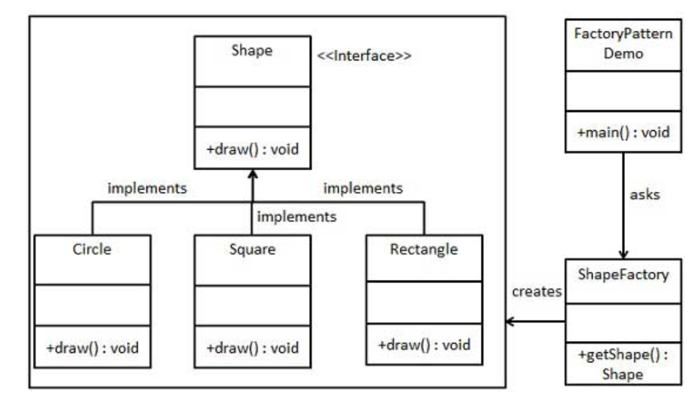

### The binder

Client programs require a way to obtain the remote object reference of the remote objects in the server. A **binder** is a service in a distributed system that supports this functionality. A binder maintains a table containing mappings from textual names to object references. Servers register their remote objects (by name) with the binder. Clients look them up by name.

### Activation of remote objects

- A remote object is active if it is available for invocation in the process.
- A remote object is passive if it is not currently active but can be made active. A passive object contains:
    - the implementation of the methods
    - its state in marshalled form

### Object Location

- Remote object references are used for addressing objects
- The object reference contains the Internet address and the port number of the process that created the remote object
- This restricts the object to reside within the same process
- A **location server** allows clients to locate objects based on the remote object reference

### Distributed garbage collection

A distributed garbage collector ensures that a remote object continues to exist as long as there are local or remote object references to the object. If no references exist then the object will be removed and the memory will be released.

## Indirect Communication

Indirect communication is defined as communication between entities in a distributed system through an intermediary with no direct coupling between the sender and the receiver(s).

- Space uncoupling: sender does not know or need to know the identity of the receiver(s)
- Time uncoupling: sender and receiver can have independent lifetimes, they do not need to exist at the same time. Time uncoupling is not synonomous with asynchronous communication.

### Group Communication

Group communication offers a space uncoupled service whereby a message is sent to a group and then this message is delivered to all members of the group. It provides more than a primitive IP multicast:

- manages group membership
- detects failures and provides reliability and ordering guarantees

Efficient sending to multiple receivers, instead of multiple independent send operations, is an essential feature of group communication.

### Group Model

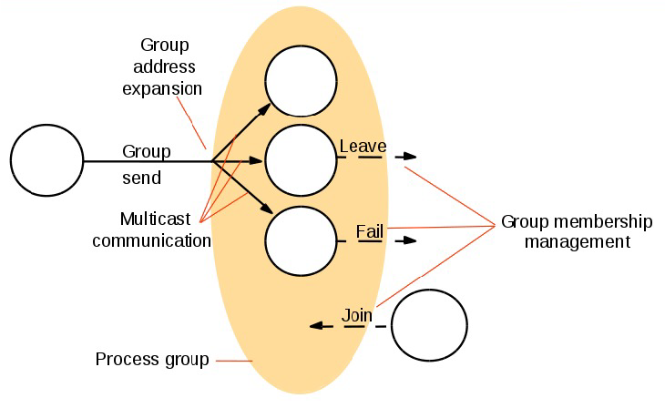

### Group services

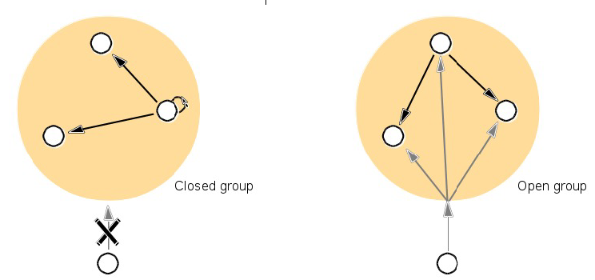

- closed groups only allow group members to multicast to it
- overlapping groups allows entities to be members of multiple groups
- synchronous and asynchronous variations can be considered

```
Closed groups, in which only the members of the group can send to the
group. Outsiders cannot send messages to the group as a whole, although
they may be able to send messages to individual members
Open groups are used, any process in the system (outsiders)can send to any
group.
```

### Implementation issues

- reliability and odering in multicast
    - FIFO (first in first out) ordering is concerned with preserving the order from the prespective of a sender process. If itemA is put onto a queue before itemB, then itemA will come out of the queue before itemB.
    - causal ordering, a message that happens before another message will be preserved in that order in the delivery at all processes. If itemA reaches a single computer before itemB, then itemA happens before itemB.
    - total ordering, if a message is delivered before another message at one process then this is preserved at all processes

If you have a global, shared queue that multiple processes write to over a network (i.e. a specific kind of distribute system), then causal ordering and FIFO ordering are the same thing only from the view of the process that holds the queue. If itemA happens before itemB, then itemA was the first in, and will be the first out.

- group membership management
    - group members leave and join
    - failed members
    - notifying members of group membership changes
    - changes to the group address

### Publish/Subscribe Systems

Publish/subscribe systems are sometimes referred to as distributed event-based systems.

A publish/subscribe system is a system where publishers publish structured events to an event service and subscribers express interest in particular events through subscriptions which can be arbitrary patterns over the structured events.

- financial information systems
- live feeds of real-time data, e.g. RSS feeds
- support for cooperative working, where a number of participants need to be informed of events of shared interest
- support for ubiquitous computing, including management of events emanating from the ubiquitous infrastructure, e.g. location events
- a broad set of monitoring applications, including network monitoring in the Internet

#### Events and notifications

RMI and RPC support the synchronous communication model where the client invoking the call waits for the results to be returned. Events and notifications are associated with the asynchronous communication model.

Distributed event-based systems can use the publish-subscribe communication paradigm:

- Objects that generate events publish information that are of interest to other objects.
- Objects that are interested in a particular type of event subscribe to the type of events.
- Publishers and subscriber are loosely coupled.

#### Characteristics of distributed eventbased systems

- **Heterogeneity**: Allows objects that were not designed to interoperate (to operate together) to communicate due to the loosely coupled nature.
- **Asynchronous**: Communication is asynchronous and event driven.

#### Example: Simple dealing room system

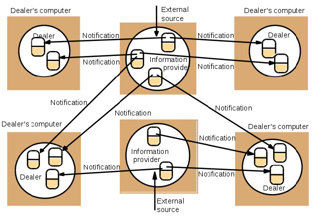

#### Event Types

- Events sources can generate different types of events. Attributes contain informations about the event.
- Types and attributes are used by subscribers when subscribing to events.
- Notifications occur when event types and attributes match to that of subscriptions.

#### Programming model

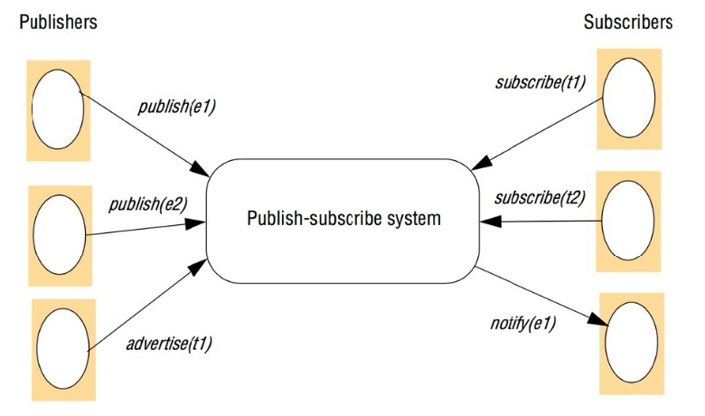

#### Types of publish-subscribe systems

- **Channel Based**: Publishers publish to named channels and subscribers subscribe to all events on a named channel.
- **Type Based**: Subscribers register interest in types of events and notifications occur when particular types of events occur.
- **Topic Based**: Subscribers register interest in particular topics and notifications occur when any information related to the topic arrives.
- **Content Based**: This is the most flexible of the schemes. Subscribers can specify interest is particular values or ranges of values for multiple attributes. Notifications are based on matching the attribute specification criteria.

#### Centralized versus decentralized

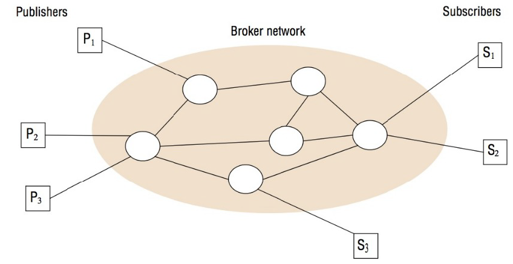

#### Overall System Architecture

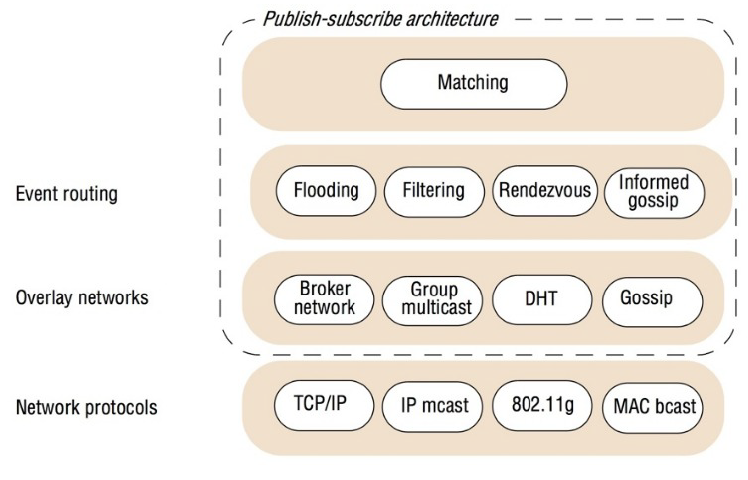

### Message Queues

Whereas groups and publish/subscribe provide a one-to-many style of communication, message queues provide a point-to-point service using the concept of a message queue as an indirection, thus achieving the desired properties of space and time uncoupling. The are point-to-point in that the sender places the message into a queue, and it is then removed by a single process.


#### Programming model

- send: producers put a message on a particular queue
- blocking receive: a consumer waits for at least one message on a queue then returns
- non-blocking receive: or poll, a consumer will check and get a message if there, otherwise it returns without a message
- notify: an event is generated at the receiver when a message is available

#### Example WebSphere MQ

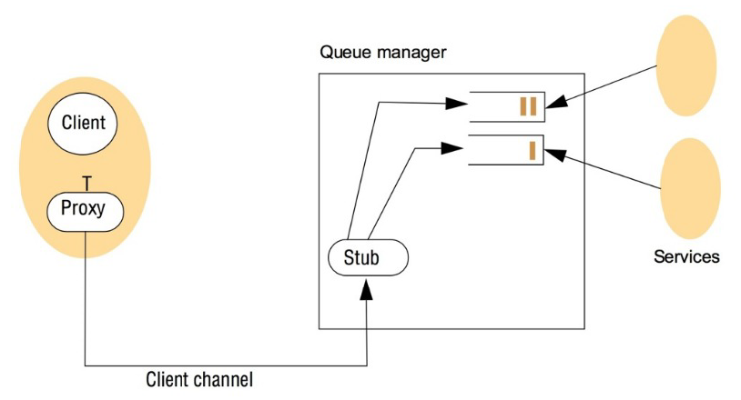

### Shared memory approaches

Distributed shared memory is an abstraction for sharing data between computers that do not share physical memory. Processes access DSM by reads and updates to what appears to be ordinary memory within their address space.

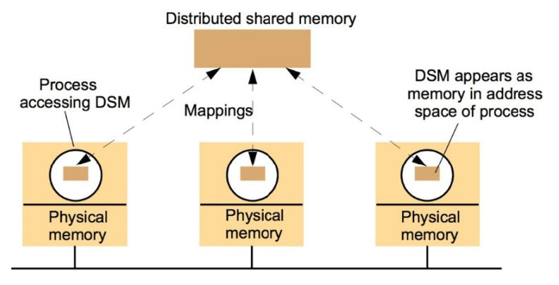

#### Tuple Spaces

The tuple space is a more abstract form of shared memory, compared to DSM.

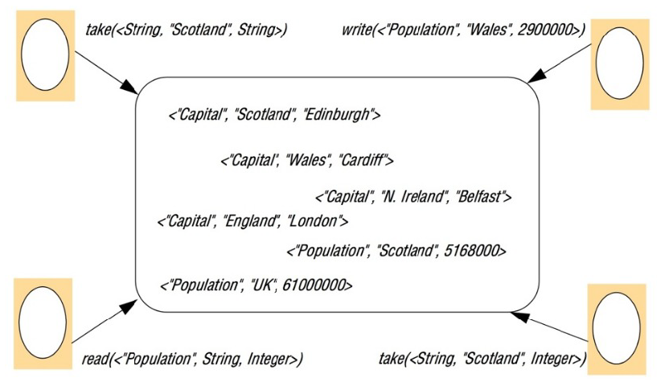

#### Example York Linda Kernel

The implementation uses multiple Tuple Space Servers.


### Summary

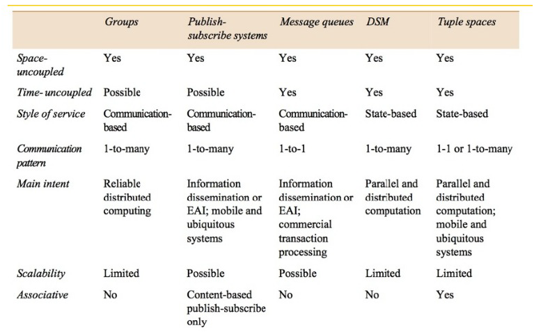

## OS Support

### Networking versus Distributed OS

- A **networked operating system** provides support for networking operations. The users are generally expected to make intelligent use of the network commands and operations that are provided. Each host remains autonomous in the sense that it can continue to operate when disconnected from the networking environment.
- A **distributed operating system** tries to abstract the network from the user and thereby remove the need for the user to specify how the networking commands and operations should be undertaken. This is sometimes referred to as providing a single system image. Each host may not have everything that would be required to operate on its own, when disconnected from the network.

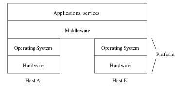

The figure depicts two different hosts, each with its own hardware and operating system, or platform, but conceptually supporting a consistent middleware that supports distributed applications and services.

If the operating system is divided into kernel and server processes then they:

- _Encapsulate_ resources on the host by providing a useful service interface for clients.Encapsulation hides details about the platform's internal operations; like its memory management and device operation.
- _Protect_ resources from illegitimate access, from other users and other clients that are using resources on that host. Protection ensures that users cannot interfere with each other and that resources are not exhausted to the point of system failure.
- _Concurrently process_ client requests, so that all clients receive service. Concurrency can be achieved by sharing time -- a fundamental resource -- called time sharing.

E.g. a client may allocate memory using a kernel system call, or it may discover an network address by using a server object. The means of accessing the encapsulated object is called an invocation method.

The core OS components are:

- _Process manager_ -- Handles the creation of processes, which is a unit of resource management, encapsulating the basic resources of memory (address space) and processor time (threads).
- _Thread manager_ -- Handles the creation, synchronization and scheduling of one or more threads for each process. Threads can be scheduled to receive processor time.
- _Communication manager_ -- Handles interprocess communication, i.e. between threads from different processes. In some cases this can be across different hosts.
- _Memory manager_ -- Handles the allocation and access to physical and virtual memory. Provides translation from virtual to physical memory and handles paging of memory.
- _Supervisor_ -- Handles privileged operations, i.e. those that directly affect shared resources on the host, e.g. to and from an I/O device. The supervisor is responsible for ensuring that host continues to provide proper service to each client.

### Protection

Resources that encapsulate space, such as memory and files, typically are concerned with read and write operations. Protecting a resource requires ensuring that only legitimate read and write operations take place.

- **Legitimate operations** are those carried out only by clients who have the right to perform them. A legitimate operation should also conform to resource policies of the host, e.g. a file should never exceed 1 GB in size or at most 100MB of memory can be allocated.
- In some cases the resource may also be protected by giving it the property of **visible versus invisible**. A visible resource can be discovered by listing a directory contents or searching for it. An invisible resource should be known a priori to the client; it can be guessed though.
- **Resources that encapsulate time**, i.e. processes, are concerned with execute operations. In this case a client may or may not have the right to create a process. Again, host based policies should be enforced.

The **kernel** is that part of the operating system which assumes full access to the host's resources. To do this securely requires hardware support at the machine instruction level, which is supplied by the processor using two fundamental operating modes:

- supervisor mode -- instructions that execute while the processor is in supervisor (or privileged) mode are capable of accessing and controlling every resource on the host,
- user mode -- instructions that execute while the processor is in user (or unprivileged) mode are restricted, by the processor, to only those accesses defined or granted by the kernel.

Most processors have a register that determines whether the processor is operating in user or supervisor mode.

Before the kernel assigns processor time to a user process, it puts the processor into user mode.

A user process accesses a kernel resource using a system call. The _system call is an exception_ that puts the processor into supervisor mode and returns control to the kernel.

### Processes and threads

A process encapsulates the basic resources of memory and processor time. It also encapsulates other higher level resources.

Each process:

- has an address space and has some amount of allocated memory,
- consists of one or more threads that are given processor time, including thread synchronization and communication resources,
- higher-level resources like open files and windows.

Threads have equal access to the resources encapsulated _within the process_.

Resource sharing or interprocess communication is required for threads to access resources _in other processes_. E.g. shared memory or socket communication.

### Address spaces

Most operating systems allocate a virtual address space for each process. The virtual address space is typically byte addressable and on a 32 bit architecture will typically have 2^32 byte addresses.

The virtual address space can be divided into _regions_ that are contiguous and do not overlap.

A **paged virtual memory scheme** divides the address space into fixed sized blocks that are either located in physical memory (RAM) or located in swap space on the hard disk drive.

A **page table** is used by the processor and operating system to map virtual addresses to real addresses. The page table also contains access control bits for each page that determine, among other things, the access privileges of the process on a per page basis.

A **page table** is used by the processor and operating system to map virtual addresses to real addresses. The page table also contains access control bits for each page that determine, among other things, the access privileges of the process on a per page basis.

The operating system manages the pages, swapping them into and out of memory, in response to process memory address accesses.

### Shared memory

Two separate addresses spaces can share parts of real memory. This can be useful in a number of ways:

- _Libraries_: The binary code for a library can often be quite large and is the same for all processes that use it. A separate copy of the code in real memory for each process would waste real memory space. Since the code is the same and does not change, it is better to share the code.
- _Kernel_: The kernel maintains code and data that is often identical across all processes. It is also often located in the same virtual memory space. Again, sharing this code and data can be more efficient than having several copies.
- _Data sharing and communication_: When two processes want access to the same data or want to communicate then shared memory is a possible solution. The processes can arrange, by calling appropriate system functions, to share a region of memory for this purpose. The kernel and a process can also share data or communicate using this approach.

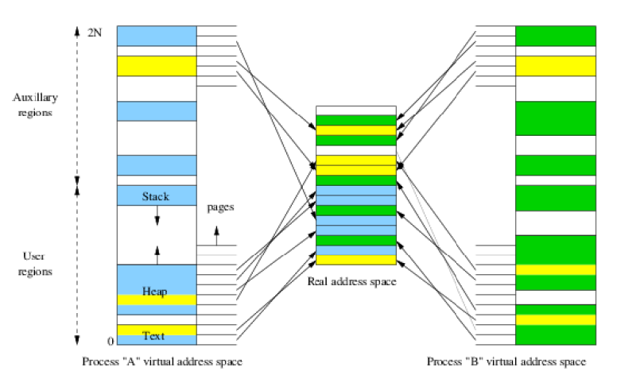

### Creation of a new process

The operating system usually provides a way to create processes. In UNIX the ```fork``` system call is used to duplicate the caller's address space, creating a new address space for a new process. The new process is identical to the caller, apart from the return value of the fork system call is different in the caller. The caller is called the parent and the new process is called the child.

In UNIX a ```exec``` system call can be used to replace the caller's address space with a new address space for a new process that is named in the system call. That means it terminates the currently running program and starts executing a new one

A combination of fork and exec allows new processes to be allocated.

### Copy on write

When a new process is created using fork, the address space is copied. The new process' code is identical and is usually read-only so that it can be shared in real memory and no actual copying of memory bytes is required. This is faster and more efficient than making a copy.

However the data and other memory regions may or may not be read-only. If they are writable then the new process will need its own copy when it writes to them.

**Copy on write** is a technique that makes a copy of a memory region only when the new process actually writes to it. This saves time when allocating the new process and saves memory space since only what is required to be copied is actually copied.

### New processes in a distributed system