<!-- markdownlint-disable MD033 -->
<!-- markdownlint-disable MD007 -->
<!-- markdownlint-disable MD026 -->
<!-- markdownlint-disable MD040 -->
<!-- markdownlint-disable MD024 -->

# Statistical Machine Learning

## Contents

- [Introduction Probability Theory](#Introduction-Probability-Theory)
- [Statistical Schools of Thought](#Statistical-Schools-of-Thought)
- [Linear Regression Optimisation](#Linear-Regression-Optimisation)
- [Logistic Regression Basis Expansion](#Logistic-Regression-Basis-Expansion)
- [Regularisation](#Regularisation)
---

## Introduction Probability Theor

- Data = raw information
- Knowledge = patterns or models behind the data

### Terminology

- **Instance**: _measurements_ about individual entities/objects.It is object that a model will be learned for prediction.
- **Attribute (Feature)**: component of the instances.
- **Label (Response)**: an outcome that is categorical, numeric, etc(after prediction).
- **Models**: discovered relationship between attributes and/or label

### Supervised vs unsupervised learning

In _supervised learning_, Input and output data are labelled for classification to provide a learning basis for future data processing.

In _unsupervised learning_, an AI system is presented with unlabeled, uncategorised data and the system’s algorithms act on the data without prior training. The output is dependent upon the coded algorithms.

### Evaluation (supervised learners)

- Typical process, Pick an _evaluation metric_
- When data poor, _cross-validate_

## Statistical Schools of Thought

### Frequentist Statistics

- _parameter_:  a value that tells you something about a entire population and something in an equation that is passed on in an equation. A parameter never changes, because everyone (or everything) was surveyed to find the parameter. For example, the average age of everyone in your class is a parameter.
- _parameter estimates_: Parameters are descriptive measures of an entire population. However, their values are usually unknown because it is infeasible to measure an entire population. Because of this, you can take a random sample from the population to obtain parameter estimates. One goal of statistical analyses is to obtain estimates of the population parameters along with the amount of error associated with these estimates.
- _Point estimate_: Point estimates are the single, most likely value of a parameter. For example, the point estimate of population mean (the parameter) is the sample (100 out of entire population) mean (the parameter estimate).
- The difference between _a statistic and a parameter_ is that statistics describe a sample. A parameter describes an entire population.

To estimate good behaviour in ideal conditions:

- _Bias_: The error due to bias is taken as the difference between the expected (or average) prediction of our model and the correct value which we are trying to predict. We have only one model so talking about expected or average prediction values might seem a little strange, but we can use the whole process more than once. _Bias measures how for off in general these models predictions are from the correct value._
- _Variance_: The error due to variance is taken as the variability of a model prediction for a given data point.The variance is how much the predictions for a given point vary between different realization of the model.

Asymptotic properties (it is typically assumed that the sample size n grows indefinitely):

- _Consistency_: Estimates converges to true value as the number of data points used increases indefinitely.
- _Efficiency_: asymptotic variance is as small as possible as the number of data points used increases indefinitely.

#### Maximum‐Likelihood Estimation

It is a method in statistics for estimating parameter(s) of a model for given data. The basic intuition behind MLE is that the estimate which explains the data best, will be the best estimator. The main advantage of MLE is that it has asymptotic property. It means that when the size of the data increases, the estimate converges faster towards the population parameter

- It is a _general principle_ for designing estimators or machine learning algorithms
- Involves optimisation
- MLE estimators are consistent (under technical conditions)
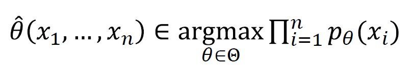

### Statistical Decision Theory

- _Decision rule_: A decision rule is a procedure that the researcher uses to decide whether to accept or reject the null hypothesis. For example, a researcher might hypothesize that a population mean is equal to 10. He/she might collect a random sample of observations to test this hypothesis. The decision rule might be to accept the hypothesis if the sample mean were close to 10 (say, between 9 and 11), and to reject the hypothesis if the sample mean were not close to 10 (say, less than 9 or greater than 11).
- _Loss function_: a loss function quantifies the losses associated to the errors committed while estimating a parameter. Often the expected value of the loss, called statistical risk, is used to compare two or more estimators: in such comparisons, the estimator having the least expected loss is usually deemed preferable.

#### Bias‐variance decomposition

The bias-variance decomposition is a useful theoretical tool to understand the performance characteristics of a learning algorithm.The decomposition allows us to see that the mean squared error of a model (generated by a particular learning algorithm) is in fact made up of two components. The bias component tells us how accurate the model is, on average across different possible training sets. The variance component tells us how sensitive the learning algorithm is to small changes in the training set

#### Empirical Risk Minimisation (ERM)

When we build our learning model, we need to pick the function that minimizes the empirical risk i.e. the delta between the predicted output and the actual output for the data points in our dataset. This process of finding this function is called empirical risk minimization. Ideally, we would like to minimize the true risk. But we don’t have the information that allows us to achieve that, so our hope is that this empiricial risk will almost be the same as the true empirical risk. Hence by minimizing it, we aim to minimize the true risk.

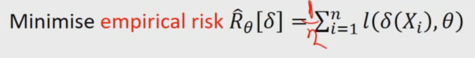

** average(1/n) in the above equation

### Bayesian Statistics

- _Beliefs_: beliefs are encode as distributions in Bayesian learning

 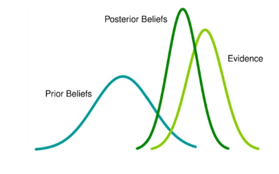

**Bayesian statistics** is a mathematical procedure that applies probabilities to statistical problems. It provides people the tools to update their beliefs in the evidence of new data.

 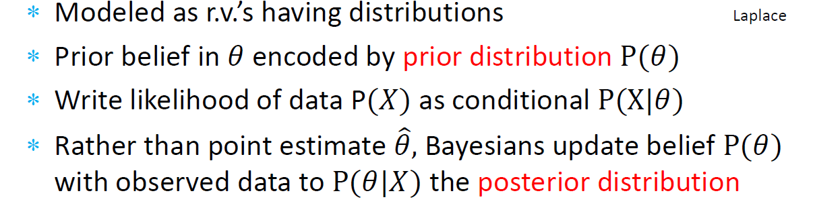

 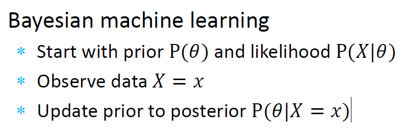

**Frequentist Statistics** tests whether an event (hypothesis) occurs or not. It calculates the probability of an event in the long run of the experiment (i.e the experiment is repeated under the same conditions to obtain the outcome). Here, the sampling distributions of fixed size are taken. Then, the experiment is theoretically repeated infinite number of times but practically done with a stopping intention. For example, I perform an experiment with a stopping intention in mind that I will stop the experiment when it is repeated 1000 times or I see minimum 300 heads in a coin toss.

### Parametric vs non‐parametric models

 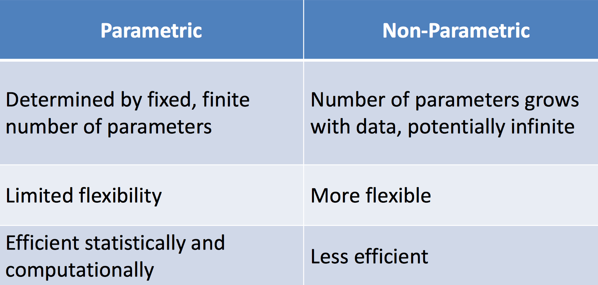

### Generative vs. discriminative models

- _Generative approach_, Model full joint P(X, Y)
- _Discriminative approach_, Model conditional P(Y|X) only

## Linear Regression Optimisation

### Linear Regression via Decision Theory

 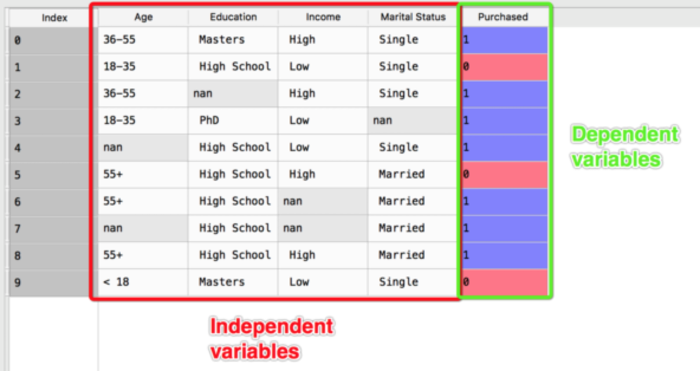

- _Independent variables_ (also referred to as Features) are the input for a process that is being analyzes.
- _Dependent variables_ are the output of the process.

**Formula in Linear Regression:** H = a+b*T

(𝐻 – humidity; 𝑇 – temperature; 𝑎, 𝑏 – parameters)

- H and T are independent variable
- a and b are dependent variable

#### sum of squared errors

The sum of the squares of residuals _SSR_ (deviations predicted from actual empirical values of data). It is a measure of the discrepancy between the data and an estimation model. A small RSS indicates a tight fit of the model to the data.

Least squares minimisation is another common method for estimating parameter values for a model in machine learnin

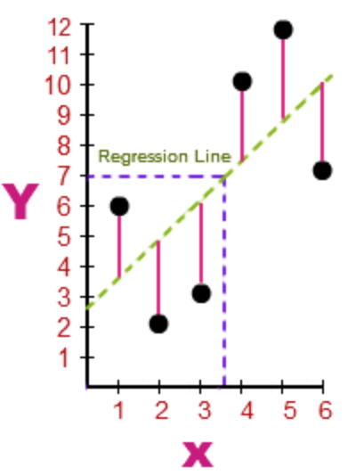

linear relationship between response y and instance with features x_1 ... x_m

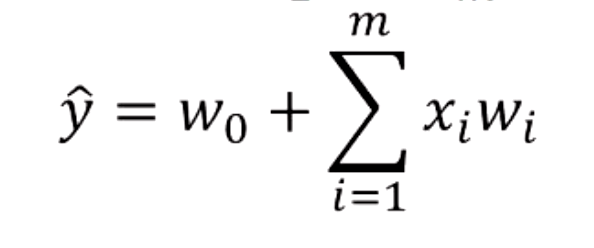

w_1 ... w_m denote weights

add a dummy feature x_0 = 1 and use vector notation

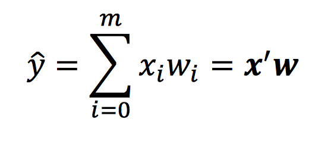

A lowercase symbol in **bold face** indicates a vector; **x'** denotes transpose

### Linear Regression via Frequentist Probabilistic Model

#### Maximum likelihood estimation

_Maximum likelihood estimation_ is a method that determines values for the parameters of a model. The parameter values are found such that they maximise the likelihood that the process described by the model produced the data that were actually observed.

_Maximum likelihood estimation_ is a method that will find the values of parameters that result in the curve that best fits the data.

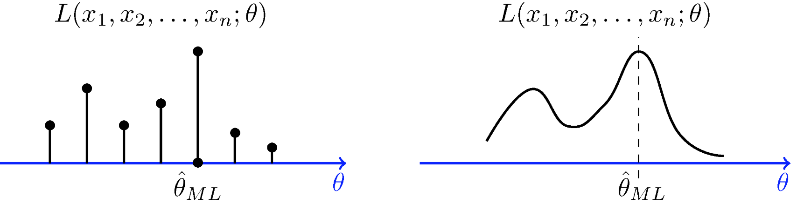

### Non‐linear Continuous Optimisation

- _Analytic solutions_, Some problems in applied machine learning are well defined and A set of logical steps that we can follow to calculate an exact outcome. There are problems that turn up again and again that can be solved with a pattern of design that is known to work well, regardless of the specifics of your application.

- _Approximate iterative solution_, It uses an initial guess to generate a sequence of improving approximate solutions for a class of problems, in which the n-th approximation is derived from the previous ones. A specific implementation of an iterative method, including the termination criteria, is an algorithm of the iterative method.

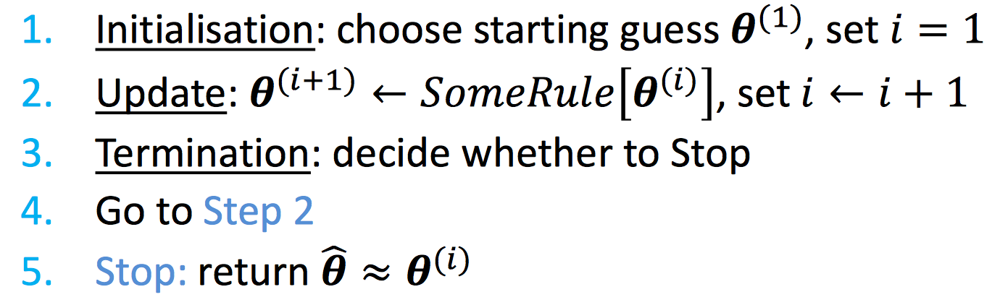

### L_1 and L_2 norms

- _L_2 norm_ (aka **Euclidean distance**)

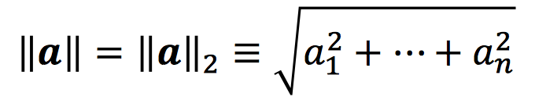

- _L_1 norm_ (aka absolute norm or **Manhattan distance**)

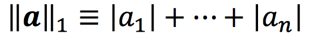

### Log trick

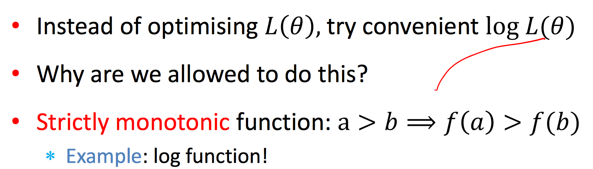

## Logistic Regression Basis Expansion

- _binary classification_: the task of classifying the elements of a given set into two groups

### Logistic regression model

_Probabilistic_ approach to classification

- P(Y=1|**x**)=f(**x**)
- s(**x**)=**x'w**

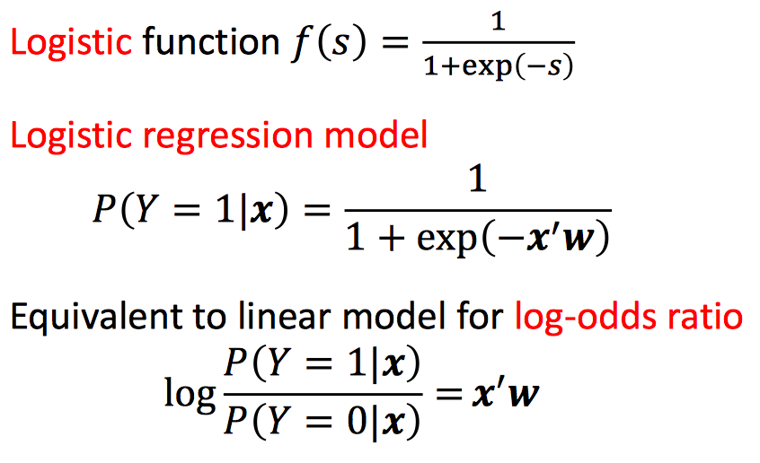

**Note:** here we do not use sum of squared errors for fitting

**Logistic regression is a linear classifier**

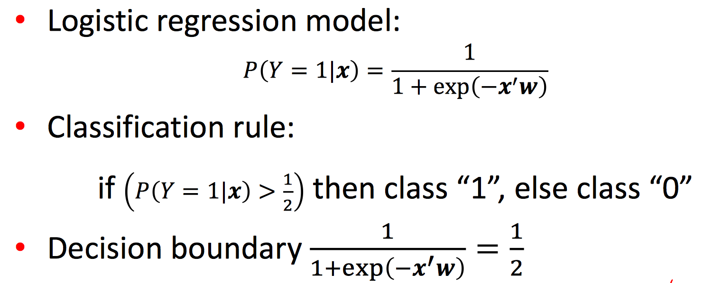

_Decision boundary_ is the line where P(Y=1|**x**)= 0.5

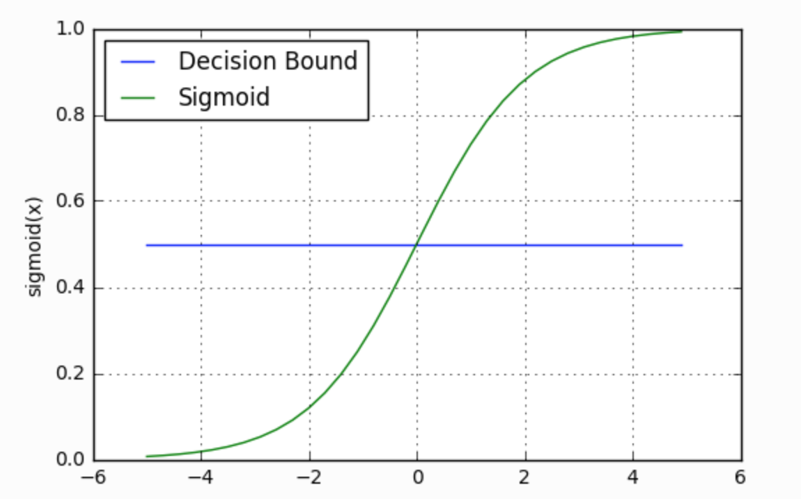

Vector **w** is perpendicular/normal to the decision boundary

### Linear vs. logistic probabilistic models

_Linear regression_ assumes a Normal distribution with a fixed variance and mean given by linear model

_Logistic regression_ assumes a Bernoulli distribution with parameter given by logistic transform of linear model

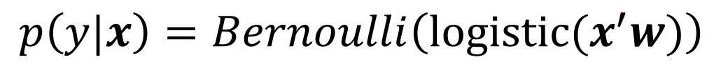

#### Train as Max Likelihood Estimation

- Training: maximise this expression wrt weights **w**

#### Iterative optimisation

Training : logistic regression amounts to finding **w** that maximise log‐likelihood

### Cross entropy

_Cross entropy_ is a method for comparing two distributions

Cross entropy is a measure of a divergence between reference distribution and estimated distribution. For discrete distributions(how close it is to each other):

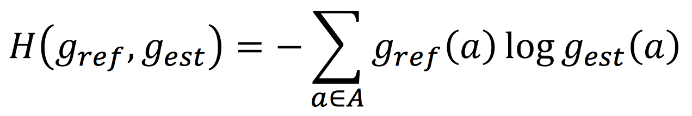

**A** is support of the distributions

#### Training as cross‐entropy minimisation

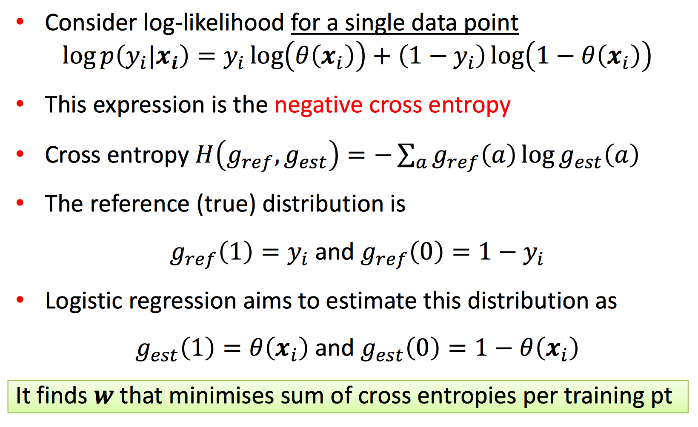

### Basis expansion

- Data transformation, also known as basis expansion, is a general technique
- It can be applied for both regression and classification
- For example, It can make non-linear problem dataset to linear seperable dataset

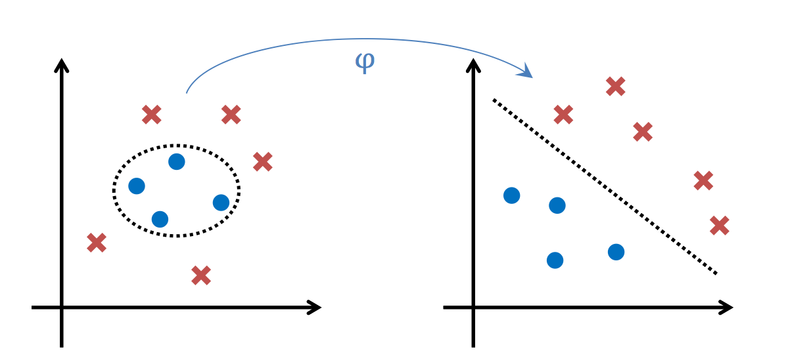

#### Transform the data

Map data onto another features space, s.t. data is linear in that space

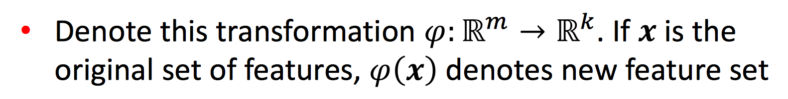

#### Polynomial regression

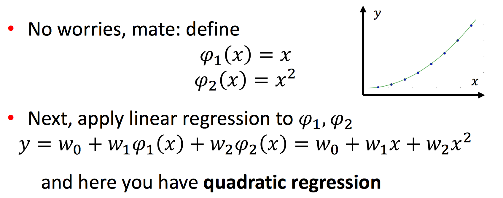

#### Challenges of basis expansion

one _limitation_ is that the transformation needs to be defined beforehand

## Regularisation

_Problems with irrelevant features_ would cause features with different weights, and no change in the model

- Same predictions!
- Same sum of squared errors!
- For example, if the  features complete clones--> increase weights

### Irrelevant (co‐linear) features in general

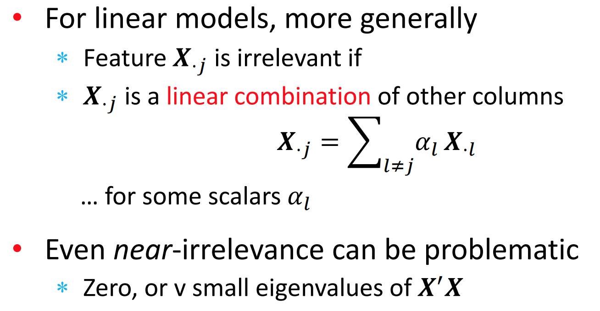

In the above, _near-irrelevance_ means the column is co-related to other column

### Ill‐posed problems

This means that the problem solution is not defined (features cannot be uniquely defined)

_Normal equation:_

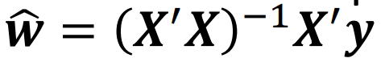

With irrelevant features, **X'X** has no inverse since linear combination (eigenvalue is 0)

### Computing posterior using Bayes rule

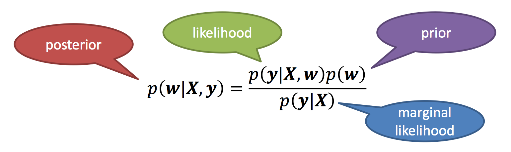

Apply log tirck:

log(posterior) = log(likelihood)+ log(prior)- log(marg)

** log(marg) is canstant with rescpect to **w**

### Varying model complexity

- Method 1: Explicit model selection

- Method 2: Regularisation -- to make overfitting model simpler

- Usually, method 1 can be viewed a special case of method 2

#### Explicit model selection

_Cross validation_: assurance that your model has got most of the patterns from the data correct, and its not picking up too much on the noise, or in other words its low on bias and variance.

- Try different classes of models, with polynomial models of various degree (linear, quadratic, cubic...)
- Use held out validation (cross validation) to select the model

 1. Split training data into D_train and D_validate sets
 2. For each degree we have model f_d
    - Train f_d on D_train
    - Test f_d on D_validate
3. Pick degree d_dash that gives the best test score
4. Re‐train model f_d_dash using all data

#### Vary complexity by regularisation

- Note that regulariser does not depend on data

- Use held out validation/cross validation to choose lambda

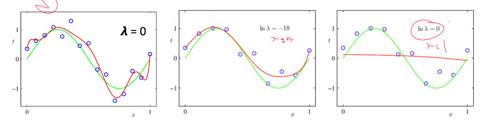

### Regulariser as a constraint

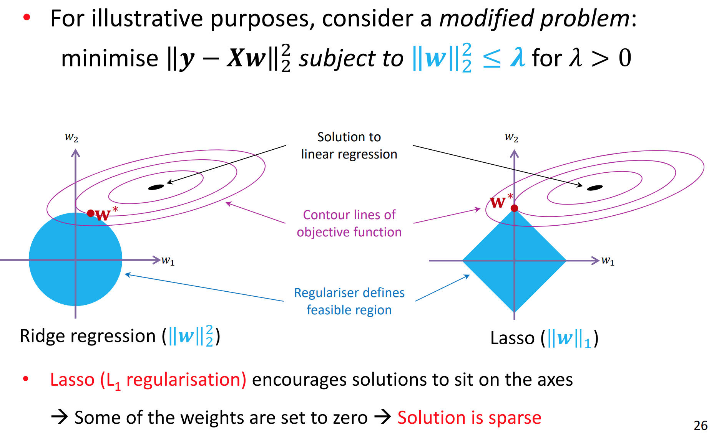

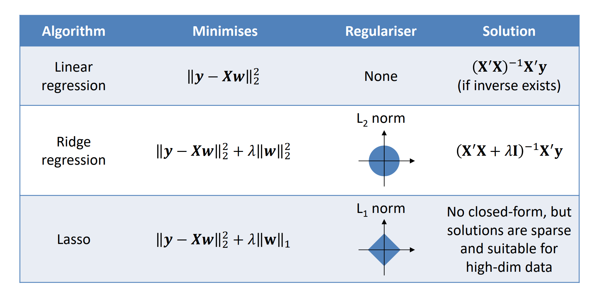

### Bias‐variance trade‐off

Analysis of relations between train error, test error and model complexity

- Training the model: ERM / minimisation of training error
- Generalisation capacity is captured by risk / test error
- More complex model ---> training error goes down
- Finite number of points ---> usually can reduce training error to 0 (is it always possible?)

#### Bias‐variance decomposition

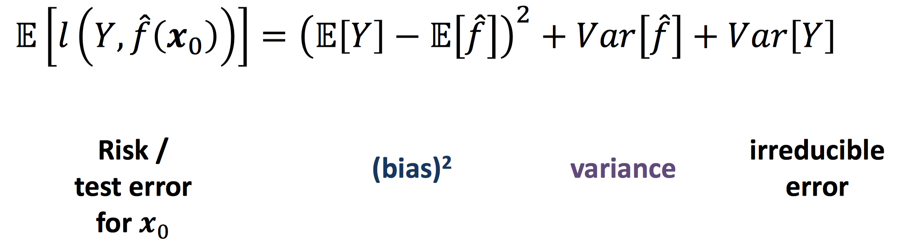

**_Variance_**:

- simple model ---> low variance
- complex model ---> high variance

**_Bias_**:

- simple model ---> high bias
- complex model ---> low bias

#### Bias‐variance trade‐off

- simple model ---> high bias, low variance
- complex model ---> low bias, high variance

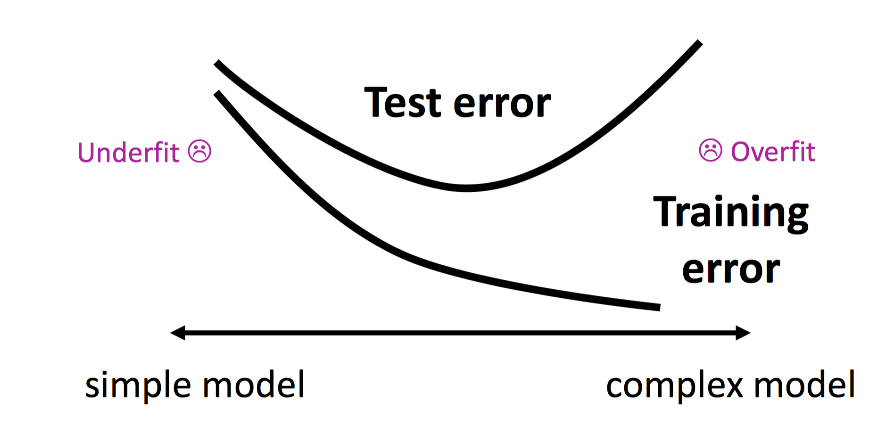
